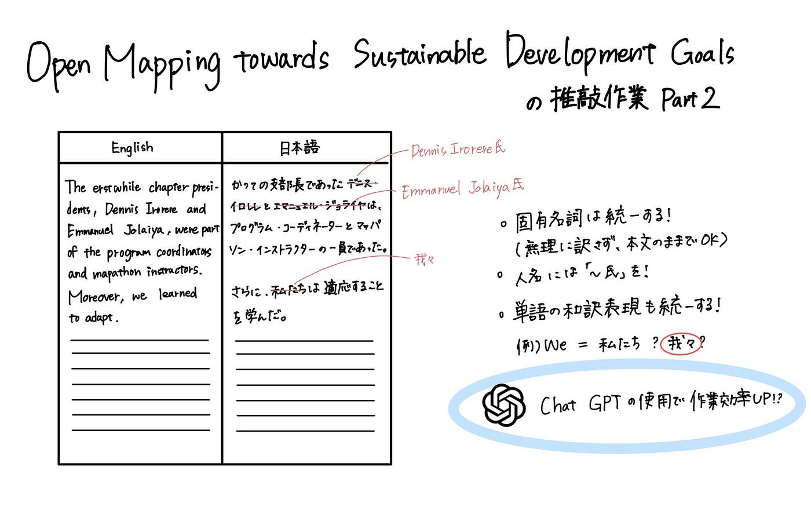

## Youth週報（10/22）

こんにちは。3年の末木です。

今週も先週に引き続き「[Open Mapping towards Sustainable Development Goals](https://link.springer.com/book/10.1007/978-3-031-05182-1)」の翻訳の推敲作業を行いました。

ここで翻訳の意義について再確認しておきます！

- 他言語化によって、YouthMappersやOSMチームの取り組みの日本での認知度を向上させ、日本で同じようなケースに直面した時の先行研究として理解される

- 我々にとっても他の国・地域の取り組みを知ることで今後の活動のヒントになる

ということでまず第一に私たちにとって理解しやすい文章にしたい…！！ので今週も精度を上げていきました！

翻訳はGoogleドキュメントで分担して行い、[古橋ゼミのGoogleドライブ](https://drive.google.com/drive/folders/1Qp1IYP81VfWuVNOYUUY5OyY2pMRHmxDu)で管理をしました。

今週は、前回と同じペアではなく、1つ先のペアのドキュメントを見て先週と同様に以下の点を中心として表記の揺れを統一しました。

- 固有名詞を統一する（無理にカタカナにせず、英語表記にする）

- 人名には「～氏」と敬称をつける

- 日本語として読みやすい文にする

今週は追加で以下の点にも意識して統一を行いました。

- 単語の和訳表現を統一させる（例：we→私たち❌　我々⭕️、YouthMappers→ユースマッパーズ❌　YouthMappers⭕️など）

また、先週のゼミにてChatGPTの有料版に1ヶ月加入し、作業効率を上げていくという話題も上がったので来週からはそちらを活用して効率を上げて精度向上に努めたいと思っています！

以下はグラレコです。

