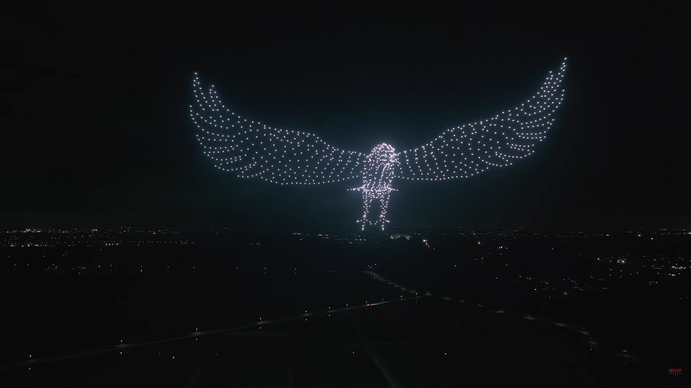
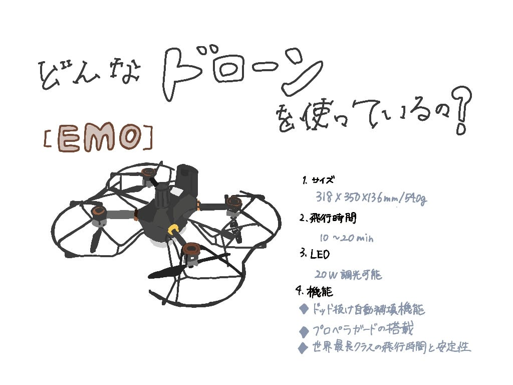

### 日本初！花火搭載のドローン！

こんにちは。ドローン部3年の林です。夏が終わり、一気に秋が訪れました。季節の変わり目なので、皆さんも体調に気を付けてお過ごしください。

今週の週報では、ドローンに関する記事を調べ、その中で気になった記事を皆さんにご紹介したいと思います。

#### 記事概要

株式会社レッドクリフは、茨城県取手市で花火を搭載したドローンを使用したショーのテスト飛行を行い、成功を収めました。テストでは、1,000機のドローンを空中でシンクロさせ、そのうちの花火搭載ドローンに自動制御プログラムで点火するという見事な演出が行われました。

#### 記事内容

レッドクリフ社は、2024年5月27日（月）に茨城県取手市で花火搭載ドローンのテスト飛行を行いました。
このテストでは、1,000機のドローンが使用され、そのうち100機には花火が搭載されていました。
1,000機のドローンが空中でシンクロし、自動制御プログラムによって花火を点火する演出に成功。夜空に現れたドローンで作られた大鳥が、翼から火花を舞い散らせる姿は、まるで羽ばたいているようで、圧巻の光景となりました。

#### テスト飛行の様子

#### [株式会社レッドクリフ](https://redcliff-inc.co.jp/company/)とは？

「夜空に驚きと感動を」を企業理念とし、主にドローンを使った空中演出や技術開発を行っている企業。特に、ドローンを複数使用したシンクロナイズド飛行や、花火を搭載したドローンを使った演出が特徴。最新技術を駆使した空中ディスプレイやパフォーマンスの分野で注目を集めています。

株式会社レッドクリフに加え、世界5ヵ国のドローンショー企業が集結し、7,998機のドローンによる「ディスプレイの大きさ」と8,100機の「同時飛行数」でギネス世界記録™︎の新記録を樹立していました。非常に幻想的で圧倒されるような映像でした！

#### どんなドローンを使用しているのか？

#### 参考記事

[レッドクリフ社、日本初の花火搭載ドローンによるドローンショーのテスト飛行成功！テスト飛行の動画も公開 — ドローンガイド — DRONE GUIDE](https://drone-guide.jp/3818/)
