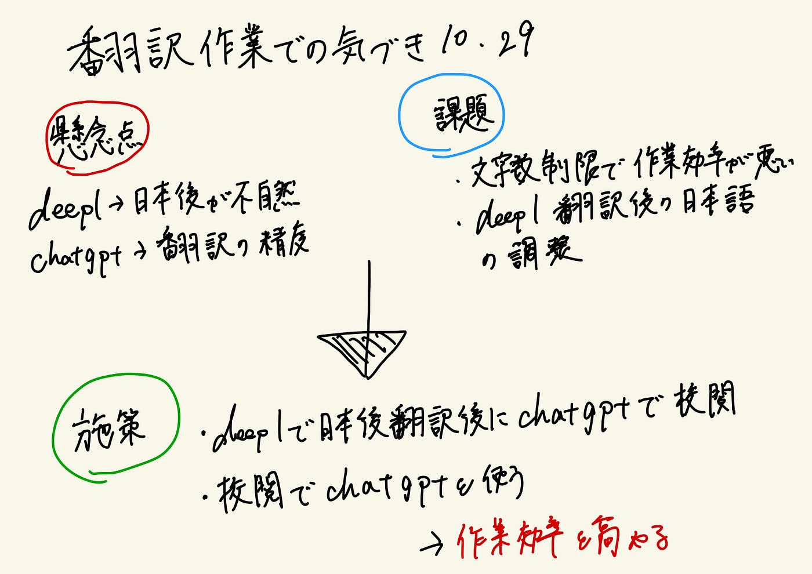

### Youth週報（10/29）

こんにちは。3年の伊藤です。

Youthでは今週の活動として、①国際会議の準備②先週に引き続き「[Open Mapping towards Sustainable Development Goals](https://link.springer.com/book/10.1007/978-3-031-05182-1)」の翻訳の推敲作業の二つの取り組みをしました！

①国際会議の準備

今週はYouthの取り組みとして国際会議の準備を行いました。発表者として、伊藤、末木、林が11月29日～12月1日にかけて行われる国際会議に参加します！

今週の作業内容として、会議参加のためのエントリーシートの作成を主に行い、ChatGPTを活用するため、今後の運用方法についての話し合いをしました。

②「[Open Mapping towards Sustainable Development Goals](https://link.springer.com/book/10.1007/978-3-031-05182-1)」の翻訳

今週も翻訳作業を行いました。週報では私が翻訳する過程での、気付きを紹介したいと思います。

DeepL、ChatGPT を使って翻訳サイトを行いました。

懸念点としては・・・
・DeepL→翻訳した日本語が少し不自然。
・ChatGPT →文字数制限、翻訳の精度に少し不安がありました。

この二点から課題として・・・
・文字数制限のために作業効率が悪い
・DeepLの翻訳後の日本語の調節

施策として行ったのは・・・
・DeepLで日本語翻訳後に、chatgptで日本語の文章校閲
・校閲をChatGPTで行うことで、効率を高めました

これらの取り組みとして、今後の課題は、作業効率が悪いので、複数のAIを活用して、効率的に作業を回したいと考えました。翻訳作業にはかなりの時間を要してしまったので、効率よく回すことをお勧めします！

