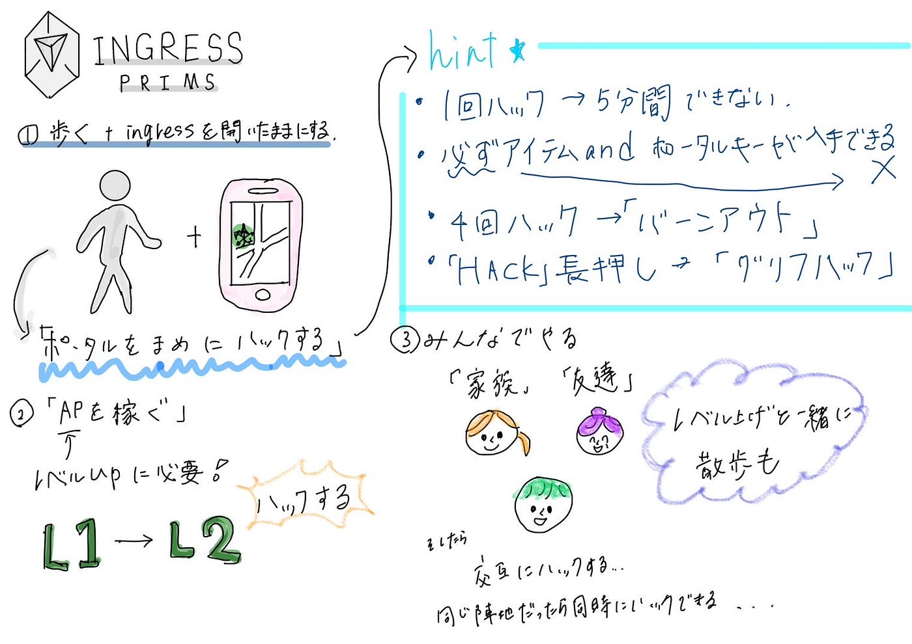

### デザイン部週報 10/29

こんにちは、最近はすっかり気温が冷え込み、長袖が欠かせない時期になりました。

ということで、今週のデザイン部の週報は3年の林が担当します。

今週は、

位置情報ゲーム攻略法第3弾ということで、Ingressを紹介します。

Ingressについて

Ingressは、Googleの社内でスタートアップとして始まり、その後独立してナイアンティックが運営しています。ゲームの概要は、オンラインでリアルタイムに陣地を取り合う、陣取りゲームです。プレイヤーは2つの陣営があり、そのうちのどちらかに属し、2つの陣営通しで戦う。

Ingressの攻略法：

1. 歩く＋Ingressを開いたままにする

→歩きながら、ポータルの場所をチェックしつつ、まめにハックする！

・一回ハックすると、同じポータルでは5分間ハックすることができない。

・ハックすると、ポータルから必ずアイテムが入手でき、運が良ければポータルキーが入手できる。

・1つのポータルを4回ハックすると、バーンアウトになってしまい、一定時間ハック出来なくなる。（バーンアウトの回復には4時間かかります。）

・ポータルのハックボタンを長押しすると、グリフハックが開始されます。表示される模様（グリフ）を覚えて順に描き、成功すれば通常のハック時よりも多くのアイテムを入手できます。

2. APを稼ぐ

→APとは、レベル上げに必要なポイントのことで、

・ポータルをハックした時

・相手陣営のポータルを攻撃・破壊した時

・リンクを作成したとき

・フィールドを作成したとき

などに貯めることができます。

3. みんなでやる

→家族や、友達などとプレーし、交互にポータルをハックしたりするとAPが効率的に稼げます。

また、一緒にプレーする人が、レベルの高い人だと、相手陣営のポータルをすぐ壊せるため、より効率的にレベル上げ可能かも？！

4. Ingressが開催している初心者育成イベントに参加する

Ingressが毎月第1土曜日に初心者のレベル上げイベントを開催しているので、積極的にこのようなイベントに参加してレベルをどんどん上げていきましょう！

イベント名：First Saturday

開催場所は、以下のurlからご確認いただけます。

[https://fevgames.net/ifs/events/](https://fevgames.net/ifs/events/)

グラレコ

