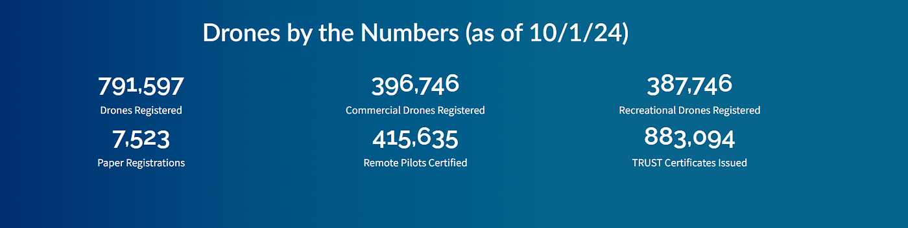
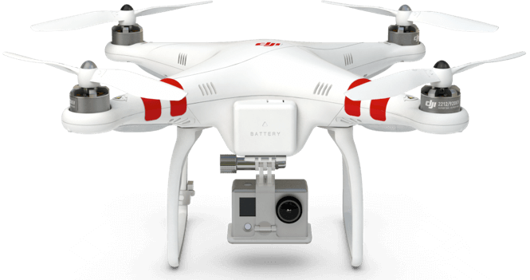
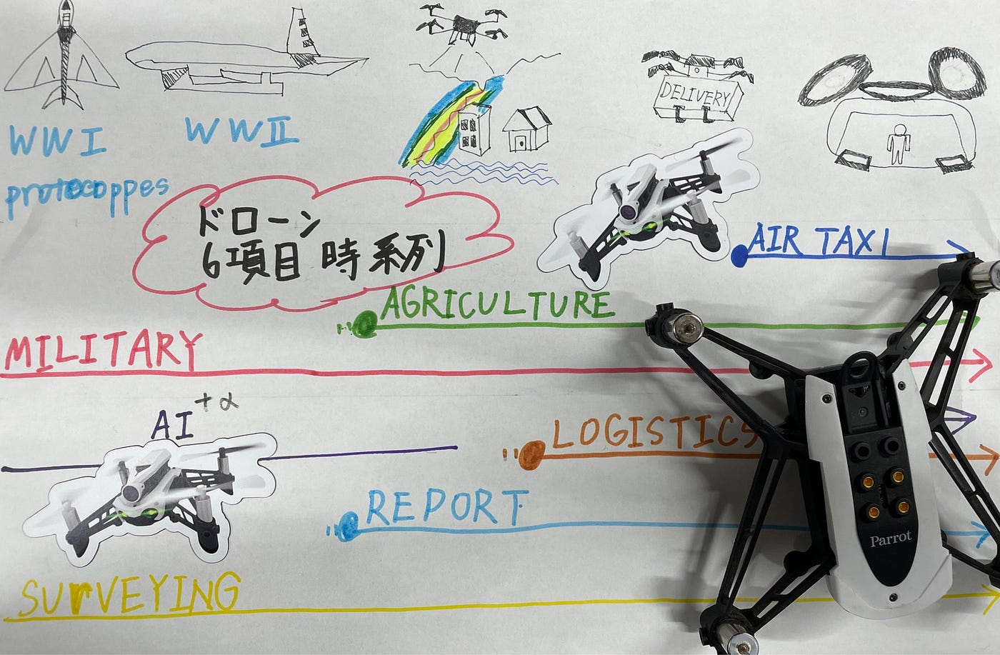

### ドローンの歴史

こんにちは、ドローン部佐藤です。

今週の記事では、ドローンがどのように誕生し、現在のような形に発展してきたのか複数のネット記事をもとに、簡単にまとめています。

近年、私たちの生活の中で「ドローン」が身近なものになりました。個人のレジャーとして楽しむ人もいれば、企業の業務に欠かせないツールとして活用される場面も多くあります。しかし、ドローンの誕生と発展の歴史は意外と知られていないのではないでしょうか。

**FAA公式のドローン飛行ガイドライン画像**
出典: 米国連邦航空局（FAA）
URL: [https://www.faa.gov/uas](https://www.faa.gov/uas)

**1.ドローンの誕生：軍事技術としてのスタート**
ドローンの歴史は、第一次世界大戦中の軍事用途から始まります。当時、遠隔で敵の陣地に爆撃を行う無人機の開発が進められていました。1917年、アメリカで「[ケタリング・バグ](https://ja.wikipedia.org/wiki/%E3%82%B1%E3%82%BF%E3%83%AA%E3%83%B3%E3%82%B0%E3%83%BB%E3%83%90%E3%82%B0)」という無人爆撃機が試作され、これがドローン技術の最初期の例とされています。ケタリング・バグは自動操縦で飛行し、目的地に到達すると爆発する仕組みでした。この試作品は実戦投入こそされませんでしたが、無人機の概念が初めて具体化された瞬間とされています。

その後、第二次世界大戦中には、より実用的な無人航空機が開発されました。アメリカやイギリスを含む各国は、無人偵察機や爆撃機の開発に資源を投入し、戦場における安全性と効率性を追求しました。特に、アメリカは無人機の戦略的活用に注力し、遠隔操作技術が向上することで、パイロットが危険なエリアに立ち入らなくても戦況を把握できるようになりました。こうした技術は、後に冷戦時代にも継承され、偵察や情報収集の面で重要な役割を果たすことになります。

**2. 冷戦時代：偵察用ドローンの進化**
冷戦時代には、アメリカとソビエト連邦の間で激しい情報戦が展開され、無人偵察機の役割がますます重要になりました。アメリカは「UAV（Unmanned Aerial Vehicle、無人航空機）」の技術を進化させ、敵国の情報を収集するために偵察用ドローンを積極的に使用しました。たとえば、アメリカ空軍は「ファイアビー」と呼ばれる偵察用ドローンを開発し、これをソビエト連邦や東ヨーロッパの上空に飛ばして情報収集を行いました。

ファイアビーのような偵察ドローンは、地上から遠隔操作され、高度なカメラで写真を撮影し、リアルタイムで情報を収集する能力を持っていました。この時代のドローン技術は、無人機が人間のパイロットが立ち入れない危険な領域でも情報収集ができるというメリットがありました。冷戦時代に培われたこの技術は、後に民間用途にも応用されていくことになります。

**3. 2000年代以降：軍事から民間利用へ**
2000年代に入ると、GPS技術の発展や小型化の進展、バッテリーの高性能化により、ドローンの民間利用が急速に広まりました。特に、ドローンメーカーのDJI（中国）は、手軽に操作できる小型ドローンを市場に投入し、一般消費者や企業にドローンが普及するきっかけを作りました。DJIの「Phantom」シリーズは、初心者でも簡単に空撮ができることから大ヒットし、映像制作や個人のレジャー用途においてドローンが一気に広まる要因となりました。

**DJI Phantomシリーズドローンの画像**
出典: DJI公式サイト
URL: [https://www.dji.com/phantom](https://www.dji.com/phantom)

民間利用のドローンは、その用途が多岐にわたります。農業では作物の生育状況を把握するために使用され、インフラの点検では橋梁やビルの高所点検にも使われるようになりました。災害対応では、救助活動の支援や被災地の状況把握にも活用されており、ドローンは人々の命や財産を守る役割も担っています。

**4. 未来の可能性：AIと自律飛行によるさらなる進化**
ドローン技術は今後も進化を続け、AI（人工知能）や自律飛行技術との融合により、さらに多様な用途での活躍が期待されています。現在、AIを搭載したドローンは、障害物を自動で回避しながら飛行する能力を持つようになっており、これにより人手をかけずに精密な作業ができるようになりつつあります。たとえば、農業分野ではAIドローンが作物の生育データを分析し、収穫や農薬散布のタイミングを最適化することが可能です。

また、物流分野では、ドローンを活用した配送サービスも注目されています。米国や中国では、既に一部の地域で試験運用が行われており、ドローンによる迅速な配送が実現しています。さらに、都市部の交通渋滞解消や空飛ぶタクシーの導入も視野に入れられており、未来の都市インフラとしてのドローンの役割も拡大しようと各国・企業が研究を進めています。

**結論**
ドローンの誕生から現在に至るまで、その技術と用途は急速で進化してきました。軍事利用から始まった無人機技術は、冷戦時代の情報戦を経て、2000年代には民間に普及し、農業や物流、災害対応などさまざまな分野で不可欠な存在となっています。今後もドローン技術は進化を続け、私たちの生活や社会により多くの恩恵をもたらすでしょう。AIや自律飛行といった最新技術の導入により、ドローンはさらに身近で多用途なツールとして発展していくことが期待されています。

**参考URL**

1. DJI公式サイト: [https://www.dji.com](https://www.dji.com)
→ ドローンメーカーDJIに関する情報や製品概要。

1. 米国連邦航空局（FAA）「ドローンガイドラインと規制」: [https://www.faa.gov/uas](https://www.faa.gov/uas)
→ 米国内におけるドローンの安全利用と規制に関する情報。

1. World Economic Forum「How drones are transforming the world’s cities」: [https://www.weforum.org/agenda/2020/06/how-drones-are-transforming-cities/](https://www.weforum.org/agenda/2020/06/how-drones-are-transforming-cities/)
→ ドローンの都市利用に関する解説とその影響についての議論。

1. 日本無人機運行協会（JUIDA）「ドローンの歴史」: [https://www.juidajapan.org/drone-history](https://www.juidajapan.org/drone-history)
→ 日本でのドローン技術の進展と歴史についての情報。

**グラレコ**

