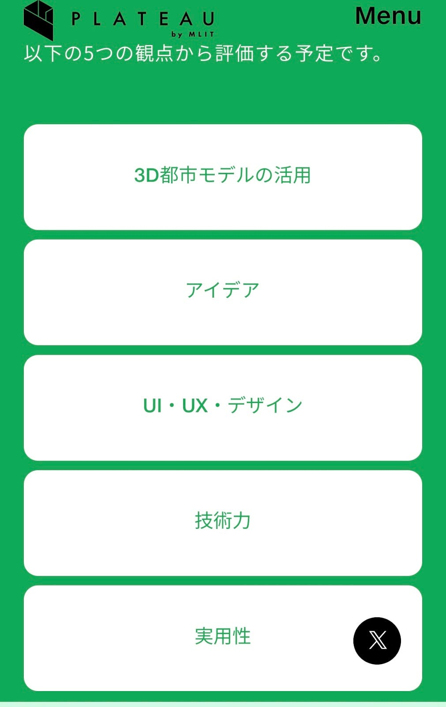
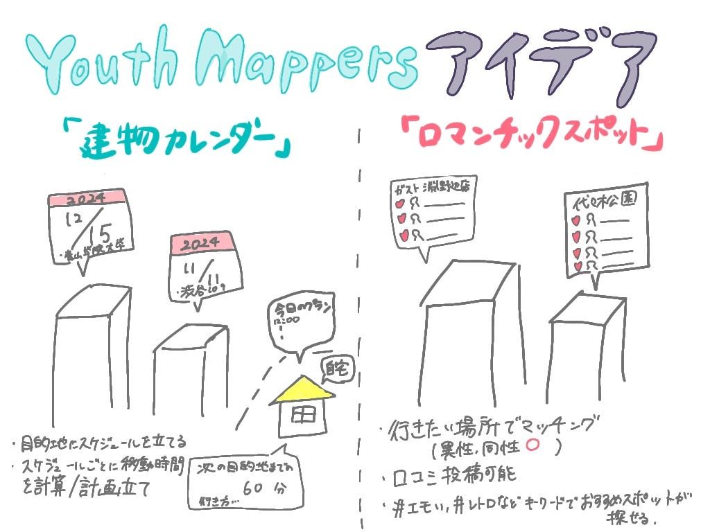

### PLATEAUAWARDに向けたアイデアソン【ユース週報】

こんばんは。YouthMappersAGU部3年の林です。

PLATEAU AWARDに向けて、ユースのみんなと会議をし、PLATEAUAward過去の事例を見たり、PLATEAUとはどんなことができるのかを調べ、2つのアイデアを出してみました。

#### ・PLATEAUとは(ChatGPT 4oより)

PLATEAU（プラトー）は、日本の国土交通省が推進する、都市の3Dデータを活用したプロジェクトの名称です。正式には「Project for Advanced and Interoperable City Models」という名称で、日本国内の主要都市の3D都市モデルを構築し、デジタル地図データとして公開しています。PLATEAUの目的は、都市計画や防災、環境保全、スマートシティの開発などに役立つ3D都市データを提供することで、自治体や企業、研究者、一般の人々がデータを活用して新しい都市の在り方やサービスを創造することです。このプロジェクトにより、都市デザイン、災害対応のシミュレーション、交通計画、観光、環境分析など幅広い分野での活用が期待されています。データは無料で公開されており、各都市の地形や建物の高さ、形状などの詳細な3Dモデルがダウンロード可能です。

#### ・PLATEAUAward過去受賞作品

2023年度の過去受賞作品を確認しました。

[PLATEAU AWARD 2023 最終審査会・表彰式](https://www.youtube.com/watch?v=yZM59DVs5kU)

【採点基準】

３D都市モデルの活用、アイデア、UI/UX/デザイン、技術力、実用性の５つ。

#### ・私たちが考えたアイデア

大まかに２つアイデアを考えました。

**1 建物カレンダー**

＜概要＞

・当日の予定のある建物に対して自分スケジュール設定ができる

・1個のツールで目的地検索とスケジュール管理ができる

（主な機能）

１1日のスケジュールを場所も含めてスケジュールを立てれる

２予定がある目的地までのルート計算と出発時間等の計画立て

３複数人での予定がある場合は、友達と情報共有(中間地点の設定や共有している日のみ居場所検索可能)

これらのアイデアに対して使えるツールをいくつか紹介します。

(1) 建物カレンダー

使えるツール（ChatGPT 4oより）

1.	GoogleカレンダーAPI：

•	予定の建物に関するイベントを作成・管理するために利用できます。

•	ルート設定や時間管理のために予定に位置情報を追加できます。

2.	Google Maps API：

•	建物までの最適なルートを提案し、予測到着時間も設定できます。

•	現在地の共有機能もありますが、共有範囲を限定する必要がある場合は追加の設定が必要です。

3.	Firebase Realtime Database：

•	現在地の共有や友達と位置情報を管理するために利用できます。

•	特定の時間や範囲でのみアクセスを許可する設定も可能です。

4.	Foursquare Places API：

•	建物やスポットのデータベースとして利用できます。ユーザーが予定を設定したい建物や場所の詳細情報を取得できます。

**2 「ロマンチックスポット」マッチングアプリ**

＜背景＞

少子高齢化、孤独化対策

＜概要＞

・行きたい場所から相手探し、マッチング

(主な機能)

1建物を色分けし、目的ごとに分類、おすすめスポット検索（＃的な、レトロ、エモいなど

２相手は異性・同性両方で選択可能

３行った場所の口コミ投稿

使えるツール（ChatGPT 4oより）

1.	Firebase Authentication + Realtime Database：

•	ユーザーの認証・データ管理に適しています。ユーザー間の掲示板機能も構築可能です。

2.	Mapbox API / Google Maps API：

•	建物やスポットの色分けや、ロマンチックスポットのハイライトに利用できます。行きたい場所からの検索も地図上で可視化できます。

3.	Algolia Places：

•	場所ベースの検索機能をサポートし、ユーザーが行きたいスポットから相手を探す際に有用です。

4.	OpenAI GPT：

•	掲示板の内容提案や、相手におすすめのスポットのアドバイスなどの自動化が可能です。

5.	Twilio API：

•	メッセージ通知機能を追加し、マッチングやスポット到着の通知をユーザーに送ることができます。

