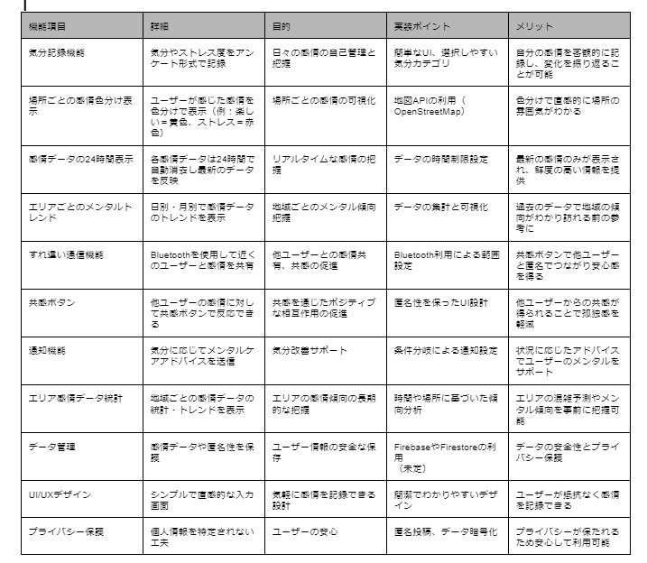
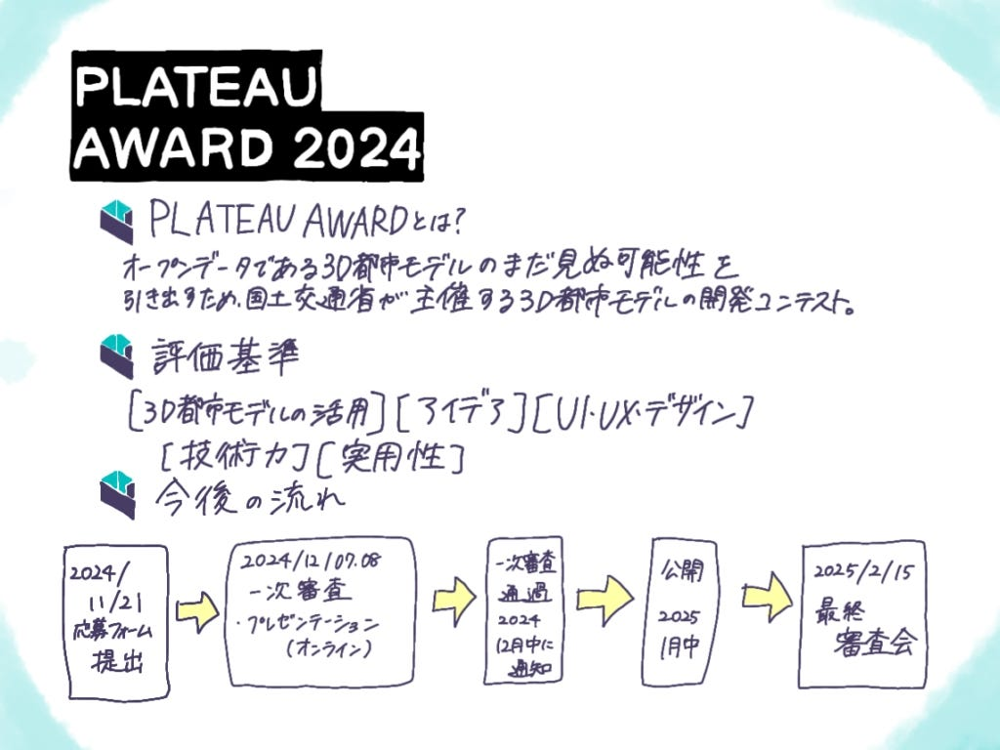

### ドローン部でPLATEAUAWARDのアイデアを考えました！

こんにちは。ドローン部3年の佐藤と林です。今週の週報はPLATEAUAWARDに向けアイデアだしを行いました。以下が2人で考えたアイデアです。ツールなど調べた段階なので、まだ試してはいないです。

### [提案]メンタルウェザーアプリ

#### 1. 概要

「メンタルウェザー」アプリは、ユーザーが訪れた場所で感じた感情を色分けで可視化し、地域ごとのメンタル傾向を把握できるサービスである。このアプリは、ユーザーが日々の気分やストレス度を記録し、場所ごとの感情を共有することで、個人の自己管理や他者との共感を促進することを目的としている。また、地域のメンタル傾向が可視化されることで、ユーザーは訪れる場所の雰囲気や混雑状況を予測することができる。

#### 2. 機能概要（いま思いついてるもの）

見にくくてすみません、、、

### 3. アプリのメリット

#### 3.1 直感的な場所評価

感情を色で表示することで、ユーザーは直感的に場所の雰囲気を把握できる。たとえば、赤色で示された場所はストレスが多い可能性があるため、混雑や騒がしさを予測できる。また、リラックスできる場所が青や緑で示されている場合、そのエリアが静かで過ごしやすいと判断できる。

#### 3.2 地域のメンタル傾向の可視化

日別や月別のトレンドデータにより、地域のメンタル傾向を把握できる。ユーザーは訪れるエリアの雰囲気やメンタル傾向を事前に確認できるため、安心して移動することが可能である。たとえば、観光地であれば、シーズン中の混雑状況をストレス度から推測することができる。

#### 3.3 他ユーザーとの感情共有と共感

Bluetoothを利用したすれ違い通信機能により、近くにいるユーザーと感情を匿名で共有し、共感ボタンを通じてポジティブな相互作用が可能である。これにより、孤独感が軽減され、地域コミュニティ内での一体感を感じることができる。

#### 3.4 メンタルケアのサポート

通知機能により、ユーザーの気分に応じたアドバイスを送信することで、日々のメンタルケアをサポートする。たとえば、ストレスが高いと判断された場合、リラックスするための深呼吸のアドバイスや散歩の提案などが通知される。

### 4. 実装ポイント

#### 4.1 データ管理と匿名性の保護

既存のサービスを利用し、ユーザーの感情データを安全に管理する。

「メンタルウェザー」アプリは[Firebase](https://firebase.google.com/?hl=ja) FirestoreやFirebase Realtime Databaseなどのクラウドデータベースを使用することを想定する。この構成により、リアルタイムでデータを更新し、匿名性やプライバシー保護に配慮したデータ管理を実現する。

データベースは以下の4つの主要コレクション（テーブル）で構成できるらしい：

- **Users（ユーザー情報）**ユーザーの匿名性を保ちながら、感情の記録やすれ違い通信などの機能をサポートするための基本的な情報を格納。

- **Emotions（感情データ）**ユーザーが記録した場所ごとの感情データを格納し、色分け表示や24時間の表示期間を管理する。

- **Locations（位置情報）**感情データが記録される位置情報を管理し、エリアごとのトレンドを可視化する際に使用する。

- **Trends（エリアトレンド）**各エリアの感情トレンドや月次・日次の統計情報を格納し、過去の傾向を分析できるようにする。

[参考資料2024/11/04][https://zenn.dev/yucatio/articles/173f386c471398](https://zenn.dev/yucatio/articles/173f386c471398)

[https://firebase.google.com/?hl=ja](https://firebase.google.com/?hl=ja)

#### 4.2 地図APIの活用

地図API（OpenStreetMap）を利用し、感情データを色分けして地図上に表示する。色分けにより、ユーザーが視覚的に場所の雰囲気を把握できるよう工夫する。

#### 4.3 UI/UXデザイン

シンプルで直感的なデザインを採用し、ユーザーが気軽に感情を記録できるようにする。入力画面は簡潔で分かりやすく、操作性を高めることでユーザーの利便性を向上させる。

#### 5. 結論

「メンタルウェザー」アプリは、ユーザーの感情を地図上に可視化することで、日々のメンタルケアと地域のメンタル傾向の把握をサポートする新しいタイプのアプリである。色分けや共感ボタン、すれ違い通信機能を活用することで、ユーザーは自己の感情管理だけでなく、他者との共感を得ることができる。また、匿名性の確保とプライバシー保護を徹底することで、安心して利用できるプラットフォームを提供することが可能である。

以上の提案内容に基づき、「メンタルウェザー」アプリはユーザーにとって価値あるサービスとなり、日常生活におけるメンタルケアを支援する有力なツールとなることを期待する。

#### PLATEAUAWARDについて

