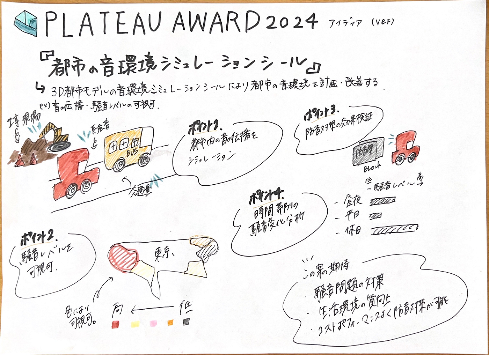

V＆F週報 PLATEAU AWARDハッカソン

こんにちは、三年の福田です。

今週はハッカソンで、PLATEAU AWARD応募作品のデザインを考えました。

V＆Fでは都市の音環境を適切に評価・改善するためのシミュレーションツールの開発をすることにしました。

私たちが考えるツールでの

主な機能：

１.音源の設定とシミュレーション

交通量や工事現場など、都市内の主要な音源を設定し、音の伝播をシミュレーションします。また、建物や地形の影響を考慮し、音の伝播をリアルタイムで計算します。

２．騒音レベルを可視化する

3D都市モデル上に騒音レベルを色わけで表示し、騒音の高低を直感的に把握できるようにします。

３.防音対策の効果検証

騒音の影響が大きい場所において、防音壁の設置や建物配置の変更など、対策案をモデル上で試行し、その効果をシミュレーションで確認します。

４.時間帯別の騒音変化分析

昼夜や平日・休日など、時間帯による騒音レベルの変化を分析し、時間帯別にどのような対策が考えられるか特定することができます。

**PLATEAUが提供するデータを活用する**

建物データ→建物の形状、高さ、材質などの情報を使用し、音の反射や吸収特性を正確にシミュレーションできるようします。

道路データ→道路の位置や幅、交通量データを組み合わせ、交通騒音の発生源として設定します。

地形データ→地形の起伏や植生情報を考慮し、音の伝播経路をモデル化可視化します。

どう開発すると考えているか

１.PLATEAUから提供される3D都市モデルデータを収集し、音響シミュレーションに適した形式に変換・統合します。

2. 音の伝播モデルを開発し、建物や地形の影響を考慮した音響シミュレーションエンジンを構築します。

3. 直感的に操作できるUIを設計し、音源の設定やシミュレーション結果の可視化を容易にします。

4. 実際の都市環境での測定データと比較し、シミュレーション結果の精度を検証・最適化します。

このツールに期待できる効果

都市計画や建築設計の初期段階で、音環境の影響を事前に評価し、騒音問題の予防や改善策を講じることが可能となり、住民の生活環境の質向上や、都市の魅力向上に寄与できると考え、この提案をしました。

