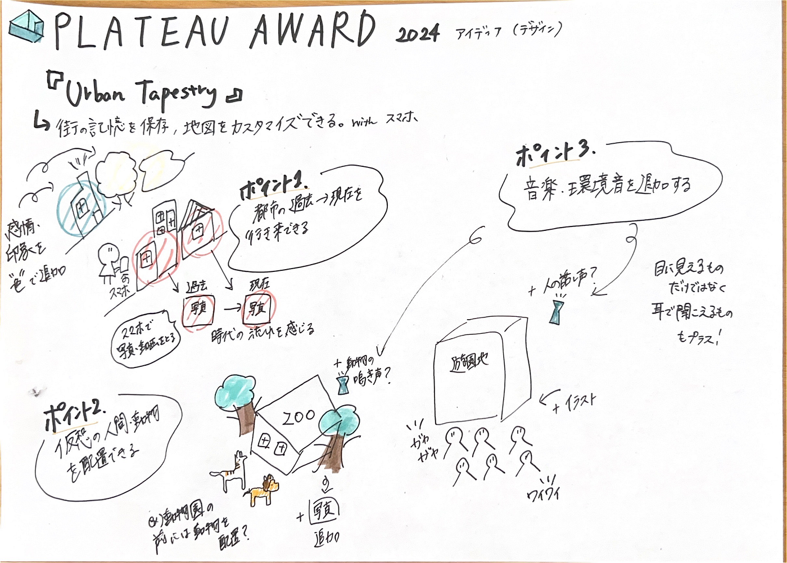

### デザイン部で考えたPLATEAU AWARDのアイディア

こんにちは！三年の福田です。

今週の週報はPLATEAU AWARDに向けたアイディアをまとめました。

「Urban Tapestry」

概要：3D都市モデルを基盤にして、都市の歴史、文化、人々の記憶を織り込んだインタラクティブなデジタルアートを作る。

スマートフォンを通じてアクセスし、街を歩きながら建物や場所にまつわる物語が浮かび上がり、過去の映像が再生される。

**→街の記憶を保存し、地図をどんどん自分好みにカスタマイズする。**

特徴：

1．ユーザーは都市の過去、現在を行き来できるようになる。

自分が同じ建物や場所を昔と今に撮った写真や動画を時間順に都市モデル上にマッピングする。

→街並みが時代とともに変化し、その雰囲気を体感することができるようになる。

＋ユーザーは感情と印象を色を追加できるようにして、場所ごとの感情を可視化する。

**例）カフェ巡りが好き→行ったカフェを地図上で写真を追加して、その場所を色付けしていく**

２.行った場所はどのようなところかに合わせて、仮想の人間や動物などを配置する。

例）動物園の前だからモデル内に動物を配置する。その中にさらに写真を埋めつけるなど

遊園地ではワクワクしている人々の様子を表現できるように、人のイラストを配置する。

３．できたら雰囲気に合わせて音楽や環境音活用したい

著作権等要確認

技術的に、PLATEAUの3D都市モデルをベースに、独自のグラフィックスエンジンで拡張したいと考えている、、、。

