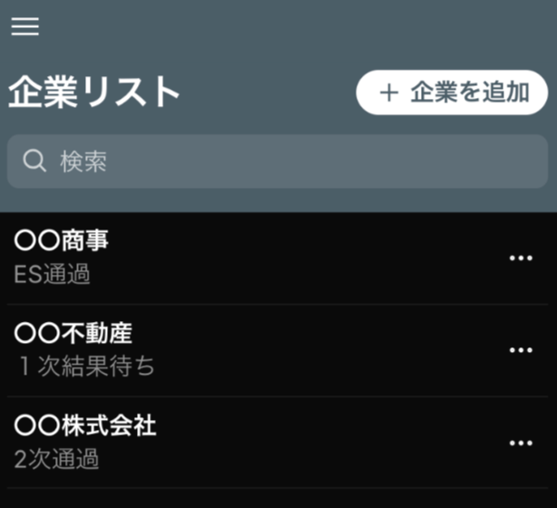
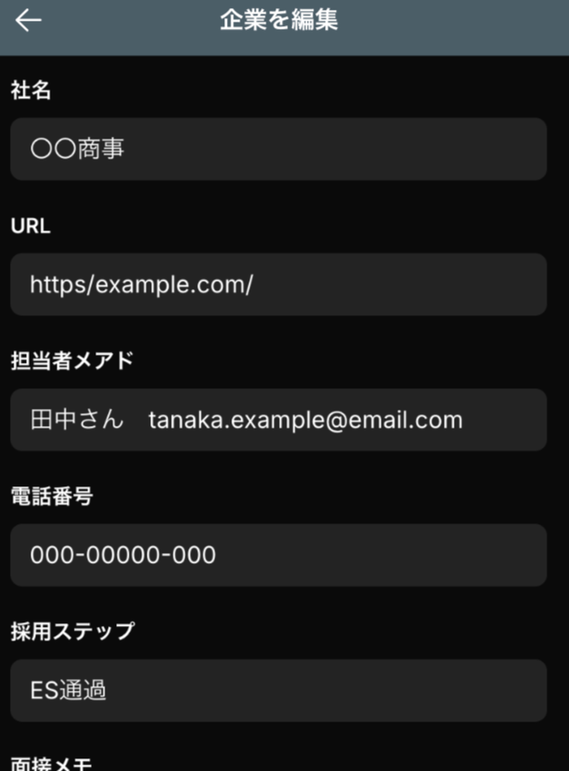
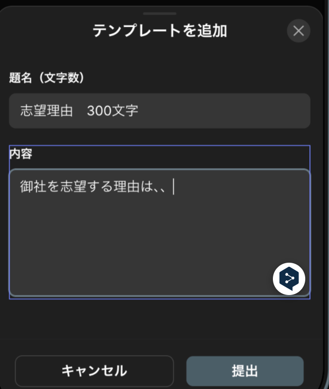
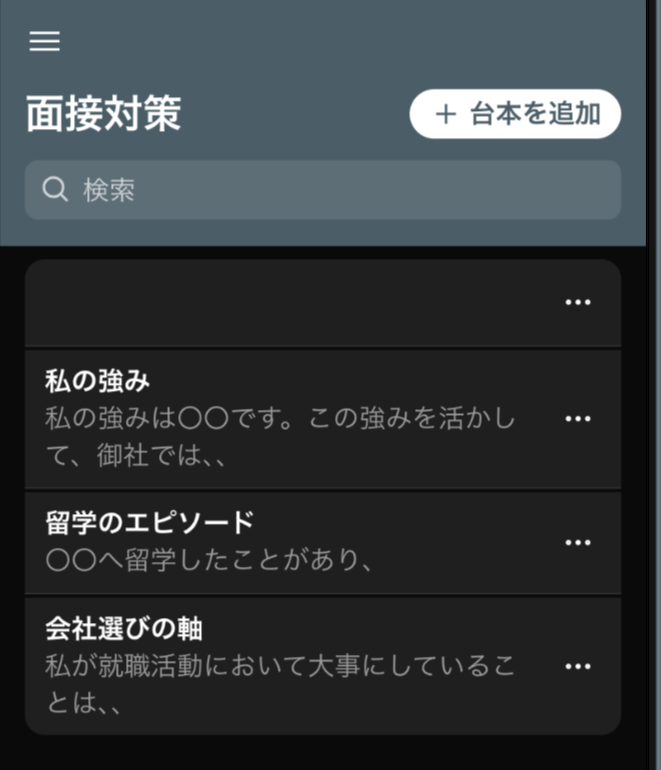
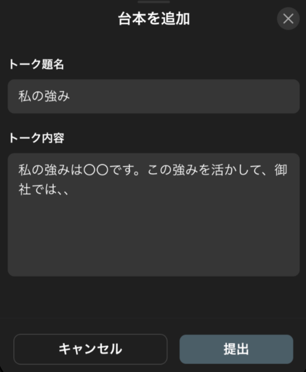
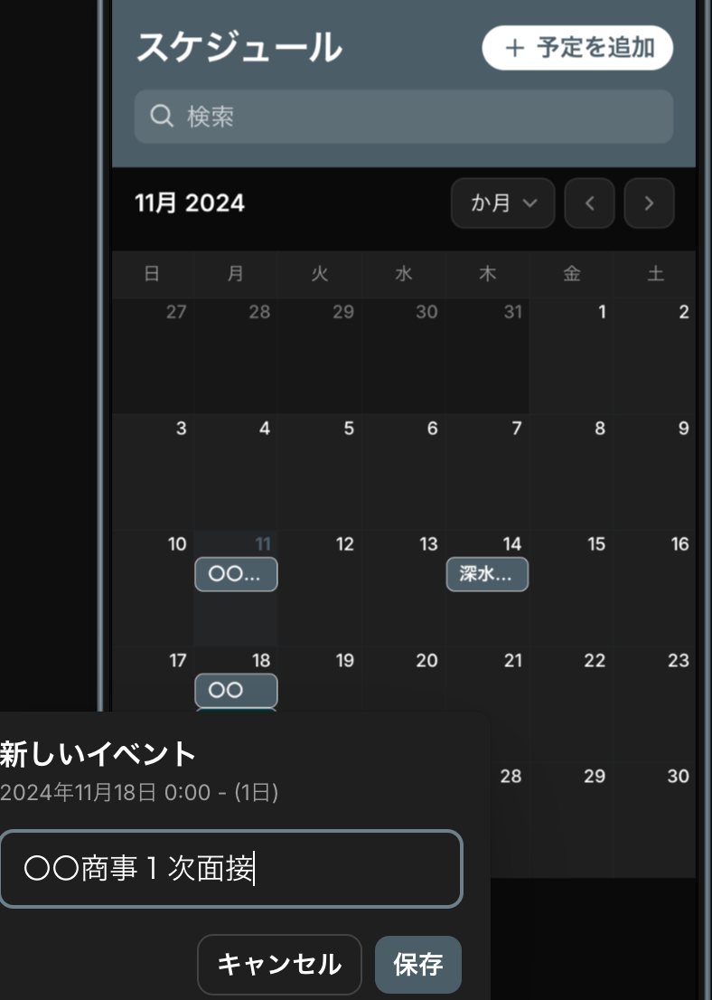
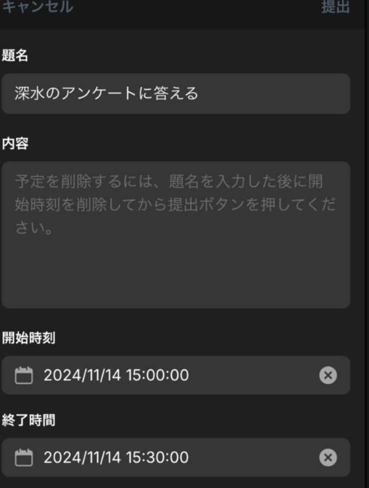
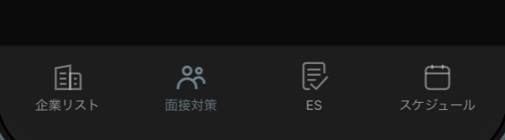

### 卒論へのご協力をお願いします。

お疲れ様です。青山学院大学古橋研究室4年の深水です。

僕が作成した就活アプリの紹介と、協力のお願いをさせてください。

### 今回作成した就活管理アプリ↓

[就活管理アプリ
Edit descriptiontomokinsyu-katuapp.glide.page](https://tomokinsyu-katuapp.glide.page/)

#### **アプリ使用後にアンケートへの回答をお願いします🙇🙇**

#### [アンケートはこちら](https://forms.gle/3uTsNfJZ1Ut5MYcA9)

僕の卒論では、就職活動に取り組んでいる学生のための就活管理アプリを開発し、そのフィードバックを得ることで、大学生の就職活動における情報管理の現状と課題を明らかにしようと考えています。

[GitHub - furuhashilab/2024gsc_Tomoki-Fukamizu
Contribute to furuhashilab/2024gsc_Tomoki-Fukamizu development by creating an account on GitHub.github.com](https://github.com/furuhashilab/2024gsc_Tomoki-Fukamizu)

今回はこのアプリの完成にあたって、これを就職活動中の方々に使用してもらい、そのフィードバックをもらうために記事を書いています。

### 目次

**⒈アプリの紹介**

**⒉ 使い方**

**⒊ お願い**

#### １ アプリの紹介

今回作成した就活管理アプリは、就活生が自分の活動状況やその詳細を全て1つのアプリ上で管理できるように作成しました。

具体的には、以下の情報を一括管理することができます。

**１，企業に関する情報**

**２. ESのテンプレート**

**⒊ 面接で話す内容**

⒋ スケジュール（カレンダー）

繰り返しになりますが、従来まで複数のアプリで管理していた情報を、1つのアプリで完結させられるのが強みです。

#### ２ 使い方

[こちらのリンク](https://tomokinsyu-katuapp.glide.page)からアプリへアクセスし、メールアドレスを使ってログインすることで利用できます。

画面下部でタブを切り替えられます。

右上の白いボタンから企業や台本、予定を追加することができます。

追加した企業や予定をタップすると編集や削除が可能です。

#### ３ お願い

僕の卒論を完成させるためには、就活中の皆様にこのアプリを使用して頂き、そのフィードバックを貰うことが必要です。

つきましては、以下からアプリの追加と、アンケートへの回答（３分ほど）をお願いしたいです。

[就活管理アプリ
Edit descriptiontomokinsyu-katuapp.glide.page](https://tomokinsyu-katuapp.glide.page/)

#### [アンケートはこちら](https://forms.gle/3uTsNfJZ1Ut5MYcA9)
