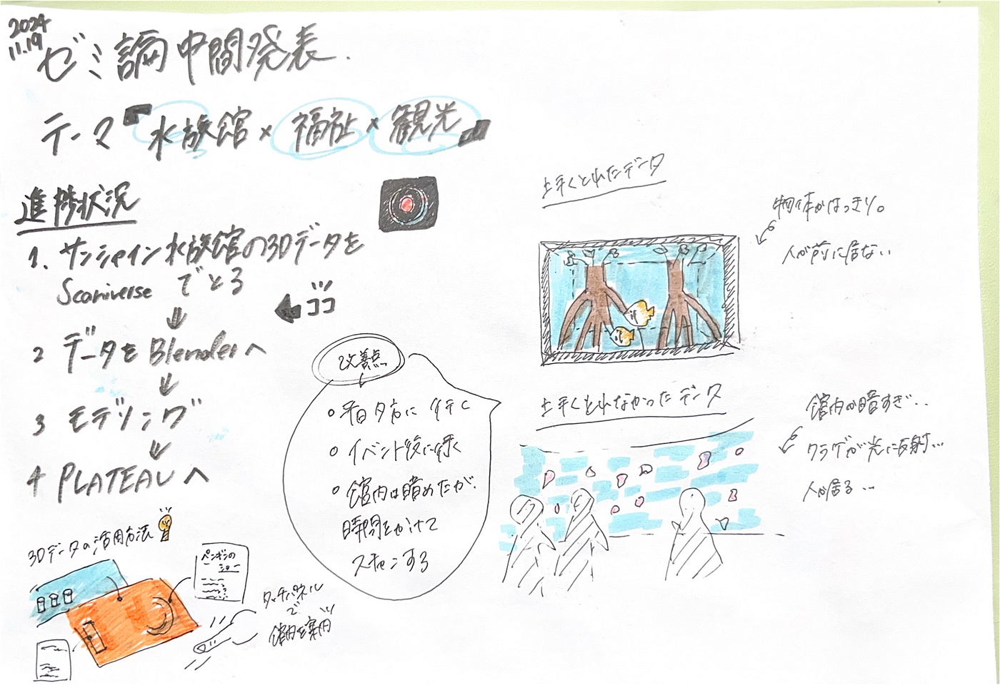

### オリジナル水族館作成途中経過(ゼミ論中間発表)

こんにちは、三年の滝沢です。

今回は11月19日に行われるゼミ論中間発表について記事を書きます。

発表資料

[発表スライド](https://docs.google.com/presentation/d/1ss7unlKChtsHdKcC5S9Wf_52fzTuQdsFTLKwAs0rGl8/edit#slide=id.g3180c75c0d0_0_10)

発表原稿

**１ゼミ論について**

テーマ「水族館×福祉×観光」

目的：水族館の問題を３Dデータで可視化し、その問題を解決する

方法手順

①サンシャイン水族館の3DデータをScaniverseでとる(現段階)→②そのデータをBlenderへ→③Blenderでモデリングしていく→④モデル作成後、PLATEAUのデータCityGMLに変換し属性を与える

**２取得した３Dデータ**

以下サンシャイン水族館の３Dデータです。

・上手くとれたデータ！！

[https://scaniverse.com/scan/raknvcrunru224gh](https://scaniverse.com/scan/raknvcrunru224gh)

[https://scaniverse.com/scan/wao6b73kfujpsmyn](https://scaniverse.com/scan/wao6b73kfujpsmyn)

[https://scaniverse.com/scan/qbrixtlpfg5dy6ux](https://scaniverse.com/scan/qbrixtlpfg5dy6ux)

・上手くとれなかったデータ…

[https://scaniverse.com/scan/dpdrspsgqkbqidkw](https://scaniverse.com/scan/dpdrspsgqkbqidkw)

**３.３Dデータを取得するうえで気づいた感想**

①課題点

・館内は暗く、壁が水槽の様々な色(サンゴ、魚）に反射して上手くスキャンできなかった。

・人が多い＋狭い場所では上手くスキャンできなかった。

・特に暗い場所(クラゲの展示)ではうまくスキャンできなない場所があった。

・夏休み期間は平日でも混んでいたため、3Dデータを思うようにとれなかった。

・館内はネット環境が弱いのかアップロードに時間がかかった。

・授業終わりに行くため、滞在時間が短く頻繁に水族館に通う必要がある。

・５分～10分1つの水槽に右往左往しているので、不審に思われてそうだった…通報されたらどうしようと不安だった…

・他のお客さんが来たらスキャンをやめなければいけなかったので、1つの水槽をスキャンするのに時間がかかった。

②良かった点

・11月の平日夕方は、イベントが終わり人がすいており、スキャンし放題だった。

・時間のかかる作業ではあるが、単純にスキャンが楽しかった。

・屋外のスキャンは簡単

⇒館内・暗い場所でのスキャンは厳しい…スキャンする時点でかなり時間のかかる…

**４.Blenerにデータを移す作業**

水族館のデータをすべて撮り終わっていない状況だが、Blenderへのデータの移行に挑戦してみたが、データの移行が上手く行かず断念。一旦、３Dデータをとることに専念することにした。

**５.これからについて**

サンシャイン水族館の3Dデータを全てとるのは時間がかかる(平日の夕方に頻繁に通わなくてはならない)…⇒PLATEAUにデータを移すのではなく、個人的に自分好みの水族館を作るという目的でいいのでは？

取り掛かりが遅すぎた。このペースだと1月末のゼミ論提出に間に合わない可能性…11月中には水族館のデータをある程度撮り終え、12月からはblenderにデータを移行させモデリングしていく作業を行うことにする。

**6.3Dデータの活用方法**

アクアパーク品川水族館で見つけた３D マップの動画→[753680967.296000.mp4](https://1drv.ms/v/c/5e669b55c0616fb6/EfrFFgvN64xMg6HOptn5SskBYfZZRcx56Gs8N2mXASuW2A?e=vYzpe1)

⇒ただオリジナル水族館を作るのではなく、このように取得した３D データを元にマップを作成することで、本来の目的である福祉と観光に貢献できるのではないか？

EX）点字や音声ガイドを併用することで、視覚障害者が安心して移動できる。勾配や段差の情報が視覚的に分かりやすいため、車椅子やベビーカー利用者に適したルートを提示することが出来る。

⇒水族館だけではなく、他の施設にも応用可能である。

