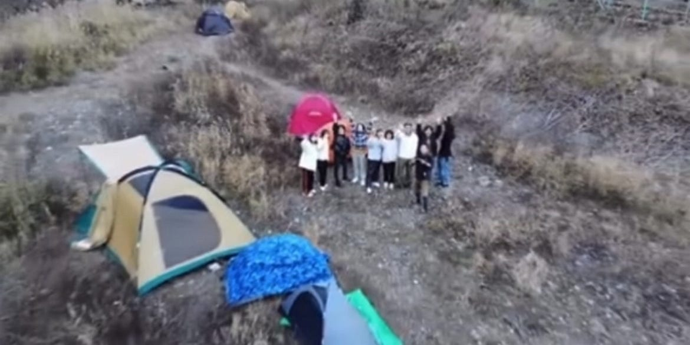
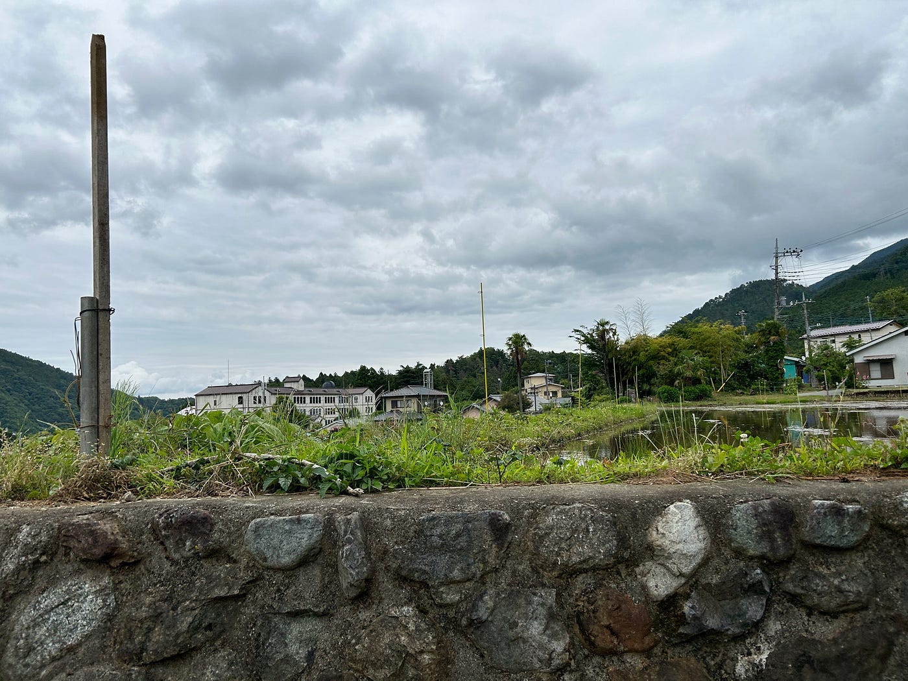
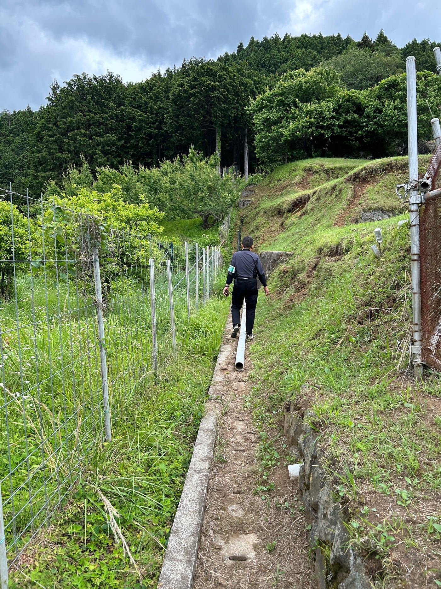

### 現役青学生が紹介する青学古橋教授のおすすめ授業は！？

こんにちは！ドローン部3年の林と佐藤です。今回の週報は、ゼミ生として実際に受講した古橋教授の授業を振り返り、それぞれの授業の魅力やおすすめポイントをご紹介します！

#### **古橋教授の授業のここがいい！**

まず、私たちが感じた「古橋教授の授業のここがいい！」ポイントをまとめてみました！

- **自宅で受講可能！**
学校に行かなくてもオンラインでも授業を受けられる（対面とオンラインが組み合わさったハイフレックス授業）。

- **点数配分、出席＜課題提出！**
リアルタイムで授業に出席できなくても、オンデマンドでまずは課題をしっかり取り組めば単位を取得できるはず（但し、リアルタイムに出席のほうがすぐに質問できるし理解度は高い）！

- **授業を何度でも見返せる！**
すべての授業内容がオンデマンド録画されて後から振り返りたいときに、録画があるので復習、聞き逃しに便利！

- **短期間で集中できる実習型授業もある！**
例えば、3日間で完結する実習型の授業があり、効率的に単位を取得できる。

- **手を動かして学べるから楽しい！**
講義を聞くだけでなく、実際に手を動かす実習が組み合わさった授業形式なので、退屈せずに取り組める。課題が感想文やレポート形式ではないので、自分の成果を実感しやすい！

#### ドローン部部員（林/佐藤）が語る！

#### 実際に古橋教授の授業を履修してみての感想！

**１．Drone Journalism［英語講義］**

**授業概要**
この授業は、横瀬町にある古橋教授の別荘に2日間（1泊2日）の実習講義。BBQを楽しみながら、テント泊やドローン操縦体験ができる！1日目の夕方に集合し、2日目の昼に解散というスケジュール。

**受講期間は？**（履修年度によって受講日程が異なる可能性があります）
12月上旬

**課題は？**

ドローンを操縦する！

授業後に出席確認用の写真を提出するだけだったきが、、レポートもあったような？（笑）

**おすすめポイント**

- 受講生との絆が深まる！

- ドローン操縦やテント泊など非日常体験が満載！

- 授業というより、アクティビティ感覚で普通に楽しい！

**懸念点**

- 寝袋やテントが必須

- アクセスが不便（横瀬町駅）

- 英語講義といいつつ日本語でも受講可能（英語を学びたい人には積極的に英語で話すこと！）

- 12月上旬ということもあり、とにかく寒い

**2．[空間情報システム入門Ⅰ**](https://syllabus.aoyama.ac.jp/shousai.ashx?YR=2024&FN=4611A10-0195&KW=&BQ=3f5e5d46524048535c48584c495933294f4e5745515b42564a5e4f5659534a22067e7d756d6071747c687e6e6b68606a6270667c6608050701780d087a0c1866127c7073767160051d74081e7d6b05186d77191e697013607d18637e1e1c7b1a59445b55415c55422d5f4f535f48565a5534475635455335495c3f4859454c5ac2b6a7c6b7a0beb5adcbb3aec9beabb7a3b4aaa5b1d0a5b2a0aabfdaacb8dbaa85999786e59083e2918c939d89959e8af583978b8190f7879ef2f3869afafc8e829ef2fee2828d85f5ef8e87f1a7afe9b3a5bee3e4f0e4e39b8992eaf9efeabd948fa9868a96878c9dd4cfaedac8afdbd5c8b1d6b1c2d3b5ccdcbbc9d9cfb8ac656070606c235553352f5a4c312b5e4c2d37425a29)

**授業概要**

この授業では、[Google Earth](https://www.google.co.jp/earth/)や[Strava](https://www.bing.com/search?q=Strava&form=ANNTH1&refig=4f60c43673c34acaa79492ca04d614b3&pc=U531)や[Tasking Manager](https://tasks.hotosm.org/)、[GitHub](https://github.com/github)などゼミ生におなじみのツールの使い方を学びます。それぞれのツールを実際に操作しながら、地理空間情報に関するスキルを深められる実践的な内容。

**受講期間は？**（履修年度によって受講日程が異なる可能性があります）

前期後半、木4.5限

**課題は？**

毎回異なるツールを学び、その内容に合わせた課題が出される。

授業中に終わらせられるものもあるし、少々時間がかかるものも、、

例：StravaでGPSアート、Pokémon GOの特定のポケモン探しなど

**おすすめポイント**

- さまざまなツールの操作スキルが身につく！

- 地理空間情報に関する最新トピックを知れる！

- ゼミ生なら復習としても役立つ！

**懸念点**

- PC操作が苦手だと少し大変かも？

- 自ら動く必要がある課題も！（Pokémon GOのように、実際に外に出て動かないとクリアできない課題もある）

**3．[空間情報デザイン基礎**](https://syllabus.aoyama.ac.jp/shousai.ashx?YR=2024&FN=4611A10-0198&KW=&BQ=3f5e5d46524048535c48584c495933294f4e5745515b42564a5e4f5659534a22067e7d756d6071747c687e6e6b68606a6270667c6608050701780d087a0c1866127c7073767160051d74081e7d6b05186d77191e697013607d18637e1e1c7b1a59445b55415c55422d5f4f535f48565a5534475635455335495c3f4859454d5ab8b6a7c6b7a0beb5adcbbcaec9beabb7a2b4d3a7b1d0a5b2a0aabfd9afb8dbaa8598e486e6e483e29f8ceb9f8995eb89fbf88f95f3f787f5e789879dfbf6fc82e6858efeaea4e0a4bca5fafbe9fffa8c8099e3f6e6e1b4a3b692bfb5afbcb5aaddc4a7d5c1a4d2c2d1aacfaedbc8acdbd5b0c0d6c6b3a592998b9993daaeaac22651453e2255453a392f5a42313d)

**授業概要**

この授業では、[ノンデザイナーズ・デザインブック](https://ebookjapan.yahoo.co.jp/books/380850/?utm_source=yahoo&utm_medium=cpc&utm_campaign=Echo_Evergreen_Yahoo_SA_ALL_Search_FirstPurchase_ALL_240701_DSA-old&utm_content=Auto_Mix_Mix_other-old&utm_term=DSA-old1_Mix_Mix_X_None_Text_Text_None_None_240726&yclid=YSS.1001023618.EAIaIQobChMI4NjHtcbtiQMVi1gPAh1Dog2qEAAYAiAAEgJrG_D_BwE)をもとにデザインの基本を学ぶ。具体的には、名刺やロゴ制作、[Mapbox Studio](https://www.mapbox.jp/mapbox-studio)を使った地図デザインなど、実践的な課題を通じてスキルを身につけられる内容。

**受講期間は？**（履修年度によって受講日程が異なる可能性があります）

前期前半、木4.5限

**課題は？**

・ポスター作製

・名刺の作成

・ロゴ制作

・Mapbox Studioで地図デザイン

・ベジェ曲線の練習

・Tasking Managerもやった覚えが、、

**おすすめポイント**

・デザインの基礎から名刺作成まで、実際の生活や仕事で役立つスキルを習得できる！

・自分自身を表したロゴ制作は意外と好きな人にははまりそう！

・ベジェ曲線の練習は苦労したが、終わったときに達成感を味わえる！

**懸念点**

・PC操作が苦手な人は若干苦労するかも、、？

・デザインセンスが乏しい人は難しいかも？（けどぜひこの授業を機にスキルアップしてほしい！）

**4．[はじめての空間情報システム](https://syllabus.aoyama.ac.jp/shousai.ashx?YR=2024&FN=4611A10-0319&KW=&BQ=3f5e5d46524048535c48584c495933294f4e5745515b42564a5e4f5659534a22067e7d756d6071747c687e6e6b68606a6270667c6608050701780d087a0c1866127c7073767160051d74081e7d6b05186d77191e697013647d616b7e1d1b7b1a53445a52415c5e422d5a4f535e48565e553441564c4453364e5c3f4859454f5ac1c4a7c6b3a0c7beadcbcbaec9b4abb6a6b4aba0b1d0a0b2a0aabfa3a9b8dbaa85e09286e69483e29b8c929989ef998af582978b8690f48e9dfc899e848e9b87f6e487f0e1fdf5e289f9ec8085f0e88892e0908ce4e8f090939be7fd9891e3b581c7819788d5d6c2dadda9bba4dccbddc493869dbf90988499928fc6d9b8c8da4135273a472043302d4b3e2e4d3f2b3d5642777266767e314b4d273d4c5a233970621f1202756f1a18)（木之下先生がメイン）**

**※受講年度によって受講内容に変更あり**

**授業概要**

この授業では、地理空間情報システム（GIS）の知識や活用方法を実践的に学ぶ。特に、青根地域でのフィールドワークを通じて、中山間地域の水路調査を行い、そのデータをGISでまとめる。

**受講期間は？**（履修年度によって受講日程が異なる可能性があります）

- 5月25日 1限～5限（座学）

- 6月8日、9日一泊二日のフィールドワーク（1限～5限）

**課題は？**

- 1日目（座学）
レポート課題

- 2・3日目（フィールドワーク）

- 中山間地域の水路を調査し、GISを用いてデータをまとめる。

- 調査内容をもとにレポート作成。

**おすすめポイント**

- 現地でリアルな中山間地域の課題を体感できる！

- 期間中はArcGISを無料で使用可能！

- 受講生同士で仲が深まる！

- 先生方が親しみやすい！フレンドリー！

**懸念点**

- 共同生活が苦手な人には不向きかも？（フィールドワーク中はコテージでの寝泊まりがあるため

- 全日程の参加が必須！**（**日程が履修時に決まっており、1日でも欠席すると単位が取得できない

**5．[応用空間情報学Ⅲ（嘉山 先生がメイン）**](https://syllabus.aoyama.ac.jp/shousai.ashx?YR=2024&FN=4611A10-0339&KW=%e7%a9%ba%e9%96%93%e6%83%85%e5%a0%b1&BQ=3f5e5d46524048535c48584c495933294f4e5745515b42564a5e4f5659534a22067e7d756d6071747c687e6e6b68606a6270667c6608050701780d087a0c1866127c7073767160051d74081e7d6b05186d74176471146f721a187f1e65786769455851462153435f5b4c525e49285b4a3141573145533d3a455f3132415b3d2fb4bcededa2c2c4b6cad6bab6babcbfcea1a1b4d4dfd7aba6b6a8b4aaaebbdad39dcbc385c7d1ca97988c989feffde69e958386d1c0dbfdd2d6cadbd0c9809bfaf6e483f7e1fc85e28dfeef89f8e88ffdf5e39480b1b4a4b4b0ff898fe1fb8e98ddc7b2a0d9d5c0b7a1d4da)

**授業概要**

この講義「応用空間情報学Ⅲ」では、地理情報システム（GIS）に関連する技術文書の翻訳作業を通じて、空間情報の扱い方を学ぶ。具体的には、オープンソースソフトウェアであるQGISやGDALの公式文書を対象にし、翻訳作業や編集を行う。さらに、翻訳成果物をGitHubやTransifexなどのプラットフォームを用いて公開する方法も習得する。これにより、空間情報分野における実践的なスキルと国際的な協働能力の向上を目指す内容となっている。

**受講期間は？**（履修年度によって受講日程が異なる可能性があります）

前期 木曜 １限

**課題は？**

・QGISの基本操作

・GDALを翻訳する際の手順をマニュアルにまとめる

・GDALの翻訳

**おすすめポイント**

実践的なスキルを習得できる点である。QGISやGDALなどのツールを活用し、空間情報を扱う技術を学ぶことができる。また、GitHubやTransifexを用いたプロジェクト管理を通じて、ITスキルや国際的な協働能力も磨くことができる。語学力と技術力を同時に高め、将来に役立つ知識を得られる授業である。

**懸念点**

この授業の懸念点は以下の通りである。

**・ハードルの高さ**
 QGISやGDAL、GitHubなどのツールを初めて使う場合、操作方法や仕組みを理解するまでに時間がかかる可能性がある。ITスキルに自信がない学生にとっては難しく感じる場合がある。

**・時間的負担**
 翻訳や編集作業は丁寧さが求められるため、想定以上に時間がかかることがある。他の科目との両立に注意が必要である。

**・チーム作業の難しさ**
 国際的な協働やITプラットフォームを使用するため、メンバー間でのコミュニケーション不足や作業分担の偏りが生じるリスクがある。

以上、ドローン部が履修した古橋教授の授業の感想でした！

3年生の皆さん、ぜひこれからの履修登録の参考にしてみてください～！

ちなみに、私たち自身もまだ受けたことのない古橋教授の授業が気になってるので、他の授業を履修したことがある方、ぜひ情報を教えてください～！（笑）

