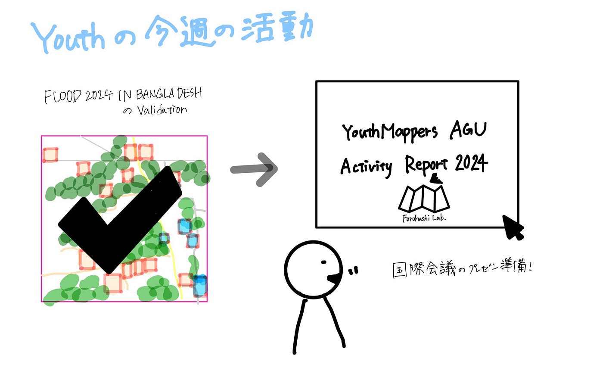

### Youth 週報11/26

こんにちは、3年の末木です。

今週のYouthの活動は

- [FLOOD 2024 IN BANGLADESH-2](https://tasks.hotosm.org/projects/17430) のvalidation作業

- 国際会議の準備

- PLATEAUに関わる情報の構造化

の3つでした！

> マッピング

SoTM Asia 2024の国際会議が今週末にバングラデシュで行われるため、今回はバングラデシュの洪水のマッピング作業を行いました。国際会議にて、YouthMappersAGUの実績として扱えるように1人5個以上validationを行いました。

[#17430: Flood 2024 in Bangladesh -2 — HOT Tasking Manager](https://tasks.hotosm.org/projects/17430)

> 国際会議準備

今週末の国際会議は11/30と12/1の2日間開催されますが、YouthMappers AGUのメンバーのうち、末木、伊藤、林が12/1に登壇予定です。現在スクリプトが完成した段階で、今週は発表練習の詰めの作業を行なっています。先ほどのvalidationの実績も示しつつ、YouthMappers AGUの今年度の活動や今後の予定を発表する予定です。初めての国際会議で緊張していますが、昨年の先輩方の発表を参考に着実に準備を進めて自信を持って発表したいと思います！

> PLATEAU構造化

先々週のハッカソンで取り組んだ内容をGitHubに構造化してまとめました。

[YouthMappersAGU · Issue #1 · furuhashilab/PLATEAUconcierge
1人3つ以上コメントしてください。 ヒント PLATEAU conciergeは2023年10月までの情報をもとに検索しているらしいので、それ以降の情報はアップデートする価値あり！ 2024,11.12 PLATEAU…github.com](https://github.com/furuhashilab/PLATEAUconcierge/issues/1#issuecomment-2469899954)

以下がグラレコです。

