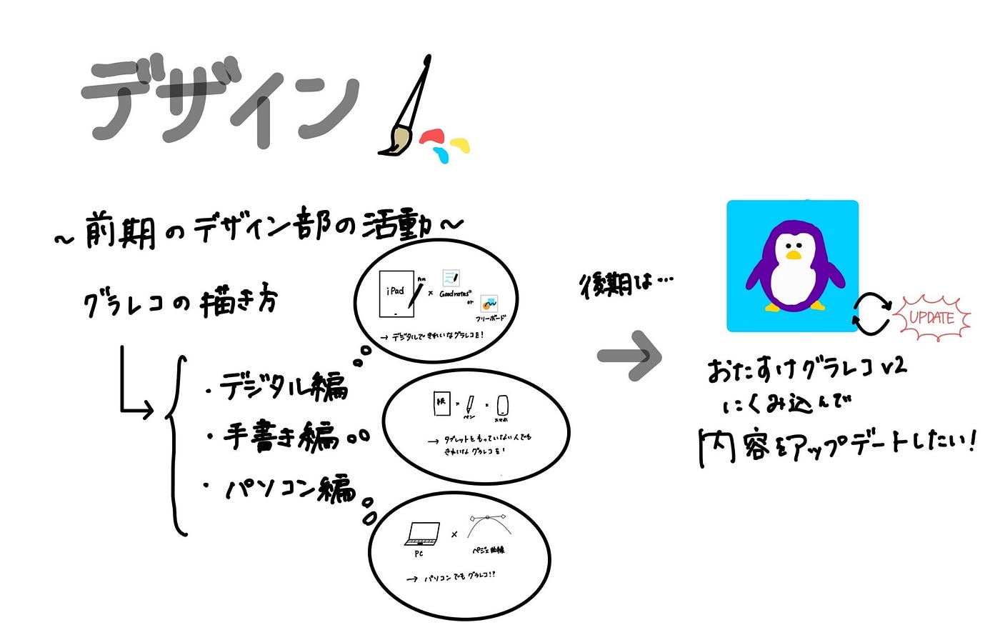

### デザイン部　11/26 週報

こんにちは！今週は3年の林が週報を担当します。

今週のデザイン部の週報は「グラレコのアプリの提案」です。

前期の私たちデザイン部はグラレコの書き方をデジタル編・手書き編・パソコン編に分けて伝授しました。

後期は、「おたすけグラレコ」アプリに私たちが伝授した内容を組み込んでアプリのアップデートを行いたいと考えています！

特に、現在、「おたすけグラレコ」アプリには、メモを使ったデジタル化の仕方とデジタルグラレコのすすめという内容が組み込まれていますが、私たちはこの内容をアップデートしたいと考えています。

これらの内容をアプリに組み込むのはどうでしょうか。

・タブレットを持っていない人でもきれいなグラレコを！（紙×ペン×スマホ）

・デジタルで綺麗なグラレコを！（iPad×Good notes/フリーボード）

・パソコンでもグラレコを！（pc×ベジェ曲線）

グラレコでまとめました。（りこ作）

