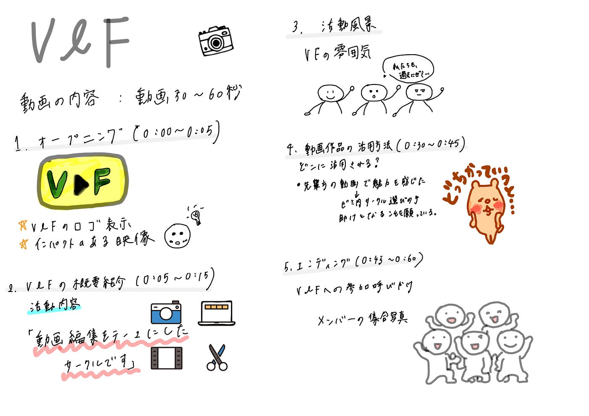

### サークル紹介動画作成プロジェクト始動【V＆F週報】

3年の高井です。
今週V＆Fでは、V＆Fに特化した紹介動画の詳細についてのミーティングを行いました。その結果、動画の構成が決定したので共有します。

> **使用する動画編集ツール**

#### ・[CapCut](https://www.capcut.com/my-edit?start_tab=video)

> **動画の構成**

#### **ターゲット**→古橋ゼミ志望の学生※特に、来年度古橋ゼミに所属する予定の学生

#### **目的**→V＆Fについて、詳しく知ってもらう

※来年度前期ではゼミがフルオンラインになると思うので、少しでもサークルのイメージをわかりやすくして、サークル決めの手助けとなる

#### **動画の長さ→**30〜60秒

#### **1.オープニング (0:00〜0:05)**

**目的**:視聴者の注意を引く、動画を離脱させない。

**内容:**

・V&Fのキャッチコピー&ロゴを表示

・インパクトのある映像エフェクトや音楽を使用する

**セリフ:**「映像を通してゼミの魅力を形にする、それがV&F」

#### **2.V&Fの概要紹介 (0:05〜0:15)**

**目的:**活動内容を簡潔に説明

**内容:**

・「動画編集をテーマにしたサークルです」と紹介

・今までの活動で作成した動画を紹介

ex)ゼミ紹介動画など

**セリフ:**「私たちは、ゼミ活動を動画で発信する映像クリエイターチームです！過去には、こんなゼミ紹介動画を作成しました！」

#### 3.活動風景(0:15〜0:30)

**目的:**V＆Fの雰囲気、動画編集の楽しさを伝える

**内容:**

・撮影風景、企画会議の様子

・メンバーが編集ソフトを使って作業している様子

・編集した動画のビフォーアフターを比較

**セリフ:**

「VFでは動画の編集だけでなく、動画素材の撮影も自分たちで行います！映像を作り上げる楽しさを、サークルメンバーと共に共有しています！」

#### 4.動画作品の活用方法(0:30〜0:45)

**目的・内容:**作成した動画がどこで活用されているのかを紹介する

**セリフ:**「私たちも、過去にゼミを選ぶ際に先輩方が作成した動画をみて、古橋ゼミの魅力を知りました！その時のように、この動画が皆さんのゼミ内サークル選びの手助けとなることを願っています！」

#### 5.エンディング(0:45〜0:60)

**目的:**VFへの参加を呼びかける

**内容:**「一緒に作りませんか？」という呼びかけ

メンバーの集合写真の表示

**セリフ:**「あなたも、映像を通して新たな挑戦をしてみませんか？皆さんの参加お待ちしております！！」

> **公開先**

・[古橋研究室YouTubeチャンネル](https://www.youtube.com/@furuhashilabs/shorts)

・[TikTok](https://www.tiktok.com/ja-JP/)で公開するのも面白そう

> **今後の予定**

・12月2日(月)の5限以降集まって撮影する

・[PLATEAU AWARD 2024](https://www.mlit.go.jp/plateau-next/award/)もあるので、余裕をもって今年中に完成させる

> _**グラレコ_**

