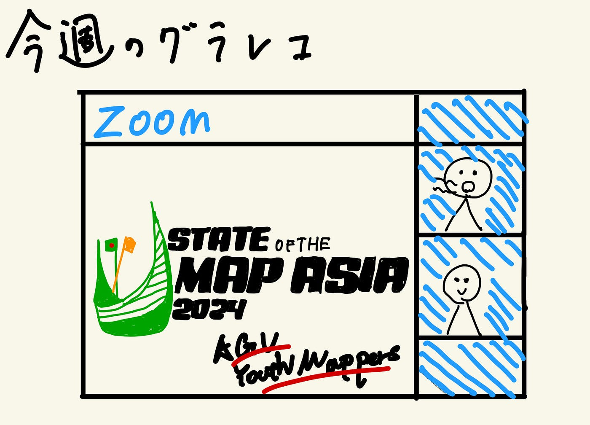

### Youth 週報(12/3)

こんにちは、３年の伊藤です。
今週のYouthの活動は11月30日と12月1日に行われたSoTM Asia 2024の国際会議について紹介します。

今週の活動概要として
・国際会議の準備
・SoTM Asia 2024の国際会議の当日

### 国際会議の準備

先週完成させていた発表スライドの校閲とスクリプトの内容構成を中心に発表準備を行いました。その後、大会運営側から事前に動画を送って欲しいとの要請があったため、[作成したスライドとスクリプトを基に発表を行いました](https://youtu.be/nc385dhg4ms?si=dGoBAVzANfm0wU-u)。

作成したスライド

### SoTM Asia 2024の国際会議の当日

発表当日は、開催運営側からのメールが届かないなど、多少のトラブルがありました。当日の変更事項など、グローバル規模で発表をすることの洗礼を受けましたが、無事国際会議を終えることができ、良かったです。

