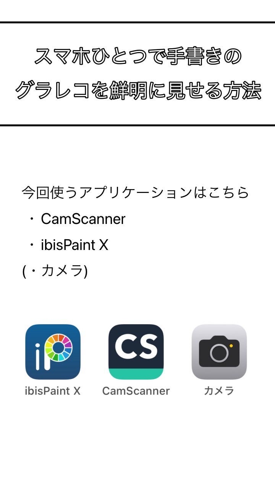
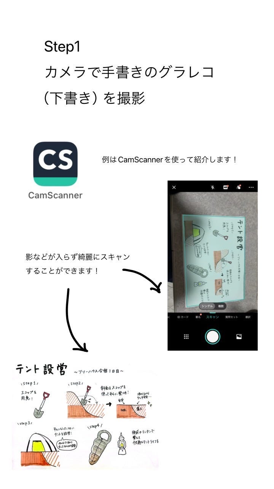
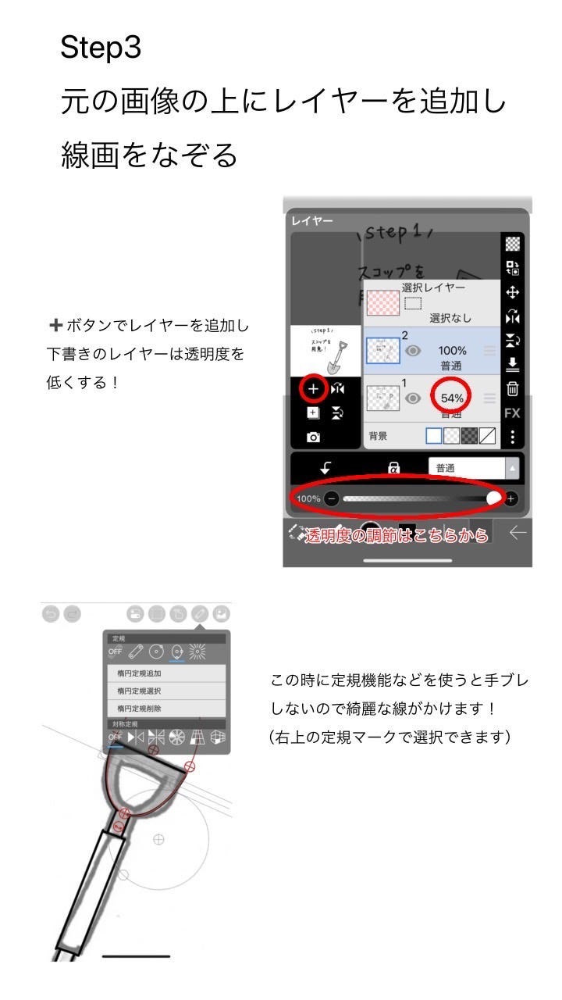
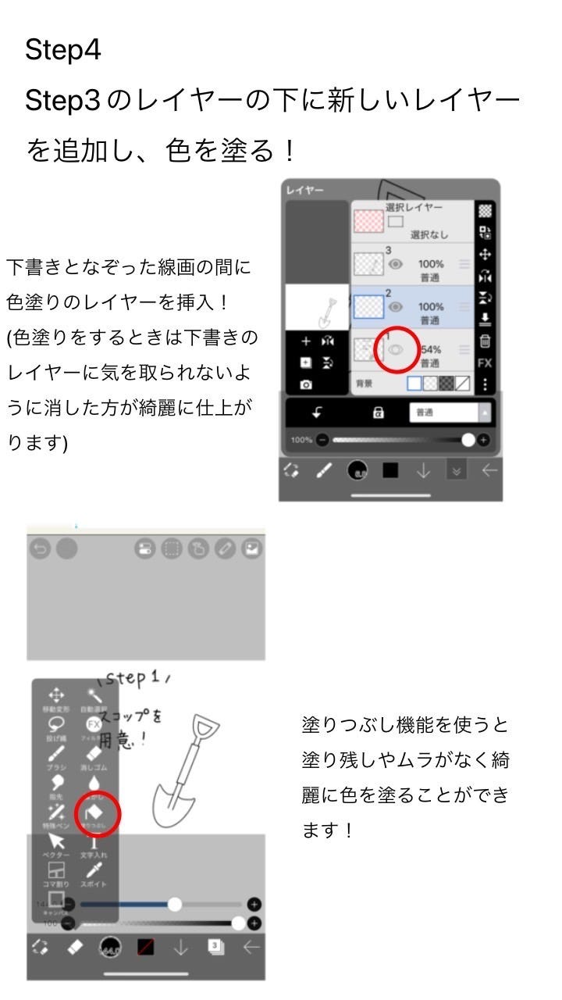
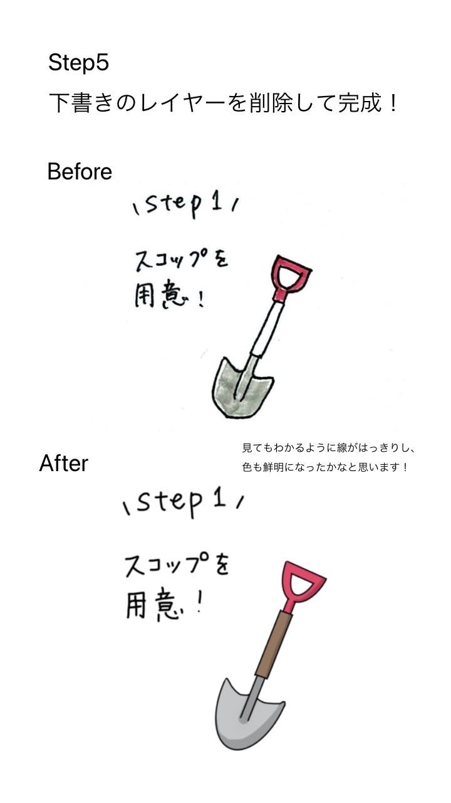
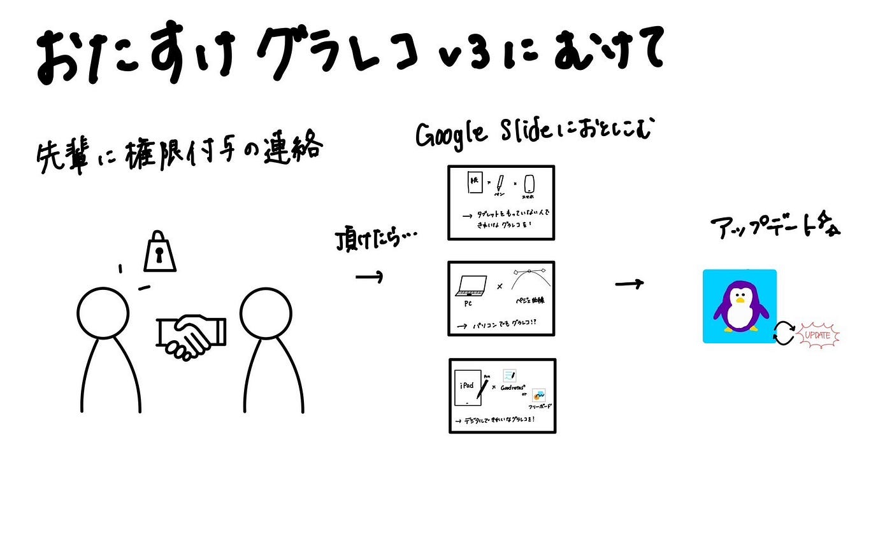

### グラレコアプリV3を作ろう大作戦

こんにちは！デザイン部3年の滝沢です。

今週の週報は、先週に引き続き「グラレコのアプリの提案」についてです。部内では[「おたすけグラレコ」](https://otasukegrareco.glideapp.io/)に組み込むアプリのアップデートについて話し合いました。

「おたすけグラレコ」について調べたところ、あるゼミ生がゼミ論としてこのアプリを作成していたことが分かりました。

このアプリについては[「おたすけグラレコ」アプリの公開レポジトリ](https://github.com/furuhashilab/otasukegrareco?tab=readme-ov-file)に詳しく記載されています。

このアプリの内容をアップデートするにあたってまず初めに行うこととして、安田さんへアプリの編集権限をいただきたいとご連絡させていただきました。しかしゼミ論でこのアプリを作成したのは佐藤さんであるため、佐藤さんにも連絡をしてみようかと思います。いずれにせよ、安田さんからの返信があり次第、アップデートを進めていきたいと思います。

アップデートする内容は「スマホでグラレコを鮮明に見せる方法」です。以下、Googleslideに組み込む材料です。

ここで、この写真をGoogleslideに埋め込むにあたってどのように縦→横に変更するのかという疑問が生じる。切り取りを使ってみようかと考えたが、より効率的な方法がないかと模索中．．．→古橋先生にアドバイスをいただく？佐藤さん、安田さんに相談してみる？

次回は、安田さんに編集権限をいただきこの写真をGoogle slideに貼り付けていきたい。

