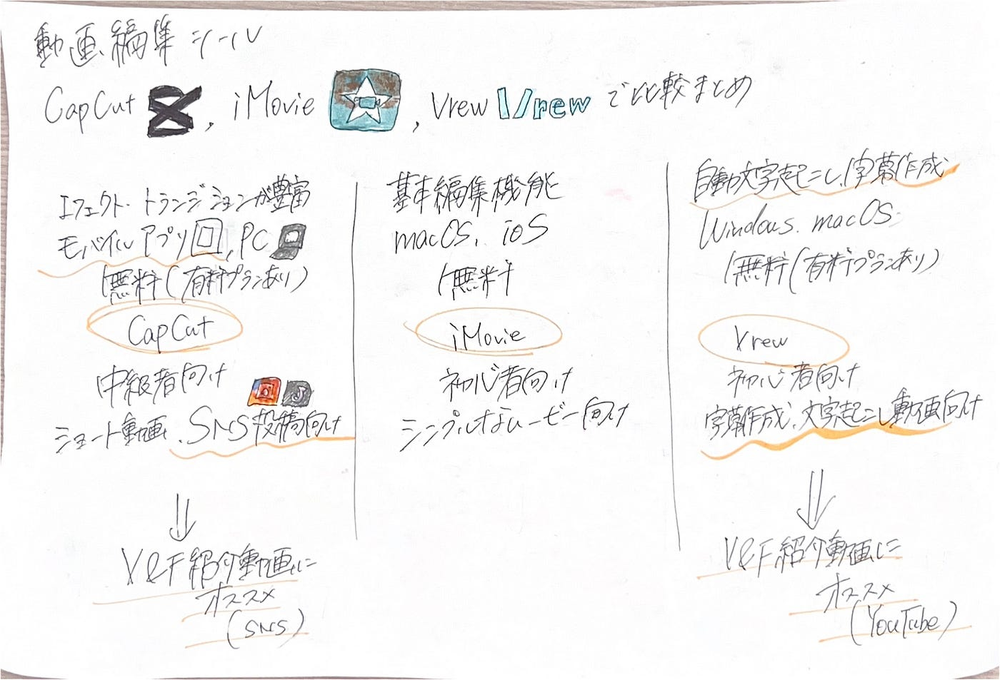

### **動画編集ツールまとめはこちら**

#### V&F 12月3日週報

こんにちは、V＆F３年の滝沢未広です。先週ご紹介したV＆F紹介動画に使用する動画編集ツールについてCapcutを使用することになっていますが、過去の記事でその他ツールを紹介したのでここにまとめました。

#### 1. CapCut

- **概要**:[ CapCut](https://www.capcut.com/ja-jp/)は、ByteDance（TikTokを運営する企業）によって開発された無料の動画編集アプリです。特に、スマートフォンで簡単に使えるため、TikTokやInstagramなどのショートビデオ向けに人気があります。

- **主な特徴**:

- **多機能な編集ツール**: トリミング、カット、合成、音楽追加、エフェクト、フィルター、トランジションなど、豊富な編集機能を提供。

- **AIベースのツール**: 自動字幕生成や背景除去など、AI技術を活用した機能が充実。

- **簡単な操作性**: 初心者でも直感的に使用できるUI（ユーザーインターフェース）。

- **高度な編集機能**: 複数レイヤーの編集やキーフレームアニメーションなど、プロフェッショナル向けの機能も搭載。

[CapCutについて記事](https://medium.com/furuhashilab/v-f-%E9%80%B1%E5%A0%B1-b7e2be6996ab)にしているので詳細はこちらをご覧ください。

### 2. iMovie

- **概要**:[ iMovie](https://www.apple.com/jp/imovie/)は、AppleのiOSデバイス向けに開発された動画編集アプリで、直感的な操作で映像を作成できることから、初心者から中級者向けに人気があります。特にApple製品との相性が良いです。

- **主な特徴**:

- **テンプレートの豊富さ**: プロフェッショナルな品質のテンプレートを使って、簡単に映像を作成できる。

- **直感的なタイムライン編集**: 操作がシンプルで、タッチスクリーンでの編集に最適化されている。

- **高品質なエフェクトとトランジション**: 視覚的に魅力的なエフェクトやトランジションが多く、ビジュアルを強調できる。

- **Apple製品との連携**: MacやiPhoneとの互換性が高く、iCloudを通じてデバイス間でのデータ同期が可能。

[iMovieについて記事](https://medium.com/furuhashilab/%E5%8B%95%E7%94%BB%E7%B7%A8%E9%9B%86%E3%81%97%E3%81%A6%E3%81%BF%E3%81%9F-29d5d30510bf)にしているので詳細はご覧ください。

### 3. Vrew

- **概要**: [Vrew](https://vrew.ai/ja/)は、主に自動字幕生成に特化した動画編集ツールで、特に日本語や多言語の字幕作成が得意です。YouTubeやSNS向けに手軽に動画を作成したいユーザーに人気です。

- **主な特徴**:

- **自動字幕生成**: 音声認識技術を使用して、動画内の音声から自動で字幕を生成。これにより、字幕編集の時間を大幅に短縮できる。

- **多言語対応**: 日本語、英語、韓国語など、多言語の字幕をサポート。

- **字幕の簡単な編集**: 自動生成された字幕を簡単に修正・調整できるインターフェース。

- **インタラクティブなUI**: 自動字幕の修正、追加や削除を簡単に行うことができるユーザーフレンドリーなUI。

[Vrewについて記事](https://medium.com/furuhashilab/ai%E3%82%92%E7%94%A8%E3%81%84%E3%81%9F%E5%8B%95%E7%94%BB%E7%B7%A8%E9%9B%86-v-f%E9%80%B1%E5%A0%B1-cd6c1387da51)にしているので詳細はこちらをご覧ください。

比較まとめ

⤴︎このように比較してみると、Capcutはアプリとパソコンで使用可能で学生が手軽に使いやすく、SMS投稿に向いていることがわかります。また、Vrewは字幕作成や文字起こしをAIが行なってくれるためYoutubeの編集に向いていることが分かります。

V&F紹介動画に向いている編集ツールはどれか？

⇨比較まとめから**tiktokにはCapcut、**

**古橋研究室公式YoutubeにはVrew**が向いていることが分かりました‼︎
