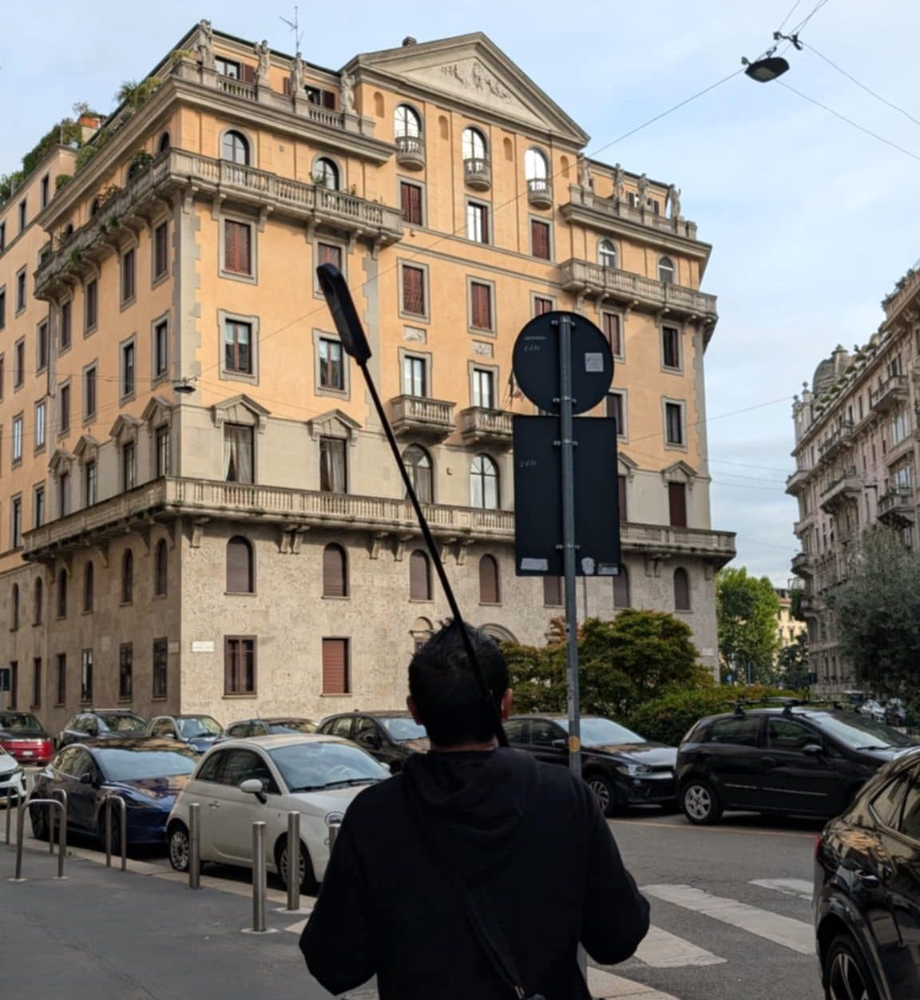
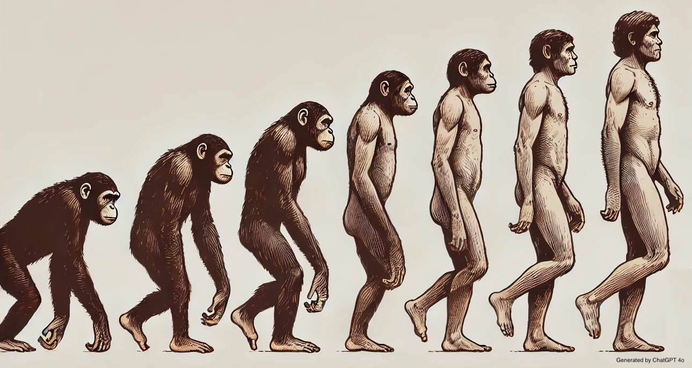
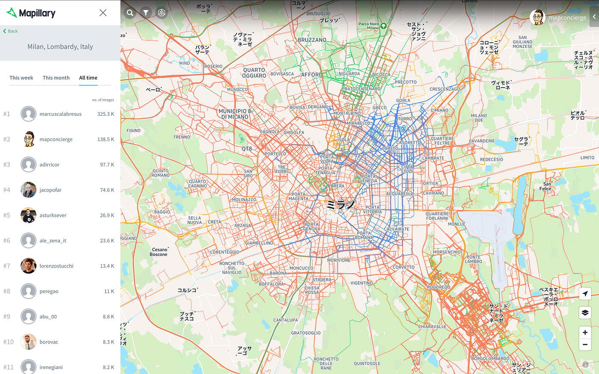
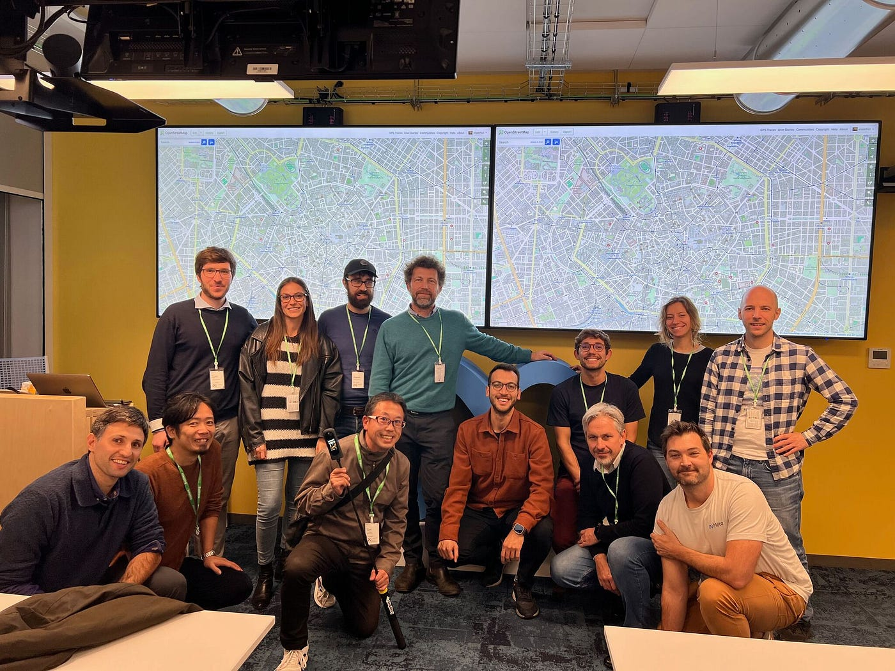
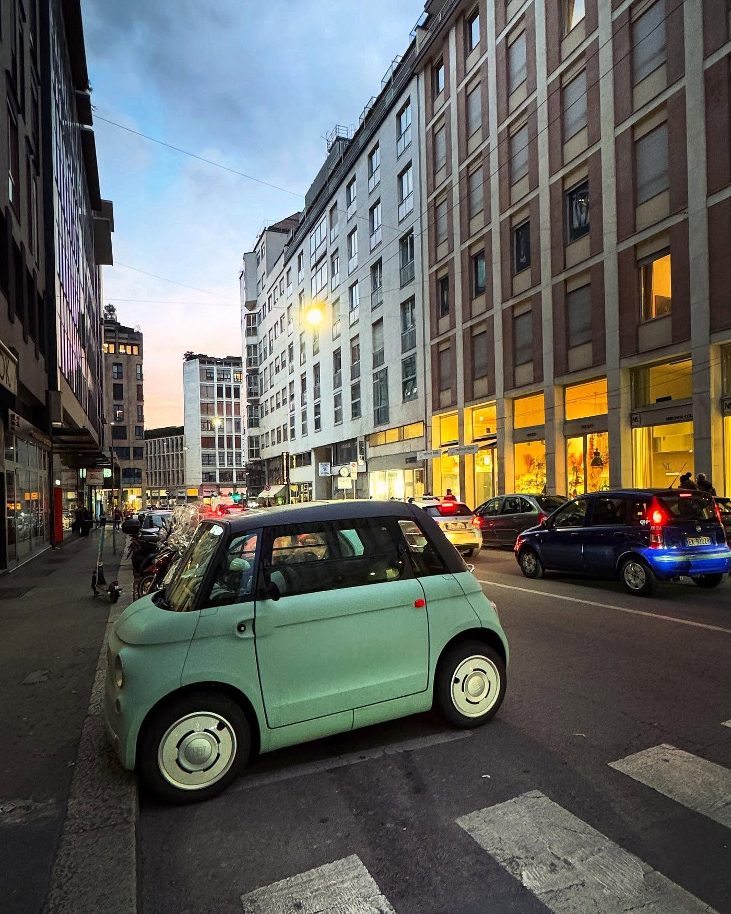
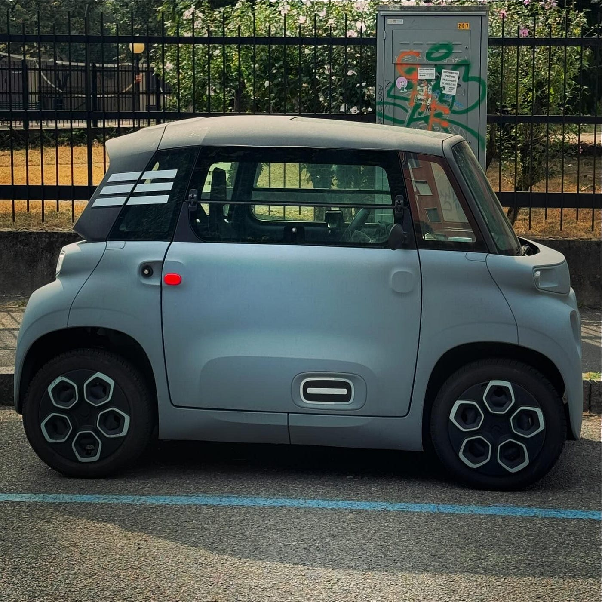
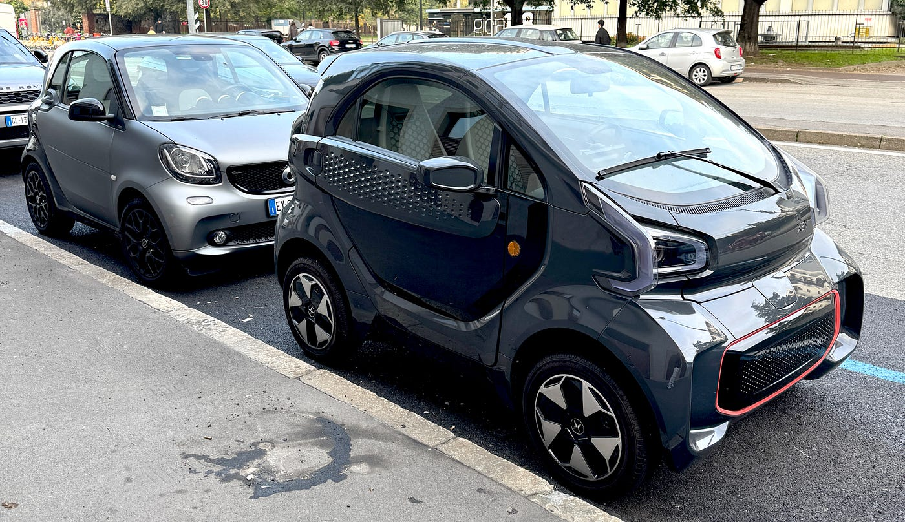

### 最もフィジカルで、最もプリミティブで、最もフェテッシュなやり方で都市を観察しています。

ハリソン古橋です。2024年しか使えないタイトルなので、アドベントカレンダー2024ネタとして拝借しましたが「[地面師](https://ja.wikipedia.org/wiki/%E5%9C%B0%E9%9D%A2%E5%B8%AB)」は2024年公開作品の中でもジオ業界として絶対見ておくべき推奨作品といえます。このためだけに Netflix 課金しても元が取れます。都市を扱う[Project PLATEAU](https://www.mlit.go.jp/plateau/)関係者の皆さんには特にオススメです。

さて、あなたは毎日、自分の住んでいる街をどのくらい歩きますか？

一般的に普段の生活で[健康を維持するために歩く歩数は7,000–8,000歩くらい、しっかり歩いた日で10,000歩](https://www.citizen-systems.co.jp/health/column/knowledge/walking/walking_02.html)を超えると言われています。

[ミラノ工科大学でのサバティカル在外研究が始まった9月1日から、宿舎と大学までの間は原則徒歩での移動にしてきました](https://medium.com/furuhashilab/%E6%97%A5%E3%80%85%E6%98%AF%E5%A5%BDlog-a5f1d97efc3e)。途中何度か引っ越しましたが、だいたいどの宿舎からも片道徒歩で40–50分くらいの距離。しかも、毎日歩くルートを変えることで、片道１時間前後、１日往復で２時間ほどの距離を歩いています。[移動軌跡記録アプリStrava](https://www.strava.com/)のログをみると、古橋はだいたい１時間で 6,000歩くらい歩いているようなので、１日の往復だけで約12,000歩。それ以外の移動も含めて、約20,000歩がデフォルト、多い日は30,000歩もミラノの街を歩いています。

#### ハリソン古橋スペック2024

- 徒歩による平均移動速度： 4.5 km/h

- 平均歩数： 6,000 foot/h

- １日あたりの平均歩数： 20,000〜30,000 foot/day

この日々20,000〜30,000歩のウォーキングをどのように街歩きに使っているのか、より具体的な都市の観察手法を解説しましょう。

### 1. 街を観察するには徒歩が一番

最もフィジカルで、最もプリミティブな人類の移動手段は何と言っても「徒歩」です。少し速歩きに近いペースの 5km/h で往復２時間だとすると、おおよそ10kmの道のりを歩いていることになるわけです。とりあえず片道5km圏内の目的地で時間の制約がなければ、躊躇なく徒歩を選択するでしょう。公共交通機関に頼るのは常にプランBなのです。

フィジカルな徒歩という移動手段は、肉体的な関節や筋肉を程よくほぐしてくれて、日々のイタリアの食文化を体験する名目で確実に拡張しつつある体内の脂肪やコレステロールの減少を促してくれます。宿舎にジムも併設されているのですが、今のところ外に出かけたほうが街の風景を観察できる意味で、二度美味しい。良い研究には、日々メンテナンスされた肉体が重要なのです。

またプリミティブな歩行という行為は、人間が人間たる能力として獲得した術であり、人によっても得手不得手や、場合によっては歩行困難な状況に陥ってしまうケースもあれど、多くの人が選択しうる、移動手段とも言えます。場合によっては車椅子での移動も広義の徒歩と言ってよいでしょう。

この最もフィジカルで、最もプリミティブな徒歩によって街を観察すると、車や自転車、電車やバスなどの移動速度が速すぎるモビリティで街を観る場合と比べて、より詳細で空気感が伝わる、生々しい都市の要素を受け取ることができます。

### 2. 移動中のデータ記録はデバイスに任せろ

よく、一眼レフカメラなどを使っているときに感じることですが、カメラに街の風景を記録をしているとき、人間はカメラのファインダーとレンズを経由して、その景色の一部のみを切り取ったかたちで記録を行っていることに気づきます。しかも写真を撮り終わったあとは、なぜかその空間のすべてを記録した気にもなっているのが不思議です。実際には、カメラというデバイスの枠を超えていないわけで、カメラトリミングされなかった周りの景色を振り返ったり、その場の喧騒や匂いや温度感を肌で感じる能力は、現時点では人間の肉体のほうが性能は上です。

そういった意味からも、ハリソン古橋の街歩き手法は、可能な限りデータ記録は自動的に行い、人間があまり関与しないスタイルにすべきで、人間の身体は全身を使って街を観察するセンサーであるべきという哲学で日々アップデートしてます。

### 2–1. 移動の軌跡はStrava

移動の軌跡はスマホアプリ [Strava](https://www.strava.com/) がデフォルトです。[YAMAP](https://yamap.com/)など他のアプリを使うこともありますが、何といっても、[GPS/GNSS](https://en.wikipedia.org/wiki/Satellite_navigation)記録開始へのUI/UXがシンプルで、グローバルに使われているため、海外の友人ともデータの共有が行いやすいのが特徴。また無課金でも自分の移動軌跡ログをGPXファイルでダウンロードできるのは安心感があります。また Facebook の友人とも繋がりやすく、お互いになんとなくジョギングしたりサイクリングしたり、ウォーキングしたりのアクティビティがタイムラインに流れてくるので、案外モチベーションもあがります。最近のスマートフォンは GPS/GNSS が２周波対応している端末も増えてきて、都市部での位置精度の悪化をある程度は抑えられるのもオススメです。次にスマホを買い替えるときは２周波対応を選びましょう。

[Strava | Running, Cycling & Hiking App - Train, Track & Share
Strava connects millions of runners, cyclists, hikers, walkers and other active people through the sports they love …www.strava.com](https://www.strava.com/)

### 2–2. 風景の記録はMapillary

街の景色を記録するのは 360°パノラマカメラメーカーとしては老舗でもある [Ricoh の THETA X](https://blog.ricoh360.com/en/12714) 一択です。廉価版として [GoPro MAX](https://gopro.com/en/us/news/max-tech-specs-stitching-resolution?srsltid=AfmBOoo9RmDOM0WYWxNFHvRTk9ver8CfS49yDwap9W8r58mr0vFy45Vj) も嫌いではないですが、なにしろ解像度が高く、安定して撮影ができるという点では総合的に比較すると、お世辞抜きで [THETA X のほうが上](https://blog.ricoh360.com/en/12714)です(GoPro MAX2 は出ないのかな？)。難点はちょっとお高いことくらい。それでも予算が余裕があれば THETA X にすべきです。少しでも THETA X を安く手に入れたい方は筆者に相談してみてください。タイミングによっては割引がされている時期があります。それにしても、動画で8K、静止画で11Kの高解像度データがGPS/GNSSメタデータ(THETA X は [CAMM形式](https://developers.google.com/streetview/publish/camm-spec?hl=ja))付きで記録できる時代がやってきたことに覚醒の感があります。

THETA X の推しポイントについては 11/5 にミラノで開催された [Mapillary イベント Walkabout Milano で熱く語りました](https://speakerdeck.com/fullfull/mapillary-with-theta-x-in-milano)。とくに8K動画の2FPSモードが手間いらずです。

Mapillary with THETA X @ Walkabout Milano, Meta Office in Milano

これらのデータを [Mapillary Uploader](https://www.mapillary.com/desktop-uploader) を使って公開すれば、都市の最新ストリート画像がアーカイブされていきます。

アーカイブされたデータは[Mapillary](https://www.mapillary.com/)内でも３次元点群処理やオブジェクト抽出が行われ、３次元データと都市内にあるさまざまな地物を自動抽出してくれます。まさに街の地図を記録しながら、最新のデジタルツインを整備していくうえでの基礎資料として [Mapillary](https://www.mapillary.com/) データはProject PLATEAUや、その他海外でのデジタルツインデータ整備、都市の分析にはMapillaryデータは欠かせない存在となっています。

2024年を例にすると、Mapillaryなどのストリートレベル画像を用いて持続的な都市とサイクリング活動の関係性について分析した研究があります。[Ito, K., Bansal, P., & Biljecki, F. (2024). Examining the causal impacts of the built environment on cycling activities using time-series street view imagery. _Transportation Research Part A: Policy and Practice_, _190_, 104286.](https://www.sciencedirect.com/science/article/pii/S0965856424003343?dgcid=coauthor)

そして何より重要なのは、Strava 記録も THETA X を使った[Mapillary](https://www.mapillary.com/)撮影も、記録開始さえしてしまえば、ある程度の時間（THETA X の動画記録シーケンスは最大25min）は、自分の目や耳や鼻などを使ったヒューマンセンサーによる都市のスキャン(観察)に集中できることです。

[Mapillary
Street-level imagery, powered by collaboration and computer vision.www.mapillary.com](https://www.mapillary.com/)

### 3. 移動中は五感で街を感じる

街歩きを最もフェテッシュに楽しむには目や耳や鼻などの人間が持つセンサーをフル活用して都市の要素を感じることです。色や形、構造、看板のサイン、街を行き交う人々、さまざまなモビリティが発する音や空気感、街路樹や歩道の状態、バリアの存在や道端に転がるゴミ、落書き、浮浪者がどこで寝ているのか、街の治安、その他、多くの情報は画像やGPS/GNSSのログだけではすべてを記録ができないため、人間が補完していく必要があります。どこにこだわるか、観察する側が持つ、それぞれのフェティシズムに合わせて、街を感じることが街歩きの秘訣です。

ちなみに筆者は、超小型モビリティ・フェチなので、町中で見かけるおなじみ Smart から Fiat Topolino、Citroen Ami、Renault twizy などなどがミラノの街にどのように最適化されて使われているのか日々観察しています。

気になるものがあったらすぐに立ち止まってじっくり観察。徒歩ならば自分のペースで自分の興味に合わせてじっくりと街を堪能できます。そういう意味では、単なる作業としてではなく、やはり自分の好みに全振りしたフェテッシュな街歩きに徹するのが長続きのコツです。

### 4. ストイックにやらない

１日20,000〜30,000歩とは言えども、あまり無理はしません。特に電子機器は水や塵で壊れやすいので、たとえば雨の日はあっさり諦めて、極力宿舎で研究活動に没頭しています。防水ハウジングをつけるという選択肢もありますが、結局雨のときはクリアな画像が得られないので、無理はしません。普段通り、いつもどおりにできるときは街歩きをするし、天気が悪い日はあっさり諦めて、室内でできる作業にきりかえればよいのです。継続性を重視する場合は、ストイックにやりすぎると、どこかで心が折れます。

ああ、雨が降っているなぁと思ったら、ハリソン古橋からカメハメハ古橋に変わるのです。

１年間のミラノ赴任期間中に中心部のほぼすべての道を踏破する！さらに、撮影したデータを分析することで3D都市モデル化を行い、ミラノデジタルツインデータの試作を行う！

「ターゲットは大きければ大きいほど狙いやすい。」とハリソン山中も言っていますね。

では、みなさんよい街歩きを！

この投稿は 2024年アドベントカレンダー [古橋研究室](https://qiita.com/advent-calendar/2024/furuhashilab)、[青山学院大学地球社会共生社会学部](https://adventar.org/calendars/10117)、[Project PLATEAU](https://qiita.com/advent-calendar/2024/plateau) の12/1日分として書きました。
