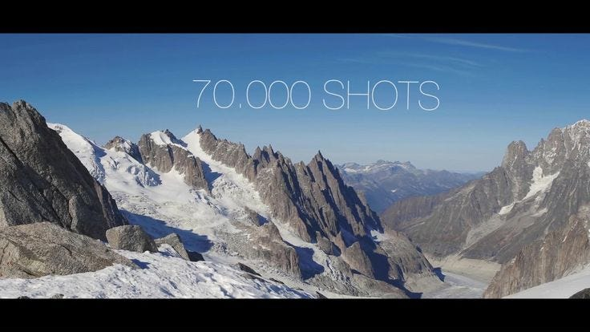
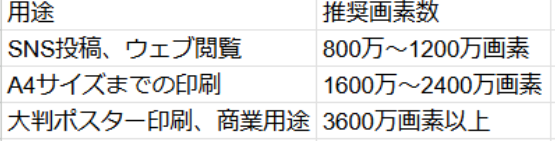
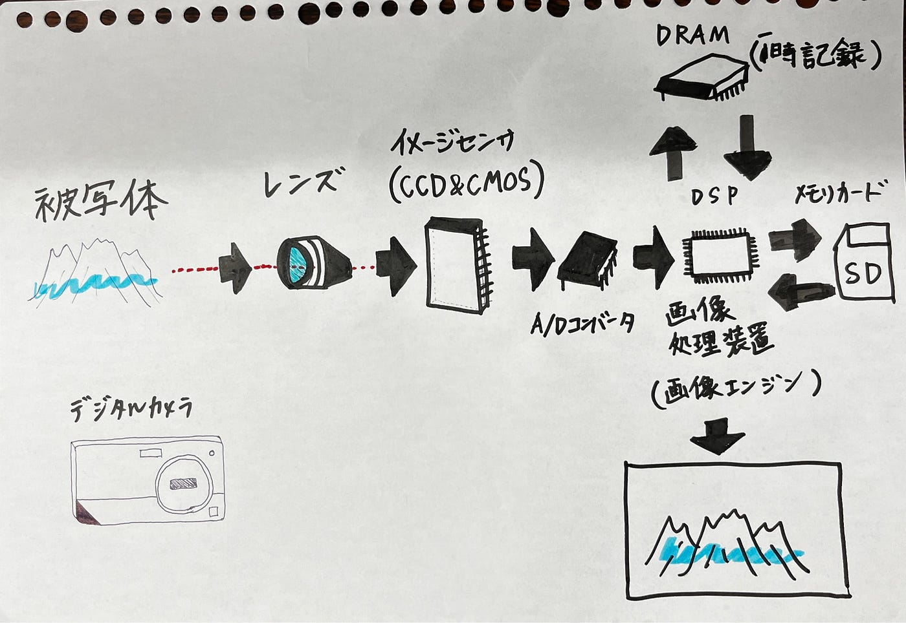

### 世界一高画質、どんな写真？

こんにちは、ドローン部の佐藤と林です！

今回の話は、タイトルの通りです。ちなみに、世界一高画質な写真をスマホで見ようとしたら、容量が重すぎて、ダウンロードすらできませんでした。ここでは、その写真と撮影プロジェクトの概要を説明します。また、カメラ機器の性能と画素数を比較してまとめてみました。

### 画像処理時間2ヵ月、驚異の高画質！

#### 概要

写真の世界では、技術の進化に伴い、驚異的な高画素数の画像が登場しています。その代表例として、2015年に公開されたアルプス山脈の写真があります。この画像は、約7万枚の写真を組み合わせ、総容量46TB、3650億画素という世界最大級のパノラマ写真として知られています。

右のYouTubeリンクから、**[実際の撮影記録ムービー**](https://www.youtube.com/watch?v=Dwyx0h9h8zg&hd=1)を見ることができます。めちゃ面白いです。ちなみに、記録用SDカードは128GBを複数枚使用したらしいです。7万枚の衝撃がえぐいです(笑)。

このプロジェクトは、イタリアの写真家フィリッポ・ブレンジーニ氏のチームによって行われました。撮影には15日間を要し、標高3500メートル、気温マイナス10度という過酷な環境で行われました。使用された機材は、キヤノンのEOS 70Dと高性能な望遠レンズで、撮影後の画像処理には2ヶ月費やしています。

このような超高画素の写真は、細部まで鮮明に表現できるため、風景写真や大判プリントに適しています。しかし、一般的な用途では、そこまでの高画素数は必ずしも必要ではありません。例えば、日常的なスナップ写真やSNSへの投稿であれば、800万〜1200万画素で十分とされています。

カメラの画素数は、用途や目的によって適切な値が異なります。以下に、一般的な用途別の推奨画素数をまとめました。

高画素数のカメラは、細部まで鮮明に撮影できる一方で、データ容量が大きくなり、処理や保存に高い性能が求められます。また、センサーサイズやレンズの性能も画質に大きく影響するため、画素数だけでなく、カメラ全体のバランスを考慮することが重要です。

最近のスマートフォンでは、1200万画素程度のカメラが主流となっています。これは、日常の撮影やSNSへの投稿において、十分な解像度とデータ容量のバランスが取れているためです。一方で、プロの写真家や印刷業界では、より高画素数のカメラが求められることがあります。しかし、高画素数が必ずしも高画質を意味するわけではなく、センサーサイズやレンズの質、画像処理技術など、他の要素も画質に大きく影響します。

#### 疑問

・各写真の重複率は何％？：ドローンの空撮などは基本的に80％だと言われているが、この場合の目安はどれくらいか

### （追記）ドローンに搭載されるカメラの性能比較

ドローンには、基本的に操作用・撮影用のカメラが事前に搭載されている場合が多いです。ドローンに搭載されるカメラは、用途や機種によって多様な種類と性能を持ちます。以下、代表的なドローンのカメラ性能を比較し、用途別に適したモデルを紹介します。

**1. DJI Mini 3 Pro**

- **センサーサイズ**: 1/1.3インチ CMOS

- **有効画素数**: 48MP

- **動画解像度**: 4K/60fps

- **重量**: 249g

- **特徴**: 軽量で持ち運びやすく、高画質な写真と動画撮影が可能。初心者や旅行者向け。

**2. DJI Air 3**

- **センサーサイズ**: 1/1.3インチ CMOS（広角および中望遠のデュアルカメラ）

- **有効画素数**: 48MP

- **動画解像度**: 4K/100fps

- **重量**: 720g

- **特徴**: デュアルカメラシステムにより、多彩な撮影視点を提供。全方向障害物検知機能を備え、中級者やプロユーザー向け。

**3. DJI Mavic 3 Pro**

- **センサーサイズ**: 4/3型 CMOS（ハッセルブラッドカメラ）

- **有効画素数**: 20MP

- **動画解像度**: 5.1K/50fps

- **重量**: 958g

- **特徴**: 高品質なハッセルブラッドカメラを搭載し、プロフェッショナルな映像制作に最適。全方向障害物検知機能を兼備。

**4. DJI Inspire 3**

- **センサーサイズ**: フルサイズ CMOS

- **有効画素数**: 未公開

- **動画解像度**: 8K/75fps

- **重量**: 3995g

- **特徴**: シネマティックな映像制作向けに設計され、プロフェッショナルな映画制作に対応。高度な飛行性能とカメラ機能を兼備。

#### **用途別おすすめドローン**

- **初心者・旅行者**: 軽量で操作が簡単な「DJI Mini 3 Pro」がおすすめです。高画質な撮影が可能で、持ち運びにも便利です。

- **中級者・映像クリエイター**: デュアルカメラと全方向障害物検知機能を備えた「DJI Air 3」は、多彩な撮影ニーズに対応します。

- **プロフェッショナル映像制作**: 高品質なハッセルブラッドカメラを搭載した「DJI Mavic 3 Pro」や、シネマティックな映像制作に特化した「DJI Inspire 3」が最適です。

ドローンのカメラ性能は、センサーサイズ、画素数、動画解像度などが重要な要素となります。用途や目的に応じて最適なモデルを選ぶことで、期待通りの撮影結果を得ることができます。

#### 参考文献

**[DJI公式ウェブサイト: 一般向けドローンの比較**](https://www.dji.com/jp/products/comparison-consumer-drones) Mavic 3 Pro、Mini 4 Pro、Air 3などの一般向けドローンの詳細な比較

**[WIREDによるDJI Air 3Sのレビュー](https://www.wired.com/review/review-dji-air-3s) **DJI Air 3Sの1インチセンサー搭載によるダイナミックレンジの向上や低照度下での画質改善について

**[The VergeによるDJI Air 3Sの紹介記事**](https://www.theverge.com/2024/10/15/24269740/dji-air-3s-drone-specs-price) DJI Air 3Sのデュアルカメラシステムや全方向障害物検知機能、低照度環境での性能向上について

### まとめ

結論として、カメラの画素数は多ければ良いというものではなく、使用目的や求める品質によって適切な画素数を選ぶことが大切です。画像処理できるレベルまで画素数を絞らないと作業に支障が出てしまいます。最新の技術によって、超高画素の写真が可能となっていますが、日常の撮影や一般的な用途では、適切な画素数のカメラを選ぶことで、十分に美しい写真を楽しむことができます。

### _**グラレコ_**

画像処理の仕組みをまとめました！

