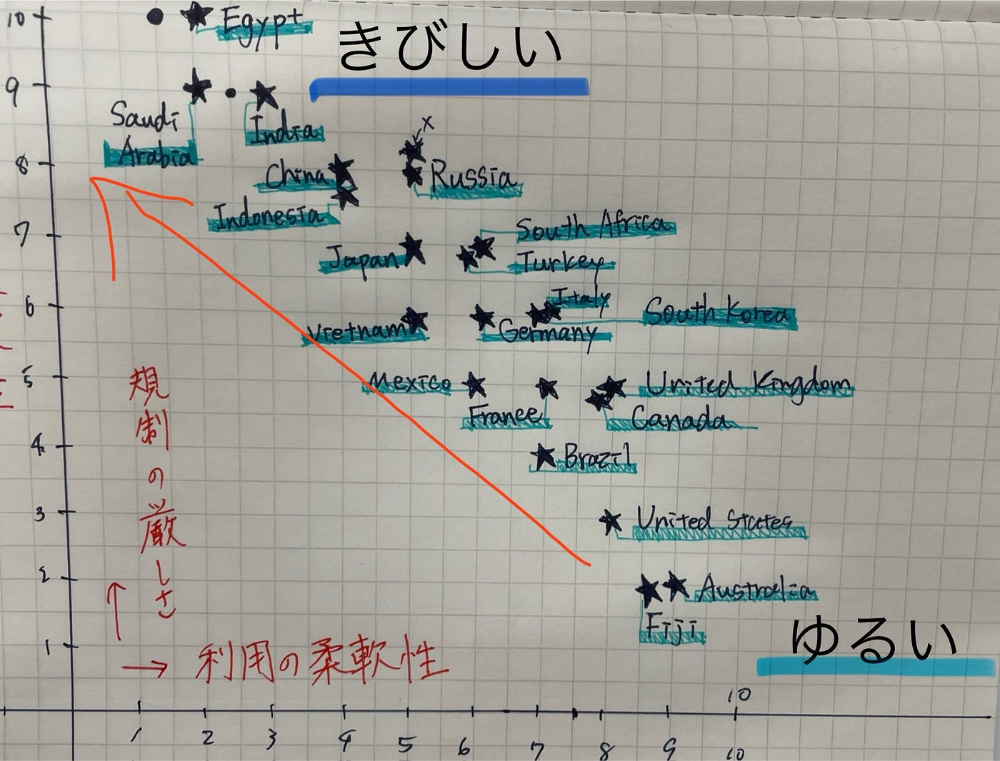

### 【旅行好き必見】海外旅行に最適なドローンと使い方ガイド

こんにちは、ドローン部3年佐藤と林です！

海外旅行でドローンを活用して、インスタ映えする写真や動画を撮りたいと思ったことはありませんか？ドローンは、一歩先行く旅の楽しみ方を提供してくれるツールです。でも、国ごとの規制や選ぶべきモデルを知らないと、せっかくの旅行が台無しになることも。

今週の記事では、**大学生や旅行好きな方**に向けて、以下の情報をわかりやすくまとめました！ぜひ、ご参考までに！！

### 目次

#### **1. 旅行におすすめのドローンモデル**

#### **2. 人気旅行先のドローン規制比較**

#### **3. 初めてのドローン旅行を成功させる準備と注意点**

これを読めば、ドローンを持って安心して海外旅行に行ける準備が整います！

### 1. 初心者でも安心！旅行におすすめのドローンモデル

大学生や旅行者にとって、ドローン選びで重要なのは「軽さ」と「扱いやすさ」です。特に以下のポイントに注目しましょう：

#### ドローンを選ぶポイント

- **軽量＆コンパクト**：250g未満のモデルは多くの国で規制が緩い。

- **簡単操作**：初心者向けのモデルはアプリ連動で操作も簡単。

- **価格**：学生でも購入しやすいコスパの良いモデルを選ぼう。

#### おすすめモデルTOP3

モデル名 重量 特徴 旅行向き度

_**No.1, DJI Mini 2 : ★★★★★ : _**約249g 軽量＆折りたたみ式で、4K動画対応。初心者に最適。

_**No.2, Holy Stone HS720E : ★★★★☆ : _**約460g GPS帰還機能付きで安心。価格も手頃。

_**No.3, DJI Mini4 pro: ★★★★☆: _**オープンマップ推奨オートパイロットの制御がしやすい。地図作りたい人向け。

### 2. 人気旅行先のドローン規制比較

海外では国ごとにドローン規制が異なるため、旅行先のルールを知ることが大切です。以下は、旅行者に人気の国々の規制概要です。

**1.日本** : 100g以上は登録必須。人口集中地区では許可が必要。 観光地周辺でも事前に禁止エリアを確認。

**2.アメリカ : **250g以上で登録必要だが、趣味利用は自由度が高い。 広大な自然の中での撮影がおすすめ。

**3.オーストラリア :** 120m以下の飛行が可能。趣味利用では許可不要。 ビーチや自然公園で撮影する際も周囲に配慮。

**4.イタリア :** 軽量モデルであれば許可不要。歴史的建造物付近は制限あり。 都市部より田舎での撮影が安心。

**5.フィジー :** 規制が緩やかで空撮が許可される場所が多い。 サンセットやビーチの撮影が魅力的。

### 3. 初めてのドローン旅行を成功させる準備と注意点

ドローンを初めて旅行に持って行くなら、以下の準備をしっかりしておきましょう。

#### 出発前の準備

**1.機体登録と保険**
 国によっては事前登録が必要。万が一に備えた保険も加入しておこう。

**2.機内持ち込みの確認**
 リチウム電池を搭載したドローンは、航空会社の規定を確認。通常は機内持ち込みが推奨されます。

**3.充電器や予備バッテリーの準備**
 撮影中にバッテリー切れしないよう、予備を用意。

#### 現地での注意点

- **周囲の安全を確認**
 人が多い場所や風が強い日には飛行を避ける。

- **プライバシーを尊重**
 他人の家や敷地を勝手に撮影しない。

- **禁止エリアを遵守**
 空港周辺や軍事施設付近はほぼ全ての国で飛行禁止。

### まとめ

この記事で紹介したポイントを押さえれば、初めてのドローン旅行でも安全に楽しむことができます。ぜひ次の旅にドローンを持っていき、特別な思い出を空から記録してください！

### 参考文献リスト

1. AEROG LAB, **【日本と諸外国のドローン飛行規制について】** [https://aerog-lab.com/a/【日本と諸外国のドローン飛行規制について】](https://aerog-lab.com/a/%E3%80%90%E6%97%A5%E6%9C%AC%E3%81%A8%E8%AB%B8%E5%A4%96%E5%9B%BD%E3%81%AE%E3%83%89%E3%83%AD%E3%83%BC%E3%83%B3%E9%A3%9B%E8%A1%8C%E8%A6%8F%E5%88%B6%E3%81%AB%E3%81%A4%E3%81%84%E3%81%A6%E3%80%91/) 閲覧日: 2024年12月10日.

1. K-DOTS **「ドローン規制各国比較」** [https://www.k-dots.jp/drone-regulation/3796](https://www.k-dots.jp/drone-regulation/3796) 閲覧日: 2024年12月10日.

1. NNA Global Navi**「海外におけるドローン規制の最新事情」** [https://nnaglobalnavi.com/?p=12635](https://nnaglobalnavi.com/?p=12635) 閲覧日: 2024年12月10日.

1. NEDO (新エネルギー・産業技術総合開発機構), **「2024年版ドローン規制のトレンド」** [https://reamo.nedo.go.jp/library/2024/04/Drones-regulation-trends-2024.pdf](https://reamo.nedo.go.jp/library/2024/04/Drones-regulation-trends-2024.pdf) 閲覧日: 2024年12月10日.

### グラレコ

### 勝手にまとめた国別ランキング：利用の柔軟性と規制の厳しさ

規制の厳しさ（y）が高い順、同点の場合は柔軟性（x）が低い順でソートしました。

1. **Egypt**: (2, 10): 許可取得が極めて困難で、趣味利用ほぼ不可。安全保障上の理由から厳格規制。

1. **India**: (3, 9): 登録・許可制が徹底され、商業・趣味利用ともに制約が多い。安全性と治安考慮から厳しい基準。

1. **Saudi Arabia**: (2, 9): 厳しい許可申請手続きや利用制限があり、観光目的でもハードル高。宗教・安全面から厳格。

1. **China**: (4, 8): 登録義務や飛行地域制限があり、都市部での飛行は困難。国家安全性確保のため厳しめ。

1. **Indonesia**: (4, 8): 観光地でも制限が存在。申請・報告義務があり、インフラや軍事施設周辺での飛行は禁止。

1. **Russia**: (5, 8): 許可申請や重量制限があり、特に重要施設周辺が飛行不可。安全保障上の懸念から規制強化。

1. **South Africa**: (6, 7): 許可取得がやや必要、特定地域で制限。法律整備進行中で、一部緩和もあるが依然やや厳しめ。

1. **Turkey**: (6, 7): 登録と一部許可制必要。観光撮影は可能だが都市部や重要施設周辺での制限は厳しい。

1. **Japan**: (5, 7): 100g以上登録必須、人口集中地区や空港周辺での飛行規制。夜間・目視外飛行も許可要。

1. **Vietnam**: (5, 6): 特定地域で申請・報告義務あり。観光地以外は制約が多く、重要施設付近での飛行はNG。

1. **Germany**: (6, 6): ヨーロッパ基準で一定の許可や登録が必要だが、条件クリアで趣味利用可能。プライバシー保護重視。

1. **Italy**: (7, 6): EUルールに準じ、登録・飛行エリア制限あり。景観保護や文化財付近での撮影制約。

1. **South Korea**: (7, 6): 市街地飛行に制限、重量規制、特定エリアで許可要。技術大国だが、安全考慮で中程度の規制。

1. **Mexico**: (6, 5): 一部地域での許可必要だが比較的ゆるめ。観光地での空撮はしやすいが、都心部は制限あり。

1. **United Kingdom**: (8, 5): EU離脱後も比較的明確なルールで運用。登録・重量規制ありつつも、クリアすれば趣味利用は簡易。

1. **Canada**: (8, 5): 登録と基礎テスト必要だが明確な運用ガイド有。許可条件を満たせば趣味・商業利用とも容易。

1. **France**: (7, 5): 登録制度とエリア制限あり。歴史的建造物保護やプライバシー考慮で制約もあるが、手続きは明確。

1. **Brazil**: (7, 4): 基本的な登録とルール遵守で飛行可能。広い国土で趣味利用は比較的自由度高め。

1. **United States**: (8, 3): 250g以下は登録不要、趣味利用しやすい。商業利用でも免許取得で多くの場所が許可内。

1. **Australia**: (9, 2): 広大な土地で趣味利用が極めて容易。最低限のルールで多くの場所で自由度が高い。

1. **Fiji:** (9, 2): 登録は不要だが、基本的なルールを守る必要あり、地上61メートル以下。操縦者の目視範囲内で操作必須。商業利用の場合、フィジー民間航空局（CAAF）への事前申請が必要。
