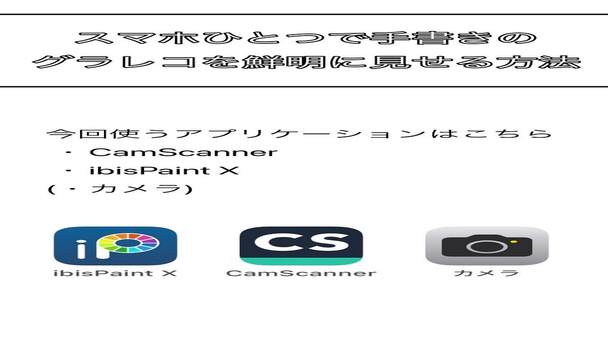
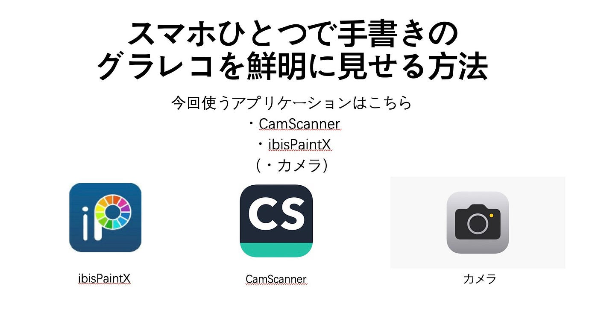
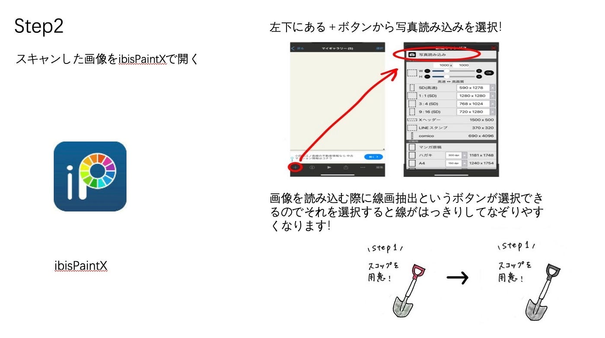
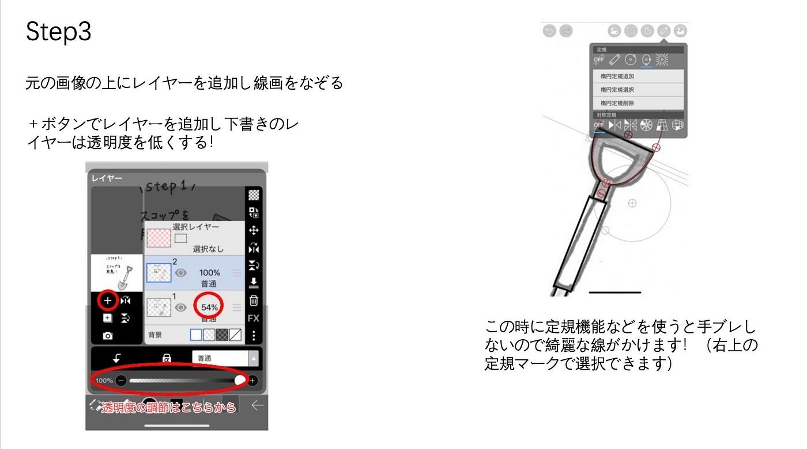
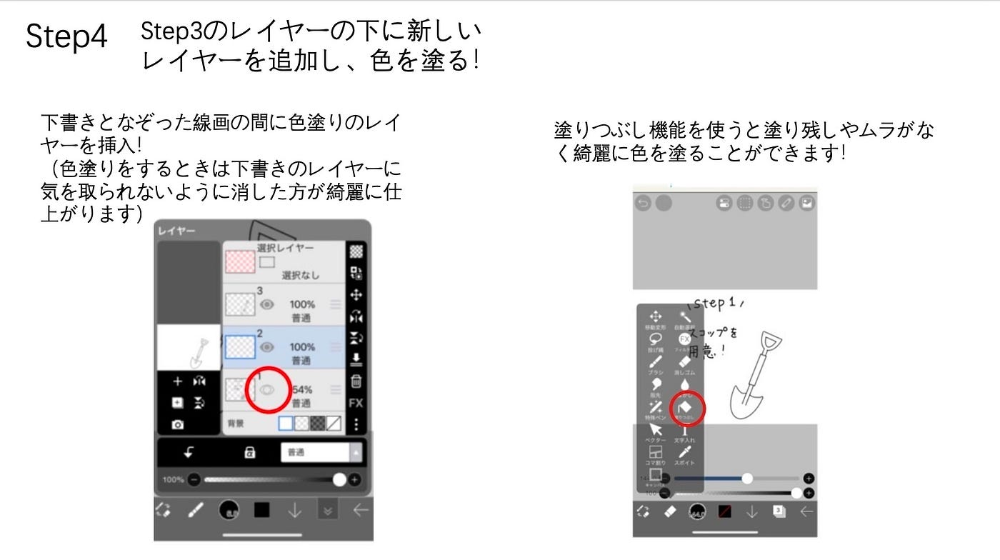
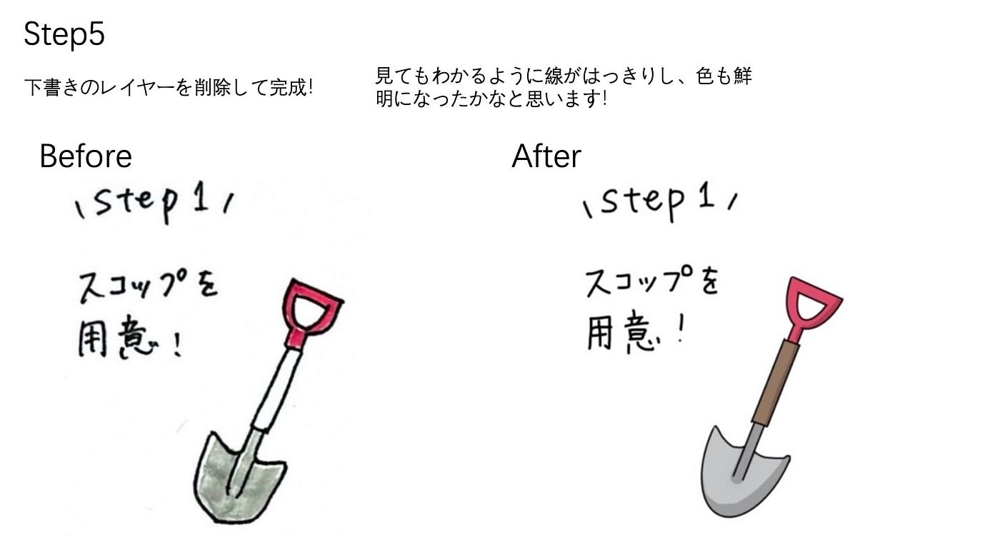
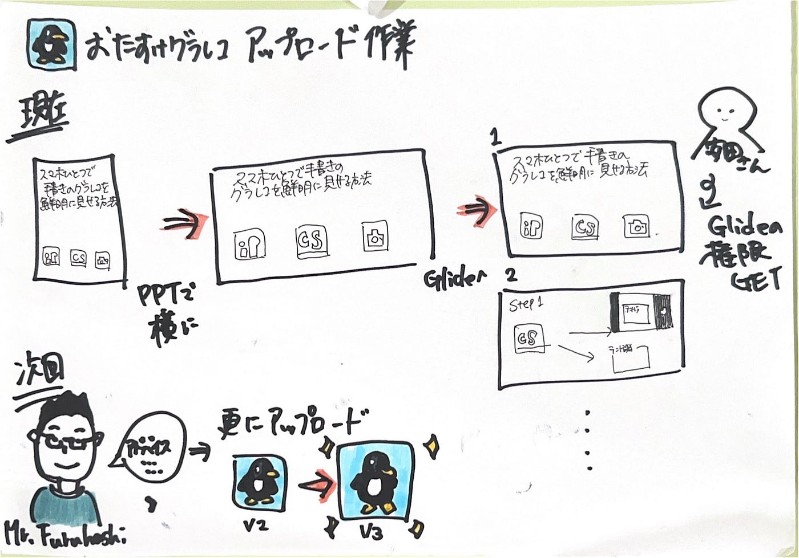

### 12/10 デザイン部週報おたすけグラレコ続き…

こんにちは、三年の福田です。

先週に続きグラレコの手書き編を「おたすけグラレコ」にアップデートする作業を続けています。

先週はスライドを縦から横にすることで止まってしまいました。そのあと色々と試してみたが、

こんな感じでした。

結果あまり上手くいかなかったので、私は同じ内容をPPTで作り直しました。

という感じで、このスライドを作ったURLを誰でも確認可にし、先輩からGlideの権限をもらうことができ、無事アップデートできました。

Glideで確認してみてください。

[おたすけグラレコ
Edit descriptionotasukegurareco.glideapp.io](https://otasukegurareco.glideapp.io/)

今回は手書きのグラレコをスマホで鮮明に見せる方法でした。また今後グラレコを簡単に描く方法、綺麗に描く方法を新たに気づくことがあったらどんどんアップデートしていきたいと思います。

