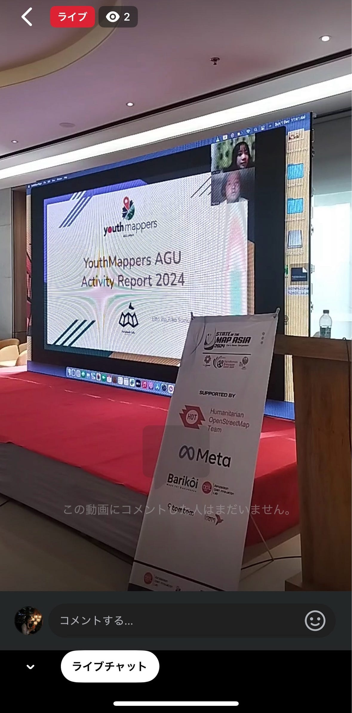
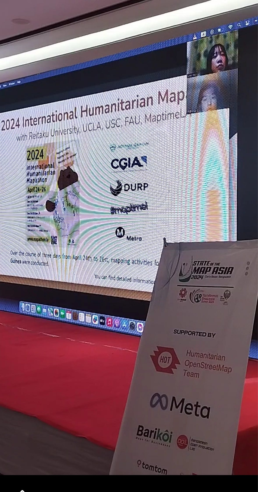

## SotM Asia 2024に参加してきました！

こんにちは、3年の末木です。

今回は2024年11月30日と12月1日の２日間でバングラデシュで開催された、[State of the Map Asia 2024](https://stateofthemap.asia//)（通称SotM Asia）に登壇したのでそちらの報告をさせていただきます！

> **発表について**

私たちは２日目の12月1日に登壇し、YouthMappers AGUの2024年の活動について発表しました。

具体的な内容としては以下のとおりです。

- UN Mappers Validation Workshop

- 2024 International Humanitarian Mapathon

- Wheelmap Mapathon（@Visa Japan）

- Crisis Mapping

- “Open Mapping towards Sustainable Development Goals” の翻訳作業

> **感想**

登壇が一ヶ月前に決まったということもあり、3人の日程を合わせることや、タスク分担などが難しく、準備段階で焦りがありました。また、国際会議が初めてであったことと、それがハイブリッドでの開催ということで、WEB会議のように行うのか、日程はいつなのか、などわからないことだらけで、英語でのメールのやり取りも苦戦しました。当日はFacebookのライブ配信で、私たちが登壇している様子（事前に提出したプレゼン動画）を見ました。スクリーンに映し出された動画のみで、会場の様子はあまりわかりませんでしたが、司会者の方からのコメントで不安だらけだった準備の苦労が報われたような気がしました。

[実際に使ったスライド](https://docs.google.com/presentation/d/1N2g2OLvJUM7MolCm7G5-PEQzRWf9nrW_KsKBBLobrSU/edit)

登壇の様子

