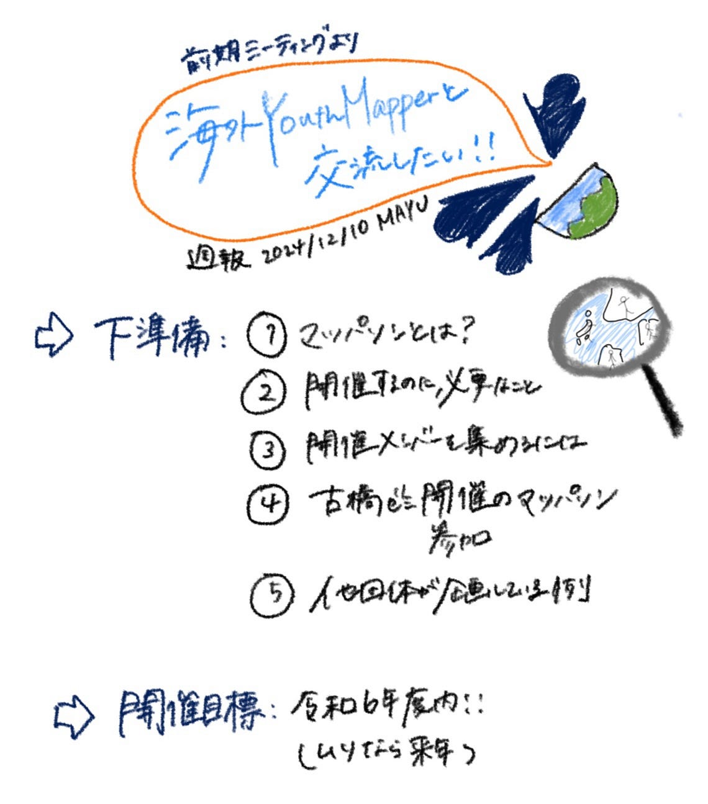

## 12/10週報

三年の金澤です。

今週は、前期にユースメンバーで『海外youthと交流したい』という声が多かったため、AGU主催のマッパソンを実行すると目標立て、話し合いました。

(海外Youthとの交流をしたい⇨個々人のスキルアップ、タスキングマネージャーが有用、チームでノルマを決めて教え合う⇨イベントに参加⇨知識と人脈を獲得⇨自分たちで開催する)

まずはマッパソンに参加して経験を積む！

【開催時期】年内度目標(来年度引き継ぎも検討)

【下準備】1人1項目調べよう

①マッパソンとは？

②マッパソンを開催するのに必要なこと

③開催メンバーを集める方法

④古橋ゼミが過去開催・参加したマッパソン

⑤他団体が企画しているマッパソンの例

[GitHub - furuhashilab/YouthMappersAGU_Mapathon
Contribute to furuhashilab/YouthMappersAGU_Mapathon development by creating an account on GitHub.github.com](https://github.com/furuhashilab/YouthMappersAGU_Mapathon)

今後の計画は、

①どのような目的で開催するのか、誰を対象にするのか、大枠を決める

②マッパソン対象の地域を決める

③スケジュールを決める（年度内に開催したい）

④担当者割りをする

となっております！
