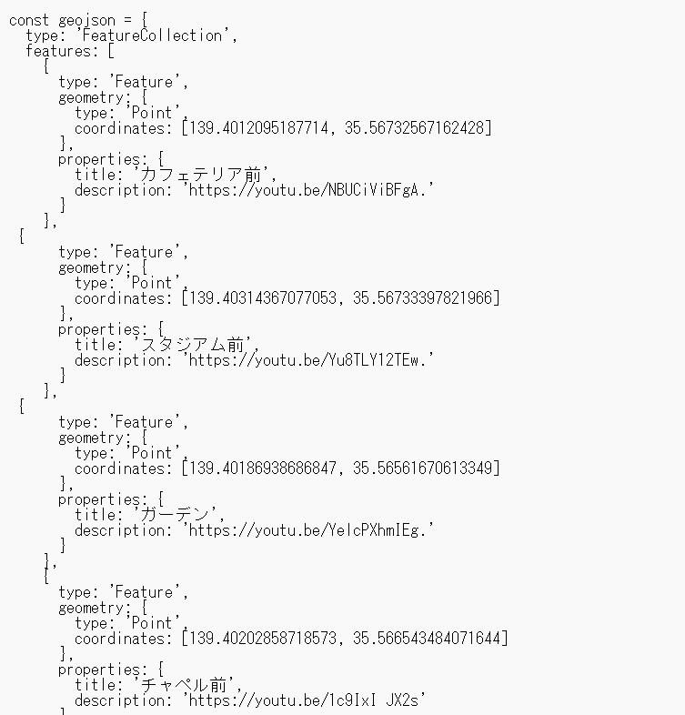
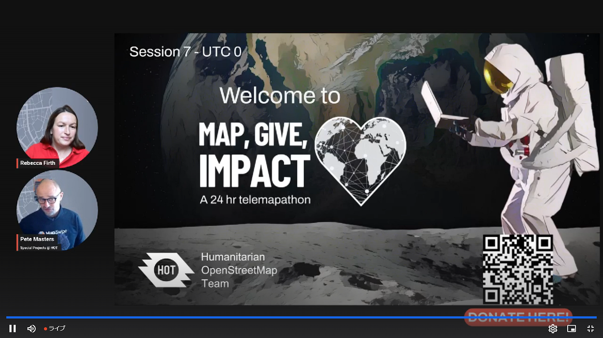
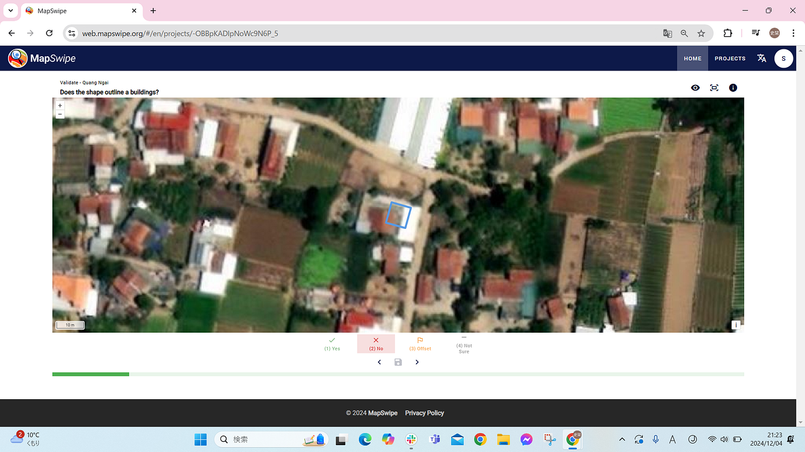
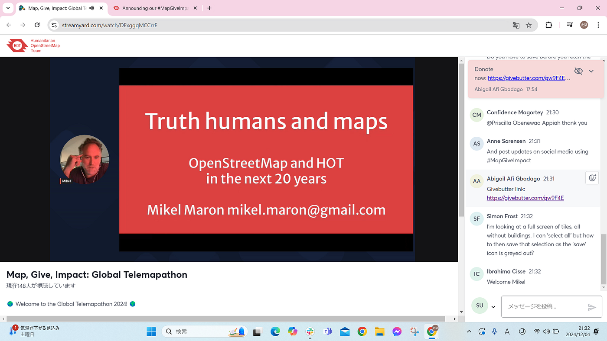
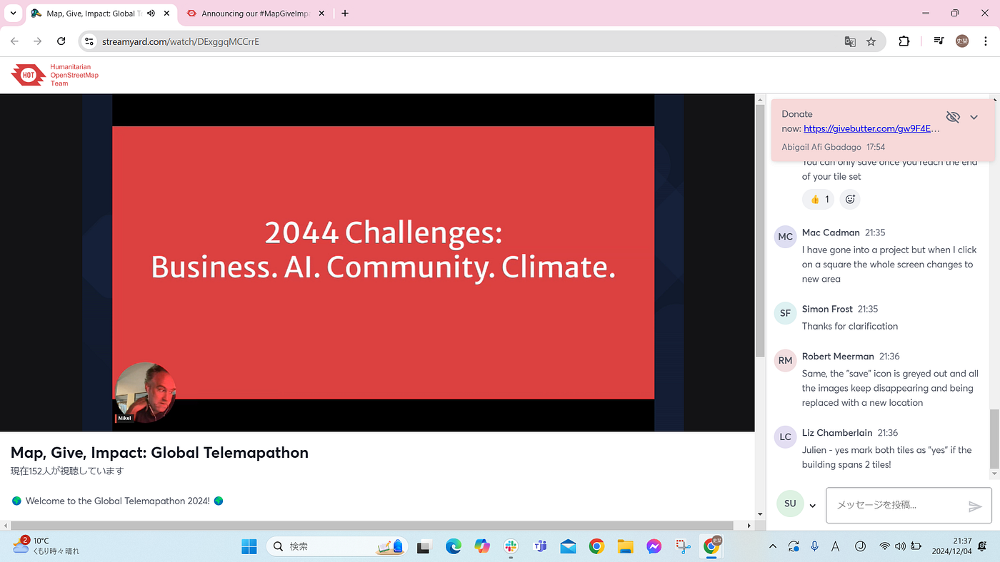
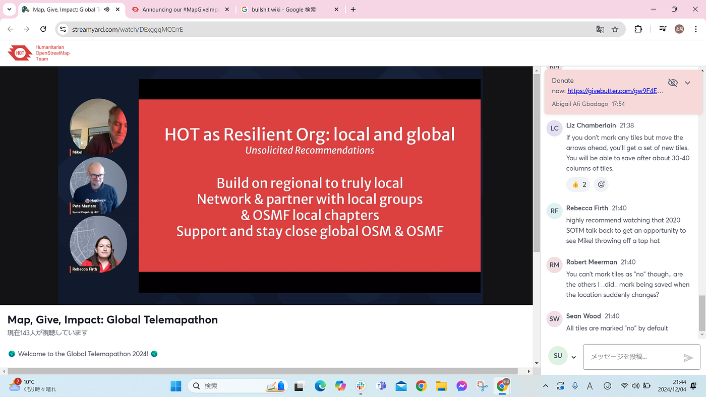

### 【卒論】12月報告＆おまけmapathon参加報告

こんにちは！4年の上原です。
最近は寒すぎるので、マフラーの代わりに髪の毛をおろして少しでも首元の暖をとろうとしています。

### 卒論12月報告

卒論の12月中間報告をいたします！

「都市空間における環境音のデジタルアーカイブ手法の検討ー相模原キャンパスを例にして」をテーマに進めています。

結局、Mapboxの開発者チームから回答をもらうことができなかったので、自力で頑張ります。Mapbox GL JSを使うことにしました。

少しコード入力に手を出し始めました。録音地点の座標を入力しました。

今後進めていて、上手く作動してくれることを祈るばかりです。

### おまけ：ローカルネットワークを築き、正確な地図を作る-#MapGiveImpact global, 24-hour telemapathon-

12月4日（水）に開催された[#MapGiveImpact global, 24-hour telemapathon](https://www.hotosm.org/updates/announcing-our-number-mapgiveimpact-telemapathon-guest-speakers/)を視聴しました。24時間ずっと開かれているマッパソンでしたが、私はSession7 12:00~2:00PM (UTC 0)の一部講演に参加しました。

[Announcing our #MapGiveImpact Telemapathon Guest Speakers!
On December 4th, we will hold our #MapGiveImpact telemapathon to celebrate both Giving Tuesday and International…www.hotosm.org](https://www.hotosm.org/updates/announcing-our-number-mapgiveimpact-telemapathon-guest-speakers/)

### About MapSwipe

[MapSwipe](https://mapswipe.org/en/)とは、スマートフォンでも手軽に参加できる地図作成のためのツールです。[Missing Maps](https://www.missingmaps.org/)のプロジェクトの１つとして始まりました。

[MapSwipe
Volunteer from your phone. Make a difference worldwide.mapswipe.org](https://mapswipe.org/en/)

MapSwipeには3つの機能があります。

1. Find
衛星画像をスワイプして、建物、道路、水路などの指定された特徴を含む画像を特定し、選択する

1. Compare
衛星画像の「前後」を比較し、被害評価、気候変動、または不正確なデータを把握する

1. Validate
遠隔マッピングやAIによって建物が事前にトレースされた場所で、その建物の輪郭の正確性を評価し、再マッピングが必要な箇所を特定する

私はValidateについての説明とワークショップを受けました。

自動的に表示される衛星画像を見て、建物や道路の特徴を確認し、それらが正しくマッピングされているかワンクリックで判断できます。「Yes（正しくマッピングされている）」「No（形や大きさが間違っている）」「Offset（位置がずれている）」「Not Sure（不鮮明で判断できない）」の4段階で検証していきます。

私が担当した範囲の衛星画像では、「No」「Offset」とRejectした建物が多かったです。ワンクリックで手軽に貢献できるので、初心者でも取り組みやすいと思いました。新3年生向けのハッカソンにも使えるかも！？ぜひアカウントを作って貢献してみてください！

[Get Involved | MapSwipe
Volunteer from your phone. Make a difference worldwide.mapswipe.org](https://mapswipe.org/en/get-involved/)

### Truth Humans & Maps

Speaker: MIKEL MARON, HOT Founder

10分という短い講演時間だったため質問をすることはできませんでしたが、HOTの設立者の考えについて直接聞くことができました！

いつも使っているツールの設立者の話を聞くことができとても勉強になりました！
