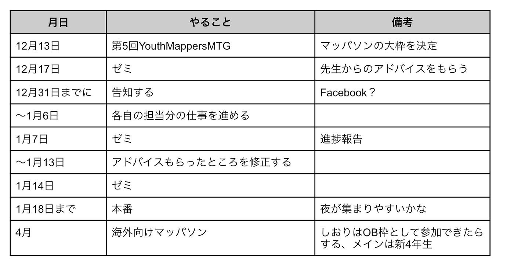
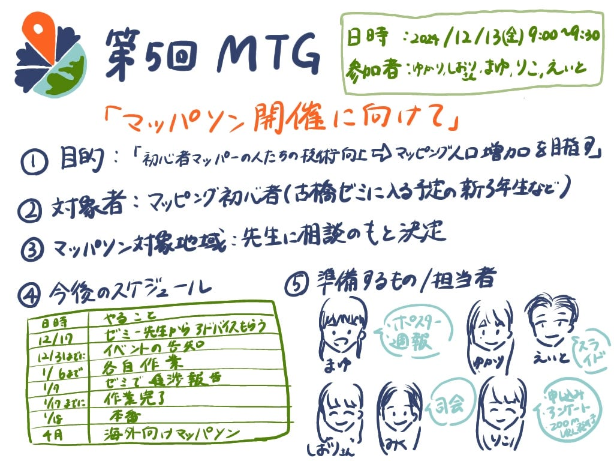

## YouthMappersAGU主催マッパソンへの準備順調！

こんにちは。Youth Mappers AGU部3年、林です。今週の週報では、2024年12月13日（金）に行ったユースのMTGで話し合った内容を共有します。

### MTG概要

日程:12/13（金）9:00～9：30

内容:Youth Mappers AGU主催のマッパソン開催に向けた必要な準備

前回までの内容:[GitHub](http://furuhashilab/YouthMappersAGU_Mapathon)上でマッパソンに関する下調べを行いました。[先週の週報](http://12/10週報 - Furuhashi(mapconcierge)Lab. - Medium)にて報告しています。

### 決定事項

**1．目的、対象者**

▷目的

「新たに地図の世界に入ってきた人に、OSMやTasking Managerを使ったマッピングの技術を身に付けてもらい、マッピングできる人口を増やす」

▷対象者

・マッピングを始めようとしている人、初心者

・マッピングの基礎を身に付けたい人

・古橋ゼミに入る予定の新3年生

→「海外マッパーと交流したい」という目的で計画をしていたが、最初から海外マッパー相手に英語で説明するのはハードルが高いと考えたため。まずは初心者である新3年生の向けのプレマッパソンを開催し、練習する。そして、ここで作成した資料やフライヤーを、英語版に直し、本番のマッパソンで使用する予定。

**2. マッパソンの対象地域**

・航空写真で鮮明に建物が読み取れるとこと

・空間地理情報にアドバンテージがある場所（日本：東京、神奈川、千葉…）

⇒先生に相談する

【先生：候補案】

・与論島

**3. 今後のスケジュール**

**4．準備するもの、各担当者**

①告知用ポスター（まゆ）

※マッパソン終了後の週報も担当する

②当日スライド資料（ゆかり、えいと）

【スライド項目】

・YouthMappersAGUとは

・Mappathonとは

・OSMアカウントの作り方

・HOTへのログイン方法

・マッピングの説明

③司会進行用スクリプト（しおり、みく）

※1月の日本人向けのマッパソンは日本語だが、4月は英語で進行する

④申し込みフォーム、参加アンケート、ZoomURL発行、その他運営事務（りこ）

※ポスター作成担当と協力して、告知と申し込みのタイミングを合わせる（ポスターにQRコードを載せても◎）

### 次回の授業までに行うこと

・各担当者は作業を進め、次回のゼミまでに進捗状況を報告する

・今週中に次回のミーティングの日程を決定する

