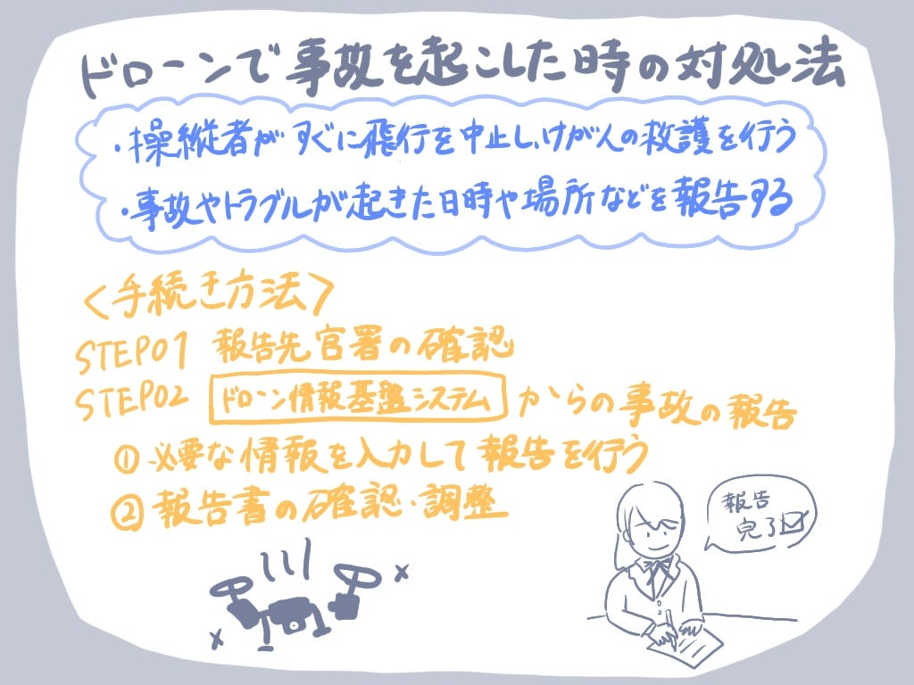

### ドローン事故が起きたとき、どう対応すればいい？

こんにちは。ドローン部3年の林と佐藤です

中国・湖北省で制御不能になった大型ドローンが体育施設に墜落し、炎上したニュースを耳にしました。そこで、今週の週報では、もしドローン操縦中に事故を起こしてしまった場合、どう対応すればいいのかを調べ、まとめました。

### 無人航空機の事故等の報告及び負傷者救護義務

ドローンなどの無人航空機で事故や重大なトラブルが起きた場合

・操縦者がすぐに飛行を中止し、けが人の救護を行う

・事故やトラブルが起きた日時や場所などを国土交通大臣に報告する

#### 上記の義務に応じない場合

※　負傷者の救護など危険を防止するために必要な措置を講じない場合、航空法第157条の6に従い、2年以下の懲役又は百万円以下の罰金が科せられます。

※　事故等の報告をしない又は虚偽の報告を行った場合、航空法第157条の10第2項に従い、30万円以下の罰金が科せられます。

### 無人航空機に関する事故等発生時の手続き

#### STEP01 報告先官署の確認

許可・承認を**受けた**飛行⇨該当の許可・承認を発行した官署

許可・承認を**受けていない**飛行⇨飛行した場所を管轄する官署

#### STEP02[ドローン情報基盤システム](https://www.ossportal.dips.mlit.go.jp/portal/top/)から事故の報告

※ログインアカウントを発行する必要があります。

**① 報告**

操縦者は、事故などが発生した日時や場所を含む詳細な情報を入力し、必要に応じて状況が分かる写真や資料を添付して報告します。

☆報告書を書く際は、[無人航空機に係る事故等報告一覧](https://www.mlit.go.jp/common/001585162.pdf)をご参照ください。

【事故/重大インシデント別報告項目】

☆「事故」と「重大インシデント」の定義はこちらを[ご参照](https://www.mlit.go.jp/koku/content/001520661.pdf)ください。

「事故」

・無人航空機による人の死傷（重傷以上の場合）

・第三者の所有する物件の損壊

・航空機との衝突又は接触

「重大インシデント」

・航空機との衝突又は接触のおそれがあったと認められるもの

・無人航空機による人の負傷（軽傷の場合）

・無人航空機の制御が不能となった事態

・無人航空機が発火した事態（飛行中に発生したものに限る）

**② 報告書の確認・調整**

提出された報告書は、提出先の航空局、地方航空局、空港事務所等で確認が行われます。報告内容の修正、追記が必要な場合は報告内容の変更の調整を行います。

### 無人航空機が墜落した場合

1.回転しているプロペラには手を出さない！

→墜落後もプロペラが回転を続ける中、機体の電源ボタンを操作しようとすると怪我する可能性があります。

☆日頃から機体の動作を強制的に停止させる操作を確認し、即座に対処できるように備えましょう。

2.不用意に近づかず、まずは安全確認をしよう！

→衝撃が加わった直後は異常がなくとも、時間をおいて発火する恐れあり。触れる前にバッテリが膨張していないか、状態確認が必要です。

#### 参考資料

・国土交通省.（2022）.無人航空機の事故及び重大インシデントの報告要領. [001520661.pdf](https://www.mlit.go.jp/koku/content/001520661.pdf)

・国土交通省 航空局 無人航空機安全課.（2023）.事故・重大インシデントについて. [https://www.mlit.go.jp/common/001623401.pdf](https://www.mlit.go.jp/common/001623401.pdf)

・国土交通省.（2024）.無人航空機に係る事故等報告一覧（令和4年12月5日以降に報告があったもの). [001585162.pdf](https://www.mlit.go.jp/common/001585162.pdf)

