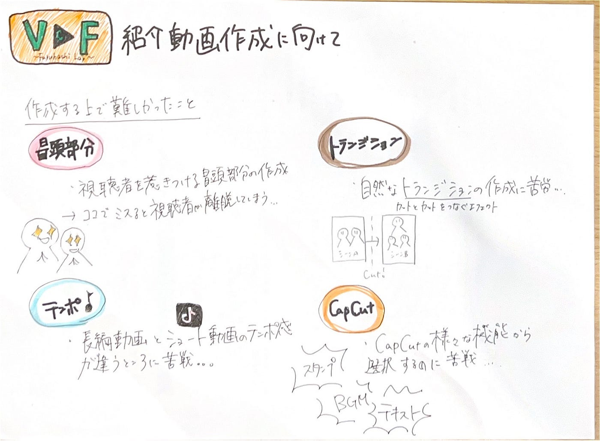

### 12/17V&F週報 紹介動画

こんにちは、三年の福田です。

先週学校で集まり動画を撮影することができました。その動画を三年の高井が編集を行いました。

TikTokにあげましたので、そちらの[リンク](https://vt.tiktok.com/ZS6RQpDsB/)がこちらです。

[GoogleDrive](https://drive.google.com/file/d/1AIgXr0DjIrD2lctlmAJWws3AAjPEj3MR/view?usp=drivesdk)

動画を編集する上で難しかしいと感じたことをまとめました。

1. 視聴者を惹きつける冒頭部分の作成は難しい！

→動画の初めは重要で、どれくらい興味を持ってもらえるか、この先を見てもらえるかを考えながら編集が必要！

→ここでミスると視聴者が離脱してしまう。

今回の冒頭では、V＆Fのロゴをアニメーション付きで表示することで、視聴者を飽きさせない工夫をした。

２. トランジションの選択

画面や音楽に合わせながら不自然にならないようにトランジションを選択することが難しかった。

3. 動画のテンポ

今回作成するのはショート動画なので、テンポ感が長編動画と違って難しかった。（時間、音楽）

4. Capcutを使った編集

→様々な機能があるからこそのどれを使うか迷ったり、無駄な作業が増えてしまったと感じる。

という感じで編集を進める際に難しいと感じた点です。

難しいこともたくさんありましたが、紹介動画を作成するためにチームで協力した撮影やフィードバックを行ったり、編集をする上で新しい課題点や技術を学んだりすることで色々な表現ができて楽しかったです。

グラレコ

