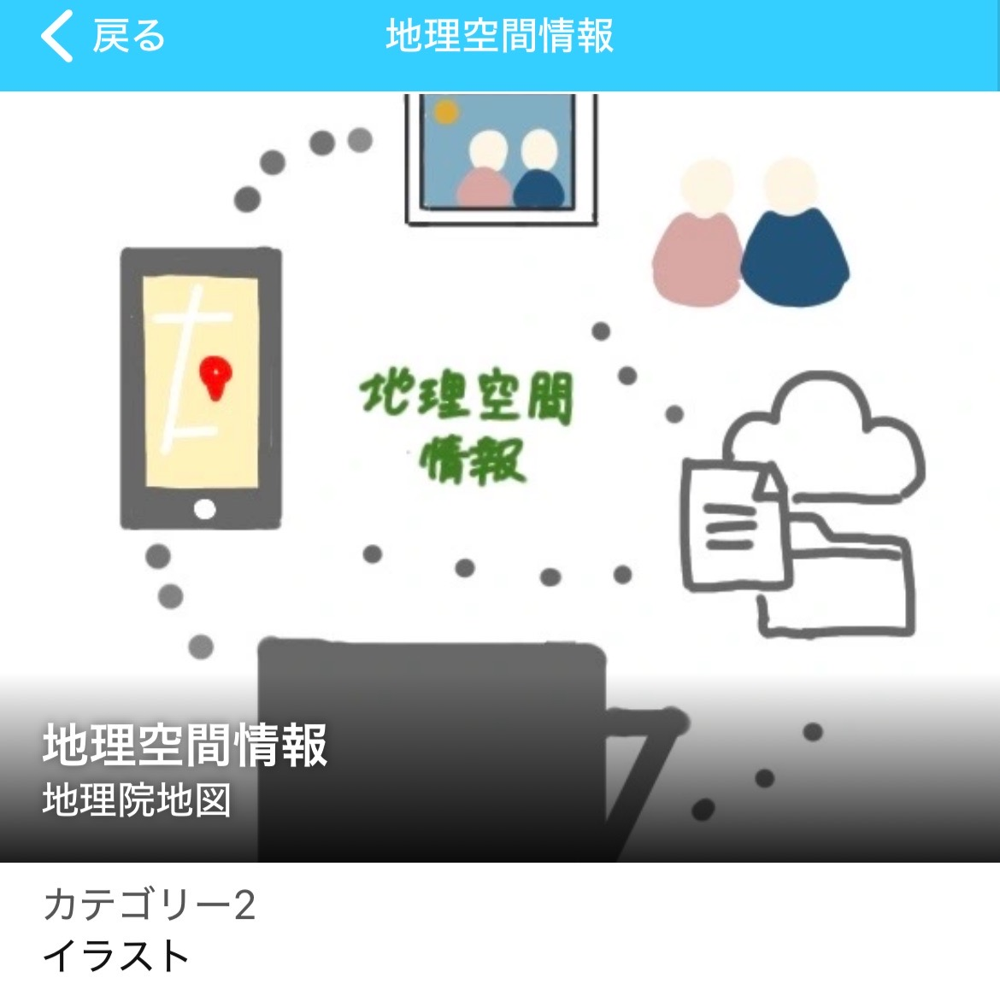
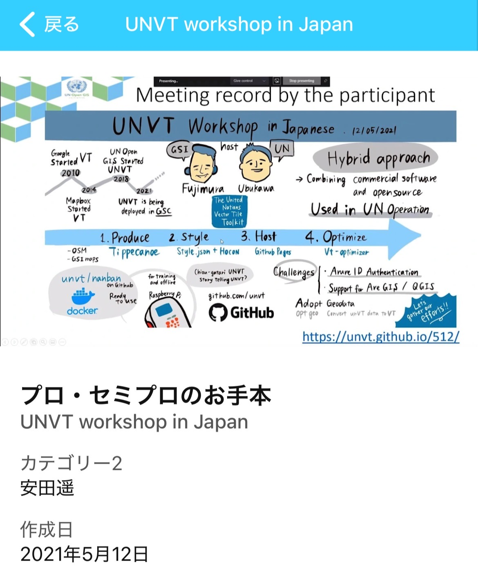
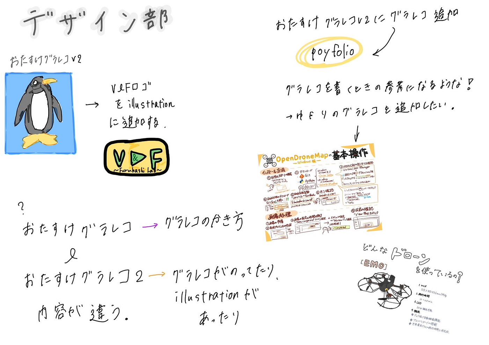

### おたすけグラレコV3完成に向けて

こんにちは！デザイン部の滝沢です！！

今週も引き続き、おたすけグラレコV3[(旧おたすけグラレコV2)](https://otasukegrareco.glideapp.io/dl/da19fa)の完成に向けてサークル内で話し合いました。

決まったこと

#### ・illustrationにイラストを追加する

→[V&F部ロゴのイラスト](https://github.com/furuhashilab/-V3-/issues/1)は？他追加したほうがいいイラストは？→先生に聞く！！

#### ・[おたすけグラレコV3用の公開レポジトリ](https://github.com/furuhashilab/-V3-/issues)を作る

#### ・Portfolioに上手なグラレコ(先生の判断)を追加する

→おのおの書いたグラレコを[ここに置いて](https://github.com/furuhashilab/-V3-/issues/3)(皆さんご協力よろしくお願いします！)、先生が上手なグラレコを選別→アプリにグラレコを追加する

#### ・[おたすけグラレコ](https://otasukegurareco.glideapp.io/)と[おたすけグラレコV2](https://otasukegrareco.glideapp.io/dl/da19fa)これ何が違うの…？今まで[おたすけグラレコ](https://otasukegurareco.glideapp.io/dl/d0a5f4)のほうにアップデートしてた…

→先生に聞く

