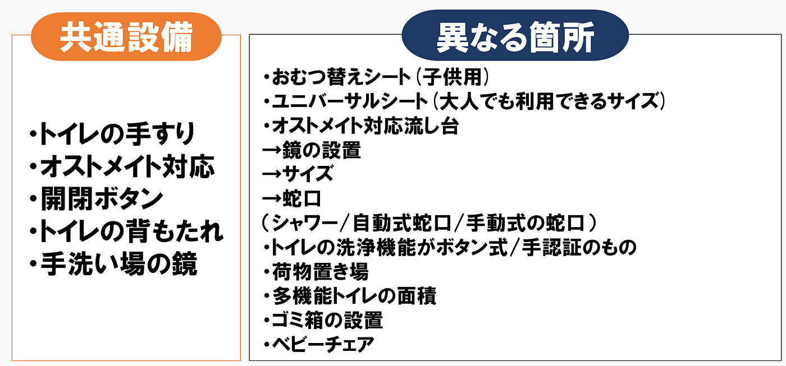
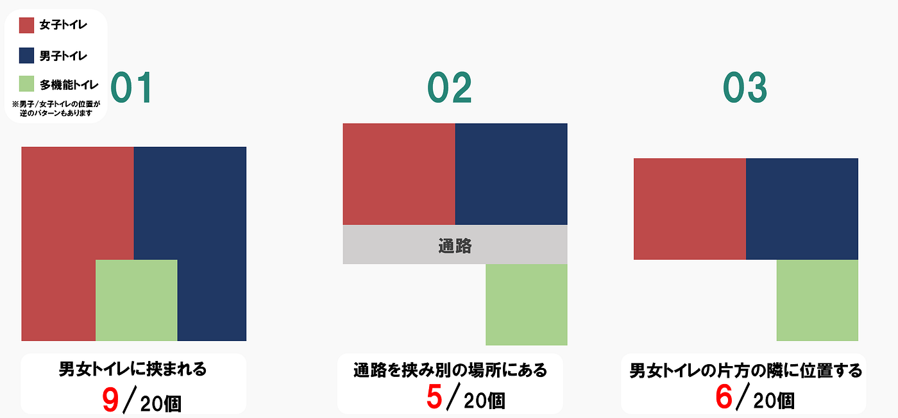
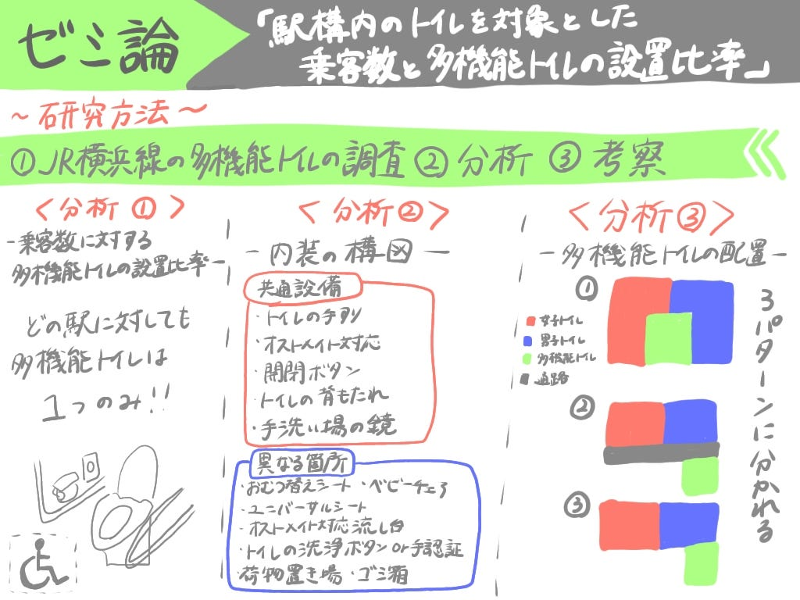

### 【ゼミ論中間発表】JR横浜線の多機能トイレを調査してみた！

私のゼミ論では、「駅構内のトイレを対象とした乗客数と多機能トイレの設置比率」というタイトルのもと、JR横浜線構内における多機能トイレの設置状況について調査を行いました。本研究では、各駅の乗客数と多機能トイレの設置比率の関連性を明らかにすることを目的とし、データ収集と分析を通じて利用者視点での利便性向上の課題を検討しました。

> GitHub：[furuhashilab/2024gsc_YukariHayashi](https://github.com/furuhashilab/2024gsc_YukariHayashi)

> パワーポイント：[zemironn.pptx](https://1drv.ms/p/s!AoV0OPVhLK7Nm2s0qjCRCZrW-_VM?e=53AX3G&nav=eyJzSWQiOjI1OCwiY0lkIjoxNTkxMzExMDA5fQ)

以下からIMRaD形式で調査結果を述べていきます。

#### 序論（Introduction）

本研究では、「駅構内のトイレを対象とした乗客数と多機能トイレの設置比率」というテーマを掲げ、鉄道駅の多機能トイレ設備に関する現状を分析しました。「古い鉄道ほど制約があり、多機能トイレが少ない」という仮説を立て、その妥当性を検証するためにまずはJR横浜線を対象に調査を実施しました。

#### 方法（Methods）

①JR横浜線の多機能トイレの調査

【内容】

１．JR横浜線の駅校内にある多機能トイレの個数を数える

２．トイレ案内図と多機能トイレ内の内装を撮影する

【定義】

１．JR横浜線は（八王子から東神奈川）までの20駅とする

２．多機能トイレは改札内のものを個数に数える

３．改札内にほかの乗り換え線があったとしても横浜線のものとしてカウントする

②データの分析

③考察

#### 結果（Results）

分析①ー乗客数に対して多機能トイレの設置比率ー

調査結果：どの駅に対しても多機能トイレは1つのみ

乗客数は駅によってかなり利用客数が違うのにもかかわらず多機能トイレは駅に１つのみということがわかりました。

分析②ー内装の構図ー

全ての多機能トイレの内装を調査し、共通設備、異なる箇所を分析しました。以下が調査結果をまとめたものです。

分析③ー多機能トイレの配置ー

調査結果：以下画像の3つのパターンに分けられる

#### 考察（Discussion）

・乗客数に関係なく各駅に多機能トイレが1つ設置されている

・ JR横浜線間で多機能トイレの設備や面積は一致していない

・多機能トイレの配置は3つのパターンに分類される

#### 今後ゼミ論の研究予定

①OpenStreetMapにトイレ情報の追加

②仮説検証のため別の線で同様の調査を行う

③どんな多機能トイレ構造が良いかデザイン案を考える

