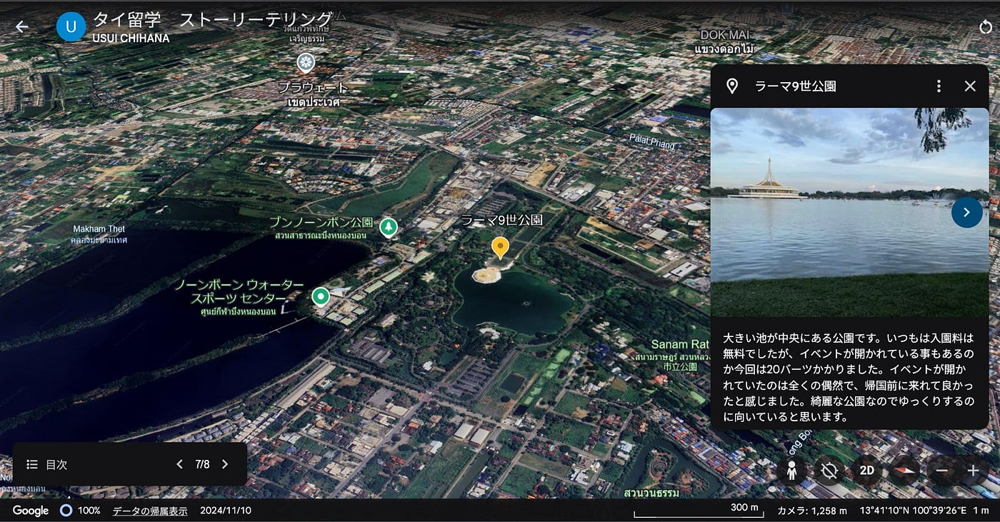
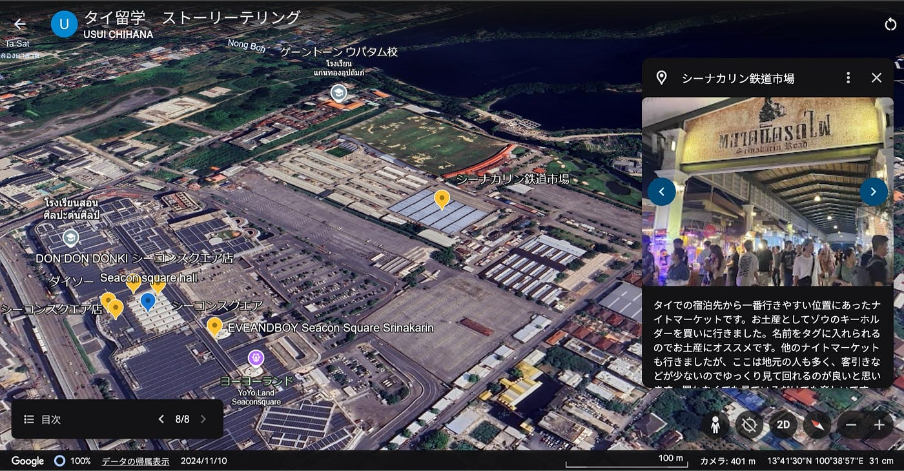

### タイ留学中のストーリーテリング作品

こんにちは、2年の臼井千瑛です。

私は2024年8月から12月の約4ヶ月半、タイに留学していました。その中で色々な場所に行く機会がありましたが、今回は留学中に度々訪れていたショッピングモール、公園、ナイトマーケットに行き、それをストーリーテリング作品としてまとめました。

### 1.ストーリーテリング作品

まず今回行った場所をGoogle Earthでまとめました。訪れた場所は、シーコンスクエア、ラーマ9世公園、シーナカリン鉄道市場です。

[Google Earth
Aw snap! Google Earth isn't supported on your browser. You may need to update your browser or use a different browser.…earth.google.com](https://earth.google.com/earth/d/1K3sxKTDQJ_d2oE8UQAmDTIIyHkbB-a3h)

帰国直前の時期だったので、お土産を買い、よく行っていた場所を振り返る目的で訪れました。場所は訪れた順に並んでいます。

### 2.Stravaログ

次にStravaで記録したログです。

[strava.app.link](https://strava.app.link/bujbSiojAPb)

宿泊先から電車で移動している間は記録していません。ぐちゃぐちゃに記録されているのがショッピングモール、丸く円のように移動しているのが公園、カクカク曲がっていていくつかの四角が重なっているように見えるのがナイトマーケットです。

### 3.Mapillaryデータ

次にMapillaryデータです。

[Mapillary
Street-level imagery, powered by collaboration and computer vision.www.mapillary.com](https://www.mapillary.com/app/?pKey=1100957941238168)

[Mapillary
Street-level imagery, powered by collaboration and computer vision.www.mapillary.com](https://www.mapillary.com/app/?pKey=946578650404008)

どちらもラーマ9世公園で撮影したものです。

### 4.キメのスクリーンショット

最後にスクリーンショットを2枚紹介します。

1枚目はラーマ9世公園です。植えられている花が綺麗で、訪れた時間が夕方だったので空が綺麗に撮れたので気に入っています。公園内は綺麗に整備されていて、地元の人の憩いの場になっていました。雰囲気が落ち着いていて、バンコクでできた私の好きな場所の一つです。

2枚目はシーナカリン鉄道市場です。駅からも近く、何度も訪れた場所です。ビンテージのものや屋台フードも沢山楽しめて雰囲気がおしゃれでした。

今回半日の外出をストーリーテリング作品としてまとめてみて、どこに訪れているかで移動の軌跡が全く違ったのが面白かったです。また、普段行っている場所を地図上に記録できるのは新しい視点で外出を振り返る事ができると思いました。
