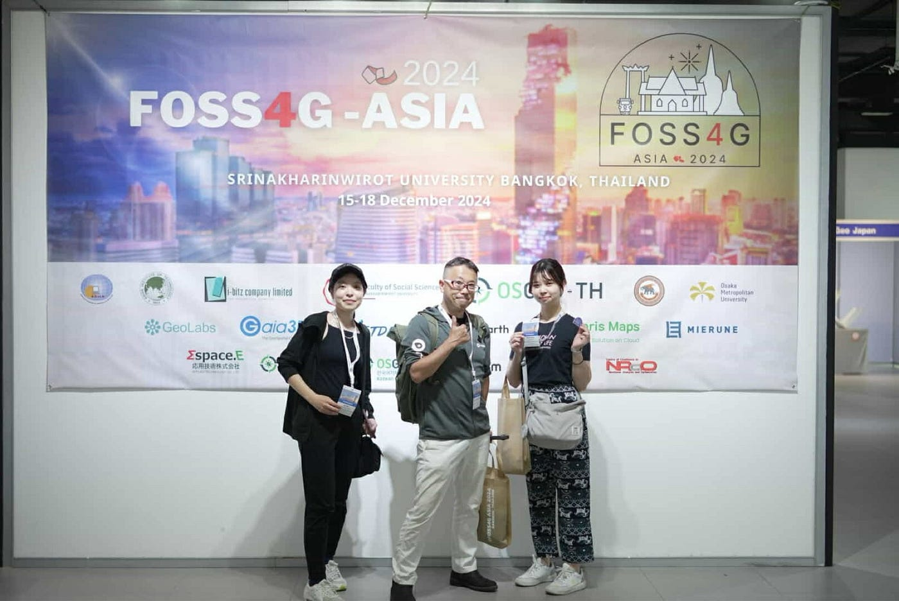

### 国際会議にてポスターセッション＠FOSS4G ASIA 2024, Thai, Bangkok

こんにちは、古橋研3年の佐藤愛妃です。

今回は、2024/12/15–12/18に開催された[FOSS4G ASIA2024 (Thai, Bangkok)](http://ABOUT - FOSS4G-ASIA 2024 | Bangkok, Thailand)にて、ポスターセッションしてきました！

昨年もコソボ共和国にて[FOSS4G2023](https://www.bing.com/ck/a?!&&p=f349161ed35842eab7cc73cd883211e6bbd401fc31bfd2018be38e76af40c804JmltdHM9MTczNDk5ODQwMA&ptn=3&ver=2&hsh=4&fclid=1c822b8e-e871-6d77-1dee-3fa6e9e66ca1&psq=foss4g+kosovo+2023&u=a1aHR0cHM6Ly9mbG9zc2sub3JnL2V2ZW50cy9mb3NzNGctMjAyMy1wcml6cmVuLWtvc292by8&ntb=1)に参加しましたが、登壇するのは今回が初めてだったので大変緊張しました。バンコク行きの飛行機では用意したA0ポスターをなくさないように必死に抱えていました（笑）

発表に関しては、4年生の上原さんと自分で前後半でパート分けしています！自分の担当は、**FOSS4Gツールの日本語訳化を通じた（QGISマニュアルの翻訳、poファイルを使用したGDALの翻訳）ローカライゼーションへの貢献について**です。

多様な分野からの参加者が、オープンソースGISツールの活用事例や技術的進展について熱く語っていたので、とても刺激的でした！

以下、報告です。

#### 1. 会議概要

- 会議名: FOSS4G Asia 2024

- 開催時期: 2024/12/15–2024/12/18

- 開催場所: Thai, Bangkok, [Srinakharinwirot University](https://www.bing.com/ck/a?!&&p=7f40e8b5ba7e4d97e4e0940720e2547b61279e275d1fda38eea59786e17dd82eJmltdHM9MTczNDk5ODQwMA&ptn=3&ver=2&hsh=4&fclid=1c822b8e-e871-6d77-1dee-3fa6e9e66ca1&psq=%e3%82%b7%e3%83%bc%e3%83%8a%e3%82%ab%e3%83%aa%e3%83%b3%e3%82%a6%e3%82%a3%e3%83%ad%e3%83%bc%e3%83%88&u=a1aHR0cHM6Ly9zd3UuYWMudGgv&ntb=1)

#### 2. 参加目的と期待

- **参加目的**: FOSS4Gツールの日本語化と、大学教育におけるオープンナレッジ・プラットフォーム構築の取り組みを発表し、国際的なフィードバックを得ることです。

- **期待する成果**: 他国の事例や専門家との交流を通じて、プロジェクトの改善点や新たなアイデアを獲得することです。

#### 3. 発表内容

**・タイトル**: 「日本の大学教育におけるFOSS4Gツールの多言語化とオープンナレッジ・プラットフォームの構築」

**・主な内容**:①佐藤愛妃、②上原史栞さんが担当

**①FOSS4Gツールの翻訳**:[QGISマニュアルの翻訳](https://docs.qgis.org/3.34/ja/docs/user_manual/index.html)と[翻訳方法をマニュアル化](https://github.com/furuhashilab/foss4gi18nJP)、[poファイルを使用したGDALの翻訳](https://github.com/yoichigmf/gdaldoc_jp)

**②若者の取り組み**:SDGsの翻訳、JOSMのバリデーション

- **発表資料**: [FOSS4G_Shiori,Aki_presentation_v2.pdf](https://github.com/furuhashilab/FOSS4GASIA2024_general-track-presentation/blob/main/FOSS4G_Shiori,Aki_presentation_v2.pdf)

・GitHubリンク: [furuhashilab/FOSS4GASIA2024_general-track-presentation](https://github.com/furuhashilab/FOSS4GASIA2024_general-track-presentation)

#### 4. **会議の雰囲気**

活発な議論とネットワーキングが行われ、オープンソースGISコミュニティの熱意を感じられました。

#### 5. 学びと成果

- **知識の獲得**: 他国の翻訳プロジェクトや教育現場でのFOSS4Gツール活用事例を学び、プロジェクトの改善に役立てることができました。

- **ネットワークの拡大**: 同様の課題に取り組む研究者や実務者との交流を通じて、今後の協力の可能性が広がりました。MIERUNEさんと交流できたことが前進です！

- **内容評価**: FOSS4Gは、他の空間情報関連の国際会議に比べて、技術的観点を重視します。そのため、今回のポスターセッションでも、ただ翻訳プロジェクトを紹介するだけでは不十分であり、新しい翻訳プロジェクトの意義や既存のプロジェクトとの違いなど説明する必要があり、途中でスクリプトの比重を変えるなど臨機応変に対応しました。

- **質疑応答: **ポスターセッション後の質疑応答でも、具体的な翻訳課題や進捗状況を聞かれる場合が多かったです。準備していなかった質問が来たこともありました。

#### 6. 今後の展望

- **プロジェクトの発展**: 会議で得たフィードバックを基に、翻訳プロジェクトの精度向上と教育現場での活用促進を図りたいです。

- **コミュニティとの連携**: 国際的なFOSS4Gコミュニティとの連携を強化し、共同プロジェクトやワークショップの開催を検討します。

- **知識と経験の蓄積**: より技術的な質問にも対応できるように知識と経験をつけたいです。マニュアルがバージョンアップした際は、最新情報を継続更新できるような仕組みを考えたいです。

#### まとめ

[応用空間情報Ⅲ](https://syllabus.aoyama.ac.jp/shousai.ashx?YR=2024&FN=4611A10-0339&KW=&BQ=3f5e5d46524048535c48584c495933294f4e5745515b42564a5e4f5659534a22067e7d756d6071747c687e6e6b68606a6270667c6608050701780d087a0c1866127c7073767160051d74081e7d6b05186d77191e697013627d1b1c7e651e7b1a57445b5741245e422d5e4f2a55482c2e55344b564d43534e4b5c3f4d59454d5ab8b4a7c6b1a0c7b7adcbbbaec9b8abced4b4d3a5b2dedfaabddcafbea5a5bba79984e79681e79782ea988ce8fc9993c0de97f5f185f7e987859ffdf0fe8098fb8cfca8a2e2a6b2abf8f9eff9f88e9e87e1f4e0e7b6a1b89cbdb7a9bab7a8e3faa5d7c7a2d0c0dfa4cdacddceaed9cbaec2d4c0b5a79097859b91dca8a8c0d8af473c2453473836215840373b)の初履修生、兼レジェンド嘉山先生の弟子1号ということで、少々プレッシャーを感じつつ、発表に取り組みました。翻訳活動という視点と取り組みを発表しているチームは他になかったため、注目を集められたように思います。

#### 移動軌跡

[https://strava.app.link/BHfNo6ftAPb](https://strava.app.link/BHfNo6ftAPb)

#### **謝辞**

FOSS4G Asia 2024 の参加チケット(有償)について、佐藤と上原の２名分チケット提供のご支援いただきました [OSGeo日本支部](https://www.osgeo.jp/)に感謝いたします。ありがとうございました！
