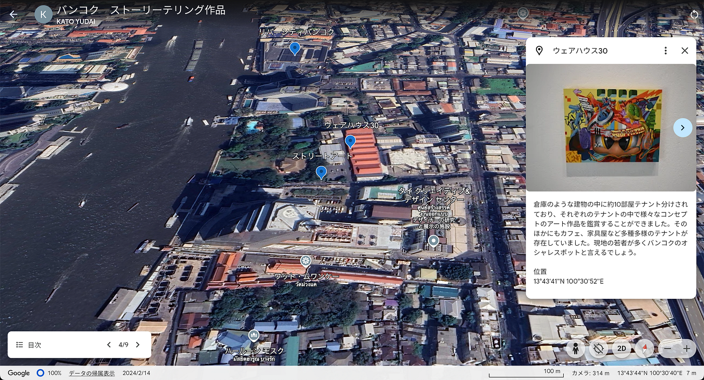
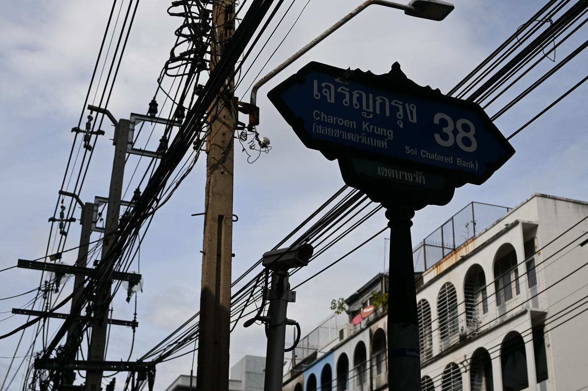

### スナップ写真を撮りまくった1日

こんにちは。2年生の加藤祐大です。

私は8月上旬から12月中旬までの約4ヶ月半、タイのシーナカリンウィロート大学に留学していました。留学期間中、タイ国内のさまざまな場所に訪れたのですが、今回は日本から持ってきた自前のミラーレス一眼カメラを片手に首都・バンコクの街中を歩き回りスナップ写真を撮った1日を皆さんに紹介したいと思います。

私が実際に歩いたルートとして、BTSサパンタクシン駅からスタートし、チャオプラヤー川を沿うように進み、目的地のヤワラートと呼ばれるタイの中華街へと向かう約10kmを途中休憩を含めて5時間半程かけて歩きました。途中何個か行きたい経由地を事前に決めていたのですが、それ以外は何も計画を立てずに、行き当たりばったりで出会った風景を写真に収めました。

まず初めに、私はGoogle Earthというツールを使ってストーリーテリング作品を作成しました。こちらが実際のPermalink URLです

[Google Earth
Aw snap! Google Earth isn't supported on your browser. You may need to update your browser or use a different browser…earth.google.com](https://earth.google.com/earth/d/1v0UwIPMA5T4bNGxT0BKoExNDSFO-jcZ_?usp=sharing)

次に、実際の行程をStravaというアプリを使い記録しました。こちらが記録したログのPermalink URLです。

[https://www.strava.com/activities/12957585469](https://www.strava.com/activities/12957585469)

記録したログを見てみると、先述の通り今回の行程ではあまり具体的な計画を立てずに歩き回っていたので、途中寄り道をしていたり、特に気に入った場所ではその周辺を時間をかけながら写真を撮っていたという点が可視化されており、いかに私が自由気ままに進んでいたのか再確認することができました。また、経過時間と移動時間に注目してみると、経過時間が約5時間半に対して移動時間は約2時間と記録されており、ここから休憩時間を含みますが約3時間半は移動をしていなかったということになり、かなりの枚数の写真を収めているということを客観的に感じることができました。（確認してみたところ1日で381枚の写真を収めていました。。。）

また、Mapillaryを使用し特に気に入った数地点で360度撮影を行いました。以下Permalink URLを記載します。

[Mapillary
Street-level imagery, powered by collaboration and computer vision.www.mapillary.com](https://www.mapillary.com/app/?pKey=3015052231981368&lat=13.728050460808&lng=100.51463807336&z=17)

[Mapillary
Street-level imagery, powered by collaboration and computer vision.www.mapillary.com](https://www.mapillary.com/app/?pKey=486458521104055&lat=13.734204449968&lng=100.51171819063&z=17)

[Mapillary
Street-level imagery, powered by collaboration and computer vision.www.mapillary.com](https://www.mapillary.com/app/?pKey=1653675665502914&lat=13.733956031349&lng=100.51202910537&z=17)

Mapillaryを使い何気なく記録したデータも、360度撮影していたことで1枚の写真を見返すよりも鮮明に当時の記憶を思い出すことができると感じました。

最後に、キメのスクリーンショットです。

今まで、どこかに出かける際には「移動」の時間にあまり重きを置かず何となく目的地まで向かっていましたが、今回のストーリーテリングを通して「移動」中も記録に残すことで1日がより深く記憶に残るものになると感じました。今後はこのようなツールを活用して移動時間にも価値を見出していきたいです。

