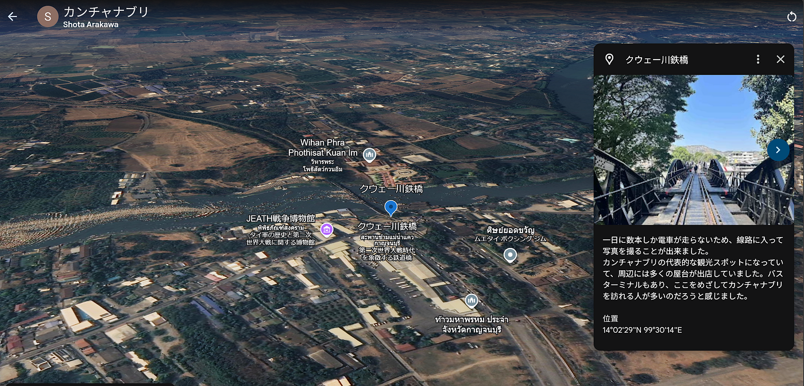

#### 留学ストーリーテリング タイ・カンチャナブリ

こんにちは。2年の荒川翔汰です。

私は2024年8月から12月中旬ごろまで、タイ・シーナカリンウィロート大学に留学をしていました。

11月にタイ・カンチャナブリを旅行した際の、駅から宿泊施設までの記録を公開します。

カンチャナブリはバンコクから西に約120㎞離れた場所に位置しており、バンコク・トンブリー駅から電車で3時間ほどで到着します。

[Google Earth
Aw snap! Google Earth isn't supported on your browser. You may need to update your browser or use a different browser…earth.google.com](https://earth.google.com/earth/d/195Vdvqx9xdPYpUV862fAsm_DGKUQ5tdf?usp=sharing)

今回はGoogle Earth を使ってストーリーテリング地図を作成しました。

駅から博物館・スカイウォークまでは徒歩で移動し、スカイウォークから鉄橋まではタクシー配車サービスを利用して移動しました。

スカイウォークまでの経路途中の川沿いの道が公園のようになっており、「車で移動していたらここは発見できなかったな」と感じ、うれしくなりました。

[11/30 カンチャナブリ | Strava
View Shota Arakawa's walk on November 30, 2024 | Stravawww.strava.com](https://www.strava.com/activities/13013660080)

旅行中はStravaを起動しながら移動し、記録を取りました。

このように道筋を振り返ると、大きな川沿いを移動していて、観光地も駅と川の間のエリアに集中しているのだなと分かります。

スカイウォークから鉄橋、鉄橋からホテルまではタクシー配車サービスで移動しました。

[Mapillary
Street-level imagery, powered by collaboration and computer vision.www.mapillary.com](https://www.mapillary.com/app/user/s_09_ll)

こちらがMapillaryの撮影データです。

この日は快晴で、湿度もそれほど高くない過ごしやすい日でした。撮影データからも綺麗な空の様子が伝わると思います。

バンコクとは違う、のんびりとした雰囲気を感じて頂けると嬉しいです。

最後に、私のお気に入りの地点のスクリーンショットを紹介します。

私がカンチャナブリを訪れた大きな理由がこの鉄橋でした。クウェー川にかけられたこの鉄橋からは、ここでしか見れないような壮大な景色を眺めることができます。

また、泰緬鉄道と呼ばれるこの路線の建設には太平洋戦争の頃の日本軍が関わっており、建設中に多くの死者を出したことから別名「死の鉄道 Death Railway」とも呼ばれています。

タイ人の友人や先生方からも、日本人として訪れるべき場所だと言われていたので、留学中に訪れることができて良かったです。

様々なツールで記録を取ったことで、普段の旅行よりも鮮明に記憶に残すことができたなと感じました。気になった道に入ってみるような思い出が実際に記録に残ることは面白いと思いました。その土地の地理的な特徴に目を向けるきっかけにもなり、良い経験ができた旅になりました。
