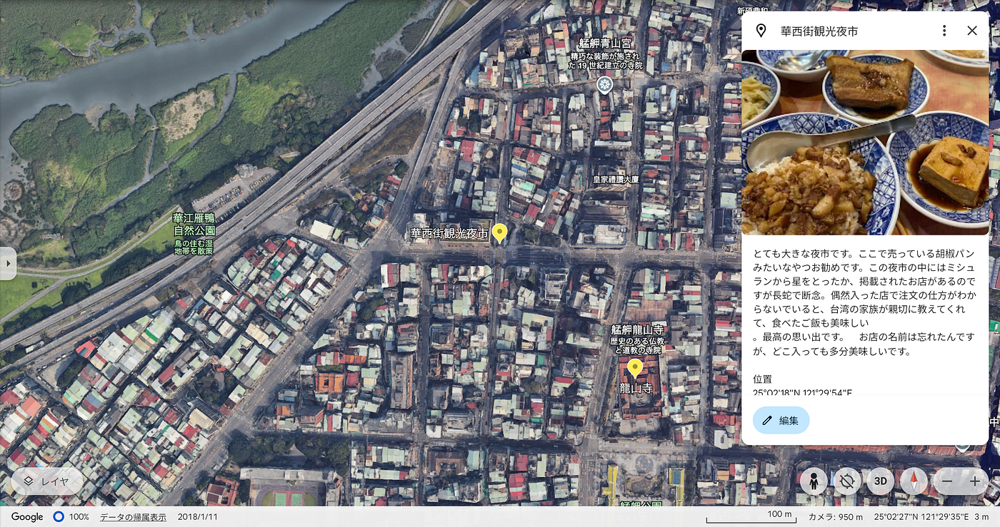

### 台湾旅行

初めまして、2年の山﨑 璃音です。私は留学には行かなかったため、11月1~5日に旅行した台湾についてストーリーテリングを行いたいと思います。

> **Google Earth**

今回は5日と滞在期間が短く、台北を中心に観光をしました。旅行する場所を絞ったおかげで、深く台北をまわることができました。台湾はナイトマーケットが有名です。実際に台湾を歩いていると朝は活気がないのですが、夜に近づくにつれて人が多くなり街全体が騒がしくなっていき、千と千尋を思い出しました。

[Google Earth
Aw snap! Google Earth isn't supported on your browser. You may need to update your browser or use a different browser…earth.google.com](https://earth.google.com/earth/d/1LWAVKxgR9hqGbhcd8araC784LEENf6PR?usp=sharing)

> **Mapillary**

次にMapillaryを用いて記録したデータです。Mapillaryで面白いなと思ったことは自動で顔を認識してモザイク処理をしてくれることです。観光地で立ち止まって一周する際は少し大変でしたが、360°まわることで一面しかない写真が繋がり一つの箱にいるように感じました。ナイトマーケットの写真をみると今でも臭豆腐の匂いを思い出せます。

[Mapillary
Street-level imagery, powered by collaboration and computer vision.www.mapillary.com](https://www.mapillary.com/app/user/0319-2004?lat=25.05577292042399&lng=121.51522625973007&z=17&pKey=1646647032933422)

[Mapillary
Street-level imagery, powered by collaboration and computer vision.www.mapillary.com](https://www.mapillary.com/app/user/0319-2004?lat=25.10680834528999&lng=121.80573282780006&z=17&pKey=1279056476612065)

[Mapillary
Street-level imagery, powered by collaboration and computer vision.www.mapillary.com](https://www.mapillary.com/app/user/0319-2004?lat=25.108232474909002&lng=121.84331542823998&z=17&pKey=1101202628377906)

> **Strava**

[台湾観光 | Strava
View 璃音 山﨑's walk on November 4, 2024 | Stravawww.strava.com](https://www.strava.com/activities/12821421994)

こちらがStravaで記録した移動ログです。台北→ジブリで有名な九份→ランタンで有名な十份→台北に帰るルートです。バスが予定時間になっても全然来なかったのですが、それも旅行の醍醐味です。その際もバス停に止まって待つ事はせずに少しでも色々なものを見てみたいと思い歩いたりしてました。初めての台湾、全てが新鮮です。九份はライトアップするとより綺麗と言われていたので、夕方に向かったのですが一番人気な場所は歩けないほど混んでいて大変でした。細い山道をバスで進む姿は、イタリアのアマルフィーコーストを思い出しました。十份についたのが夜の8時ほどになったため、パンフレットに見るような一斉にランタンが上がっている姿は見れなかったのですが、自分でも作ってあげたときは嬉しかったです。台北に帰る際、Google Mapで調べた時間より早く台北についたため、不思議に思っていたのですが、いつの間にか電車を間違えて台湾の新幹線のようなものに乗っていたのです。罪悪感を持ちつつ駅を後に、ナイトマーケットに行き食べて忘れることにしました。

> **キメのスクリーンショット**

初めて台湾に訪れたのですが、ご飯は美味しい、人も優しい、是非また訪れたいです。台湾旅行の際に記録するツールをたくさん使ったおかげで、ストーリーテリングをまとめている今でさえ、台湾旅行がつい最近の事のように鮮明に思い出せます。
