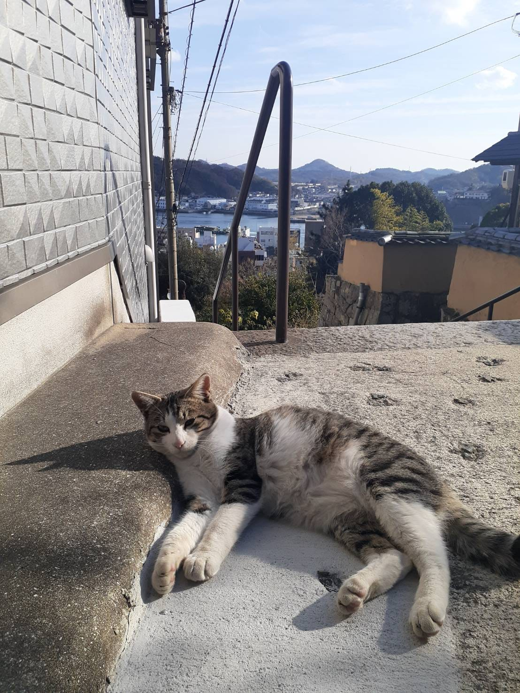
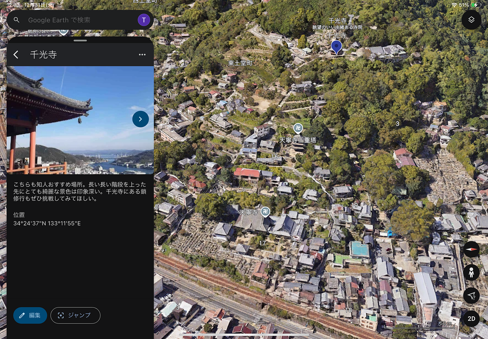

### 異世界感漂う尾道

はじめまして。2年の寺土日南子です。

私はマレーシアの留学を辞退したため、12月25日から3泊4日で広島と福岡の旅行に行った。今回のストーリーテリングでは1日目に訪れた広島県の尾道を紹介する。

#### Google Earth

[Google Earth
Aw snap! Google Earth isn’t supported on your browser. You may need to update your browser or use a different browser…earth.google.com](https://earth.google.com/earth/d/1JjyH2gVrzw1N736m-pcbUpU70IrG4TgE)

地図上には私が訪れた場所が写真と共に記録されている。尾道をよく知る知人や友達のおすすめの場所や飲食店などをメインに回った。様々な映画の舞台となっている尾道だが、街並みが美しく、本当に異世界へ迷い込んだかのような雰囲気を持っていた。

初めて訪れた地だが、特に印象深かった点は傾斜が激しく階段が非常に多かったことだ。幅の狭い細い道や階段と海の景色は非常に魅力的に感じられ、尾道が観光地として人気である理由がわかった気がした。一方、尾道の住宅街を歩いていると空き家が多く目立った。さらに、多くの家がかなり荒廃しており倒壊しそうな建物も多かった。尾道らしい風景を作り出しているのはそこにある家々も大きく影響していると思われ、今は放っておかれている家や土地も外国人によって買われてしまえば、街の景観が失われてしまう危険性があるのではないかと考えた。

#### Strava

[広島 | Strava
View H T’s run on December 25, 2024 | Stravawww.strava.com](https://www.strava.com/activities/13204259642?share_sig=X9FURMA71735613680&utm_medium=social&utm_source=android_share)

広島空港からバスと電車で約1時間ほどかけて尾道駅へ行った。直行便があると思っていたが、無かったため乗り継いでいくことになった。

尾道での移動手段は徒歩であり、千光寺へと登るケーブルカーは利用しなかった。個人的には徒歩で尾道を歩くことをおすすめしたい。千光寺へと登る道のりは階段が多くかなりきつかったが、風情ある階段やその途中で出くわした猫たちなど、普段見られない尾道の街並みをゆっくり歩き回ることができた。

尾道駅から広島駅へは電車で2時間かけて移動した。非常に時間がかかったが疲れていたこともありぐっすりと眠って広島駅へ到着した。

#### Mapillary

[Mapillary
Street-level imagery, powered by collaboration and computer vision.mapillary.com](https://mapillary.com/map/im/1156684235810380)

MapilLaryを撮影した中で、千光寺の鎖修行が非常に印象に残っている。鎖修行という名前だけ聞くとよくわからないかもしれないが、岩壁に鎖が埋め込まれておりそれを頼りによじ登るアクティビティだ。修行料は100円で、想像以上に険しく危険なものであった。スカートでの挑戦はおすすめしない。修行達成時は登りきれたという安心感が一番だった。一度登り始めたら、後戻りは厳しく挑戦する際は少し覚悟を持って挑んだ方が良いかと思う。上からの景色は良い眺めであり、挑戦する価値はある。

#### 最後に

尾道を歩いていると、たくさんの猫に出会った。尾道は元々猫が多いようで「猫の細道」と呼ばれるスポットもあるようだ。ほとんどの猫は野良猫であると思われるがあまり人間に対して警戒心がないようで近づいて写真を撮っても気にしないようであった。その時に撮った写真とキメのスクリーンショットを最後に、本ストーリーテリングを終わる。

