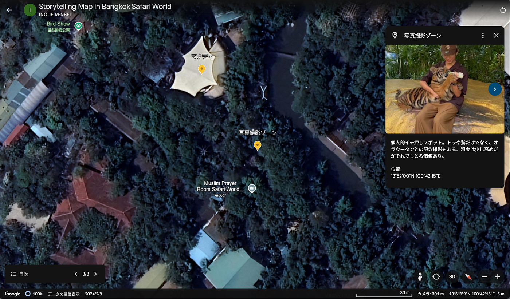

タイ留学中のストーリーテリング作品

こんにちは。2年生の井上連成（れんせい）です。

私は2024年8月から12月中頃までの約4ヶ月間､タイのカセサート大学に留学していました。留学期間中にサイアムやアユタヤなど様々な観光地に行く機会がありましたが、今回は「バンコク､サファリワールド」を訪れた時の様子を位置情報アプリを使って紹介したいと思います。

まず初めに､Google Earthを用いたストーリーテリング地図を作成しました。

[Google Earth
Aw snap! Google Earth isn't supported on your browser. You may need to update your browser or use a different browser…earth.google.com](https://earth.google.com/earth/d/1hxlR0RhaVdUItz_zs2VKQN8EPVzjaCbx?usp=sharing)

バンコクのサファリワールドは､ショーやアクションを鑑賞したり､多様な動物に餌やりができたりと､体験型の動物園であった点が特に日本の動物園との違いを感じました。また､SNS等で人気のオラウータンや､マナティなどの珍しい動物もおり､終始楽しむことができました。

次に､Stravaでの移動記録のPermalinkです。

[https://strava.app.link/iSeLdH8WNPb](https://strava.app.link/iSeLdH8WNPb)

本当は園内での移動記録を紹介したかったのですが､うまく起動できていなかったため､サファリワールドから私が住んでいた寮までの帰路の移動記録を紹介します。サファリワールドは駅から遠いため､寮まではタクシーで30分ほど移動しました。

続いて､Mapillaryの撮影データになります。

[Mapillary
Street-level imagery, powered by collaboration and computer vision.www.mapillary.com](https://www.mapillary.com/app/?lat=13.86746495359&lng=100.70529934755&z=17&pKey=1086079599635717)

[Mapillary
Street-level imagery, powered by collaboration and computer vision.www.mapillary.com](https://www.mapillary.com/app/user/2110ren?lat=13.86746495359&lng=100.70529934755&z=17&pKey=597558382638155)

[Mapillary
Street-level imagery, powered by collaboration and computer vision.www.mapillary.com](https://www.mapillary.com/app/user/2110ren?lat=13.864338649448996&lng=100.70429066204997&z=17&pKey=1101517971360003)

[Mapillary
Street-level imagery, powered by collaboration and computer vision.www.mapillary.com](https://www.mapillary.com/app/user/2110ren?lat=13.864338649448996&lng=100.70429066204997&z=17&pKey=3851409531750570)

[Mapillary
Street-level imagery, powered by collaboration and computer vision.www.mapillary.com](https://www.mapillary.com/app/user/2110ren?lat=13.864338649448996&lng=100.70429066204997&z=17&pKey=2274500022942775)

[Mapillary
Street-level imagery, powered by collaboration and computer vision.www.mapillary.com](https://www.mapillary.com/app/user/2110ren?lat=13.865968966794995&lng=100.70159222942993&z=17&pKey=585583350632687)

[Mapillary
Street-level imagery, powered by collaboration and computer vision.www.mapillary.com](https://www.mapillary.com/app/user/2110ren?lat=13.865968966794995&lng=100.70159222942993&z=17&pKey=518714127834862)

[Mapillary
Street-level imagery, powered by collaboration and computer vision.www.mapillary.com](https://www.mapillary.com/app/user/2110ren?lat=13.863695938811006&lng=100.70265890330006&z=17&pKey=592504726552793)

サファリワールドの中でも､特徴的であったり､個人的に面白かった地点を撮影しました。撮影したスポットの中で特に印象的だったのは､吊り橋の上で撮影したものでした。見た目以上に揺れるため意外とスリルがありました。360度撮影できるおかげで､普通に撮った写真に比べてより鮮明に当時を思い返せる点が良いと感じました。

最後にイチオシの場所のスクリーンショットを紹介します。

私のイチオシはトラの赤ちゃんとの写真撮影スポットです。可愛い顔に似合わない大きな手から自然の恐ろしさや偉大さを感じ取ることができました。幼い頃からの猛獣の赤ちゃんと写真を撮るという夢が叶い､とても嬉しかったです。

今回使ったアプリをこれまでほとんど使ったことがなかったので最初はうまくできるか不安であったが、失敗をしながらも楽しく位置情報アプリを使うことができました。また、写真以外の記録があるおかげでこの観光が強く思い出として残りました。さらにうまく使えるよう試行錯誤しながら、今後のフィールドワーク等を楽しみたいと思います。

ここまでご覧いただきありがとうございました。
