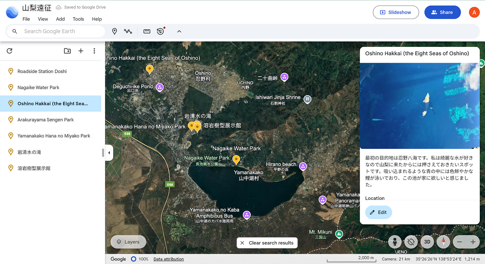

### 山梨遠征

こんにちは。二回生の本吉顕です。私は残留組として12月に山梨県に行ったのでその記録をまとめます。

> _Google Earth_

今回は具体的にどこに行きたいなどは考えず、過去に自分がGoogle Mapsでブックマークした山梨県内の言ってみたいスポットを気分に任せ、ぶらりとまわりました。どうしみちは標高があまり高いわけではないのでスタッドレスやチェーンを装備しなくても行けて安心できる道でした。

[Google Earth
Aw snap! Google Earth isn't supported on your browser. You may need to update your browser or use a different browser…earth.google.com](https://earth.google.com/web/search/Yamanashi,+Yamanakako,+Yamanaka,+1650+%e8%8a%b1%e3%81%ae%e9%83%bd%e5%85%ac%e5%9c%92/@35.4652696,138.89574765,1007.26350213a,19893.03674944d,30y,0h,0t,0r/data=CiwiJgokCeZSlAC8wEFAEYEpiB6fv0FAGTfAOzX3WWFAIZN8IrhWWWFAQgIIATIpCicKJQohMUNsWU5HdUhmOXdEOXhfajVtUGpQY09oeldSOGJnOEliIAE6AwoBMEICCABKCAiNiqmPBxAB)

> _Mapillary_

Mapillaryのように360度の写真を撮るのは、写真以外でははじめてのことでした。面白い場所があるごとにMapillaryを開き記録するのは一つの楽しみになりました。人の多いところではシャッター音が恥ずかしかったですが、写真という形で思い出を脳の外にデータ化して保存しておけることは面白いと思いました。

[Mapillary
Street-level imagery, powered by collaboration and computer vision.www.mapillary.com](https://www.mapillary.com/app/user/Akira-Akira-Akira?lat=35.50343350044999&lng=138.98955004303002&z=17&pKey=962776479081481&source=post_page-----71fb3276f2b4--------------------------------)

> _Strava_

[ゼミ課題 | Strava
View Akira Motoyoshi's ride on December 22, 2024 | Stravawww.strava.com](https://www.strava.com/activities/13168251466)

道志から山中湖あたりに戻るまでの移動ログです。この日の移動距離はStrava上では102kmとあるので、運転に疲れるようなこともなく気分良く運転できました。私にとってどうし道は関東では榛名山と並んで好きな道です。道幅が急に狭くなるなどのトリッキーな区間もありますがポイントさえ抑えれば楽しく走ることのできる道です。新倉山と花の都は初めて行く場所でしたが、新倉山はシーズンには人でごった返すそうなのでシーズンオフに行けたのは幸運だったかもしれません。それでも外国人観光客が多く、人気がありました。花の都公園は都会のイルミネーションにはない一風変わった楽しみ方ができるものでした。視力検査のイルミネーションがあったり、焚き火があったり、溶岩樹型をみれたりと普通のイルミネーションにはもう飽きてしまったという人にはおすすめです。今回はほうとうなどのグルメを堪能することはできませんでしたが、次回以降に山梨に来る際にはほうとうと日本酒とワインは体験してみるべきだと感じました。また、春になり暖かくなったら花見のために山梨に訪れたいと思います。その時は今回は見れなかった花と戯れたいと思います。

> _キメのスクリーンショット_

やはり自然が豊かな地域は運転が楽しいと感じました。私の中でのベストモーメントは忍野八海でした。名水で有名な山梨県をまた釣りなどで楽しんでみたいとも感じました。また、このように旅行をログに残すのは初めてででしたが、旅の思い出を整理する時間もとても有意義なものであるように感じました。
