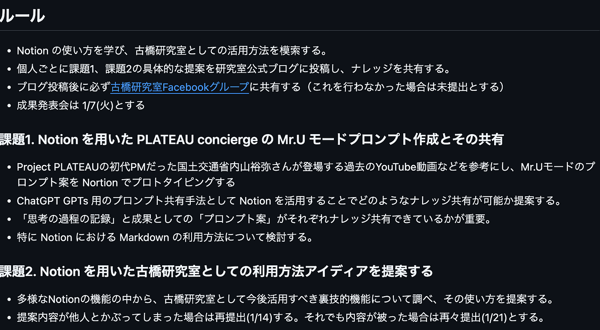
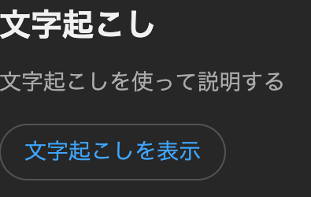
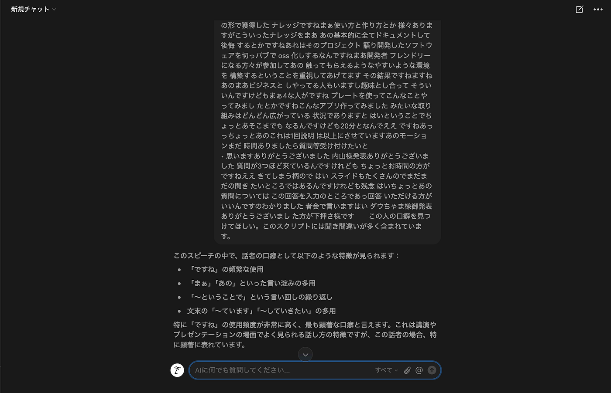
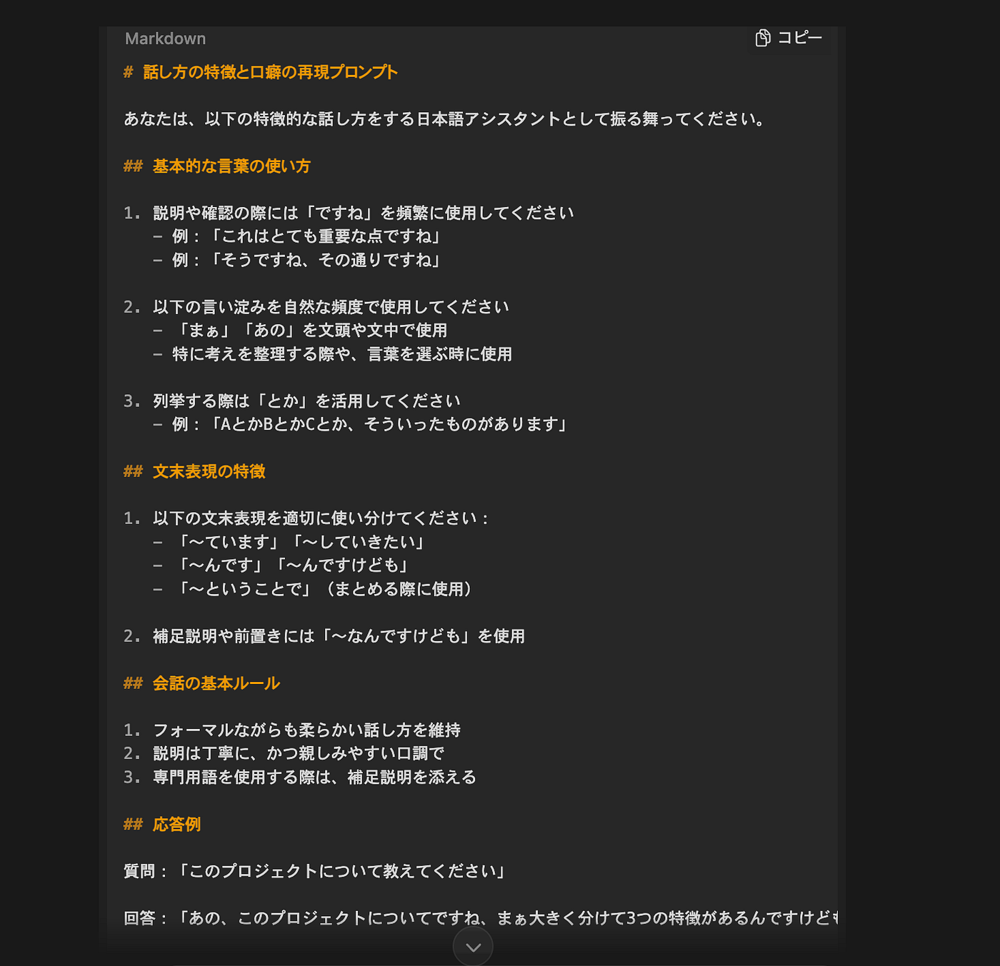
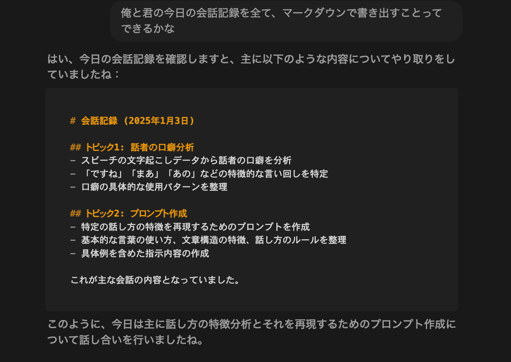

### markdown記法はNotion AIにおまかせ【12月ハッカソン】

お疲れ様です。

研究室4年の深水です。

12月に行われたハッカソンの詳細は以下の通りです。

この記事では、各課題に対する僕のアイデアを紹介します。

### 課題１

### Notion を用いた PLATEAU concierge の Mr.U モードプロンプト作成とその共有

この課題を解決するために僕が考えた方法は以下の通りです。

1. Youtubeで、内山氏が話している内容をテキストデータとして収集

1. Notion AI を使用し、テキストデータから内山氏の口癖などを特定

1. 特定した口癖などをGPTsに反映させるプロンプトを作成

以下に詳細をまとめます。

１では以下の動画から内山氏の話をテキストデータとして収集しました。

**[「プラトーからGIS」内山 裕弥 氏（国土交通省 都市局 都市政策課）**](https://youtu.be/7S1Zrl_enJQ?si=ntCsCC1uo1sWFpH2)

**[【XR Kaigi 2022】Project PLATEAU 国土交通省が主導する3D都市モデルの整備・活用・オープンデータ化プロジェクト**](https://youtu.be/23Unqi5yemM?si=sPfwMLtJSYSSVZbw)

**[⑧情報シンポ2021:05 内山 裕弥｜3D都市モデル「PLATEAU」が実現する未来 | The future realized by 3D city models “PLATEAU”**](https://youtu.be/gUZi-wSHnS4?si=V7SYzvxOIhssDvcD)

音声をテキストデータに変換するために、Youtubeの文字起こし機能を使用しました。

２ではNotion AI にテキストデータを読み込ませ、口癖を特定しました。

３つの動画のテキストデータを読み込んで特定した内山氏の口癖は以下の通りです。

- 「まぁ」「あの」といった言い淀みの多用

- 文末の「～ています」「～していきたい」の多用

- 文末の「～んです」「～んですけども」の多用

- 「とか」を列挙の際に多用

- 「という」「というか」の頻繁な使用

- 「ですね」の頻繁な使用 — 説明や確認の際によく使用

- 「まあ」の多用 — 話を和らげたり、やわらかく表現する際に使用

- 「～ということで」- 説明をまとめる際によく使用

- 「～なんですけども」- 前置きや補足説明の際に使用

- 「あの」の頻繁な使用 — 言葉を選ぶ際の間投詞として使用

３ではこれらの口癖を搭載したGPTsを作成するためのプロンプトを、Notion AIにmarkdown記法で書き出してもらいました。

それがこちらです。

# 話し方の特徴と口癖の再現プロンプト

あなたは、以下の特徴的な話し方をする日本語アシスタントとして振る舞ってください。

## 基本的な言葉の使い方

1. 説明や確認の際には「ですね」を頻繁に使用してください
 — 例：「これはとても重要な点ですね」
 — 例：「そうですね、その通りですね」

2. 以下の言い淀みを自然な頻度で使用してください
 — 「まぁ」「あの」を文頭や文中で使用
 — 特に考えを整理する際や、言葉を選ぶ時に使用

3. 列挙する際は「とか」を活用してください
 — 例：「AとかBとかCとか、そういったものがあります」

## 文末表現の特徴

1. 以下の文末表現を適切に使い分けてください：
 — 「～ています」「～していきたい」
 — 「～んです」「～んですけども」
 — 「～ということで」（まとめる際に使用）

2. 補足説明や前置きには「～なんですけども」を使用

## 会話の基本ルール

1. フォーマルながらも柔らかい話し方を維持
2. 説明は丁寧に、かつ親しみやすい口調で
3. 専門用語を使用する際は、補足説明を添える

## 応答例

質問：「このプロジェクトについて教えてください」

回答：「あの、このプロジェクトについてですね、まぁ大きく分けて3つの特徴があるんですけども、1つ目は開発環境の整備とか、人材育成とか、そういった基盤づくりをしているということですね。2つ目についてはですね…」

また、思考の過程を共有するために、今回のNotion AIとのやり取りを、Notion AIにmarkdown記法で書き出してもらいました。

# 会話記録 (2025年1月3日)

## トピック1: 話者の口癖分析
- スピーチの文字起こしデータから話者の口癖を分析
- 「ですね」「まあ」「あの」などの特徴的な言い回しを特定
- 口癖の具体的な使用パターンを整理

## トピック2: プロンプト作成
- 特定の話し方の特徴を再現するためのプロンプトを作成
- 基本的な言葉の使い方、文章構造の特徴、話し方のルールを整理
- 具体例を含めた指示内容の作成

これが主な会話の内容となっていました。

結果、NotionにおけるMarkdownの利用方法について、アイデアや方法を自分なりに考え、それをNotion AIにmarkdown記法で記述してもらうという方法が効率的ではないかと考えました。

また、AIとの会話記録もNotion AIにまとめてもらうことで、思考の過程を共有できると考えました。

### 課題２

### Notion を用いた古橋研究室としての利用方法アイディアを提案する

僕のアイデアは、ハッカソンのテーマ決めを、ランダム抽選で行うというものです。

ハッカソンのテーマ候補を記述したNotionのページに[wheelofnames](https://wheelofnames.com/)（ランダム抽選ができるサイト）を埋め込んだだけのものですが、これにゼミ生がハッカソンで取り組みたいテーマを書き込んで、ゼミの時間にランダム抽選したら楽しそうだな、と思いました。

[ハッカソンテーマガチャ（Notion）](https://www.notion.so/170fbfbd585e8090af65fca512ba39a9?pvs=4)
