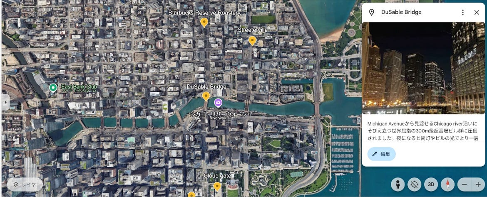

こんにちは、2年の岡村風花です。

私は2024年8月から12月の約5か月間、アメリカに留学していました。冬休みに友達と行ったシカゴの一部をストーリーテリングにまとめました。

#### 1.Google Earth

今回はシカゴの中心部を見て周りました。街全体が芸術作品で、どこを切り取っても絵になります。その一部をGoogle Earthでまとめました。

[Google Earth
Aw snap! Google Earth isn't supported on your browser. You may need to update your browser or use a different browser.…earth.google.com](https://earth.google.com/earth/d/1YL1H7tRFtRrVODU5w_Sfo0PEpTZCZGvl?usp=sharing)

#### 2.Strava

Starbucks Reserve RoasteryからTrump towerまでを記録しました。極寒の中、スマホの充電が頑張ってくれた奇跡の軌跡です。

[https://strava.app.link/stOxm3JSRPb](https://strava.app.link/stOxm3JSRPb)

#### 3.Mapillary

Michigan Avenueから見渡せるChicago river沿いにそびえ立つ世界屈指の300m級超高層ビル群に圧倒されました。夜になると街灯やビルの光でより一層綺麗でした。

[Mapillary
Street-level imagery, powered by collaboration and computer vision.www.mapillary.com](https://www.mapillary.com/app/?lat=41.8891056&lng=-87.6245944&z=17&pKey=2994100707405834)

#### 4.キメのスクリーンショット

やはり、キメのスクリーンショットは、橋から眺める高層ビル。とても綺麗でした。冷たい風が吹いて凍える夜でもこれを見る為に外出は惜しみません。最高の一枚です。

#### 5.最後に

ストーリーテリングをした率直な感想は、「もっと準備しておけばよかった」です。Strava、Mapillary共にスマホの充電、ギガの関係で思う存分に使用することが出来ませんでした。もっともっと残したいシカゴの街並みがありましたが、、またリベンジします。多少の後悔はありますがそれ以上に思い出を振り返るいい機会になりました。作っている最中に色々な思い出が蘇って幸せでした。またアメリカ行くぞ！
