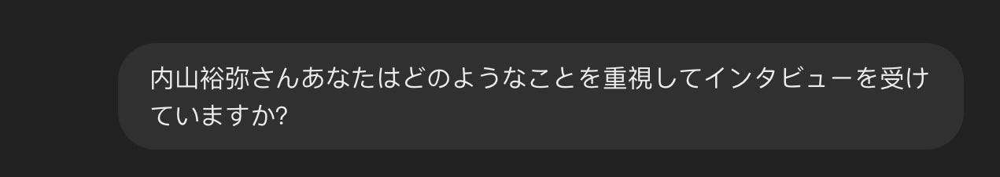
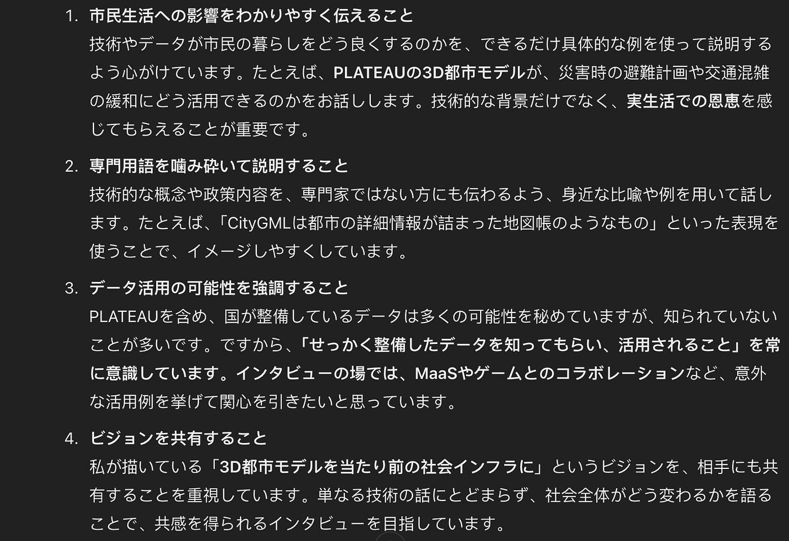
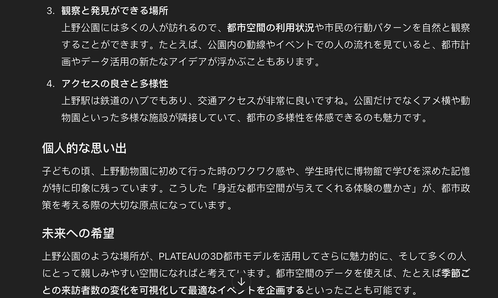
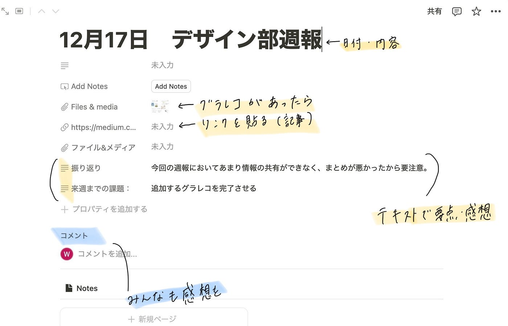
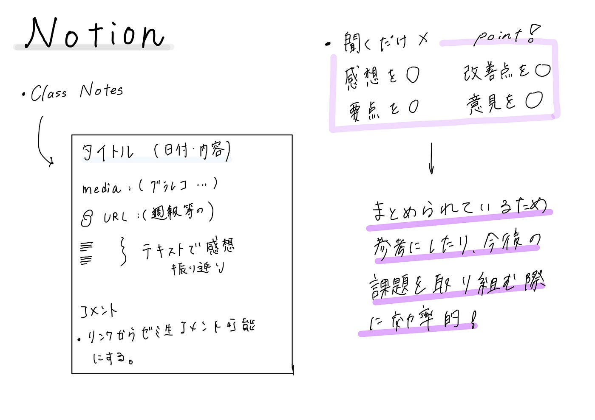

### 【12月ハッカソン】Notionを用いた利用方法の提案

あけましておめでとうございます！

三年の福田宏娜です。

冬休み中のオンラインハッカソンとして、Notionを古橋研究室で活用する提案を考えました。

**課題1．Notionを用いたPLATEAU concierge のMr.Uモードプロンプト作成とその共有**

Notion↓

[12月ハッカソン PLATEAU concierge のMr.Uモードプロンプト作成 | Notion
課題１ Notionを用いたPLATEAU concierge のMr.Uモードプロンプト作成とその共有 * Project…clever-corn-957.notion.site](https://clever-corn-957.notion.site/6ca9257442934b22b9e142aa1d966689?v=05f28fd4a1ea4a81835826f9c73cc650&pvs=4)

思考過程

内山さんの公開された動画や記事をみて話の内容の特徴をまとめる。

↓

まとめた特徴からその特徴についてよくわかる記事や動画内の文をまとめる。

↓

Mr.Uモードにして質問する。

Notionにタイピングしたプロンプト案を実際にMr.Uモードにして聞いてみました

こんな感じで与えた情報を元に回答が作成されました。

最後に家はどんな感じかイラストか写真で教えてと質問してみたところ

こんな感じの回答がされました。

都市型のプロフェッショナルにふさわしい、機能性と快適さを兼ね備えた空間となっていて、都会的な景色を望む窓とシンプルな家具が特徴であるということでした。

**課題2.Notionを用いた古橋研究室としての利用方法アイディアを提案する**

こんな感じでやってみたいというのをNotionで作ってみました↓

[12月17日 デザイン部週報 | Notion
Made with Notion, the all-in-one connected workspace with publishing capabilities.clever-corn-957.notion.site](https://clever-corn-957.notion.site/12-17-171553500dbc8020ab4ff49c446032c9?pvs=4)

機能

１．NotionのClass Notesというテンプレートを使う。

２．週報やハッカソンを選択し、その情報をまとめる。

３．順に要点や感想をまとめる。

**このように提案する目的・原因**

毎回の講義で自分たちの発表に焦点を当てすぎて、あまり他のグループの発表内容を見れていなかったことがこのような提案をした背景です。

ただ聞くだけではどうしても感想などを持つことができないので、このように週報やハッカソンなど毎回の講義で全部でなくても一つの週報を選択して感想やその要点をこまめに記録することで、他のグループのいい点やよりよく理解する点で自分たちの内容に役立たせるのではないかと思いました。

また自分たちのグループの内容を記録することによって、先生からの指摘点、自分たちの改善点を記録することができ、一目瞭然で振り返りもしやすいかと思いました。

溜まっていくとこれまでどのような取り組みをしてきたか見返すこともできるかと、、、

グラレコ

