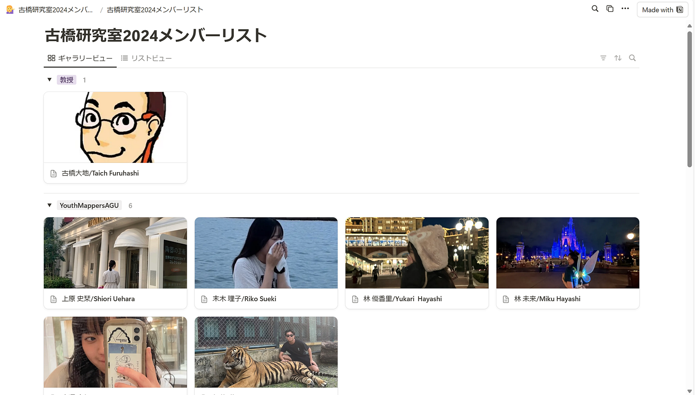
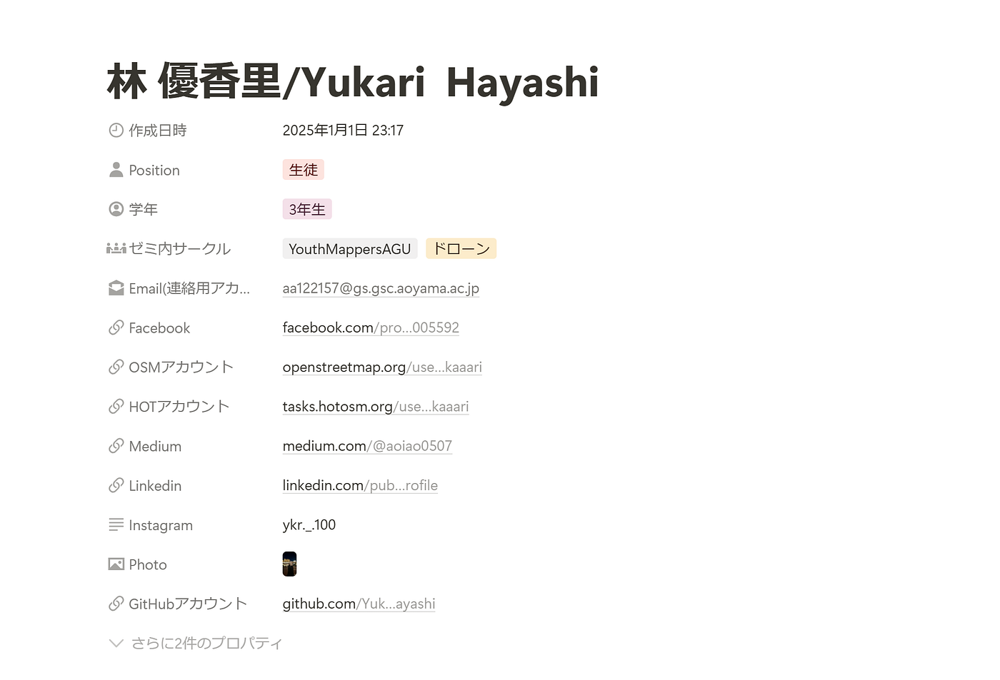
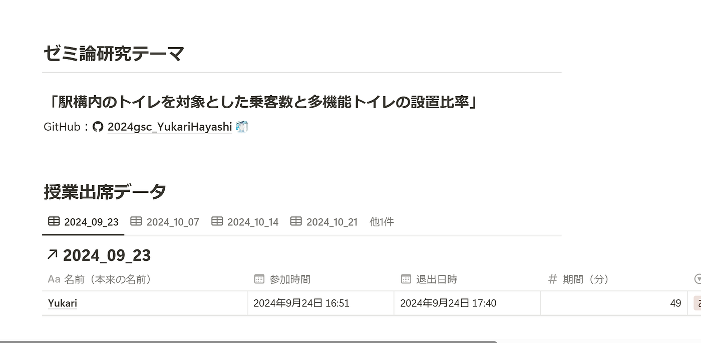
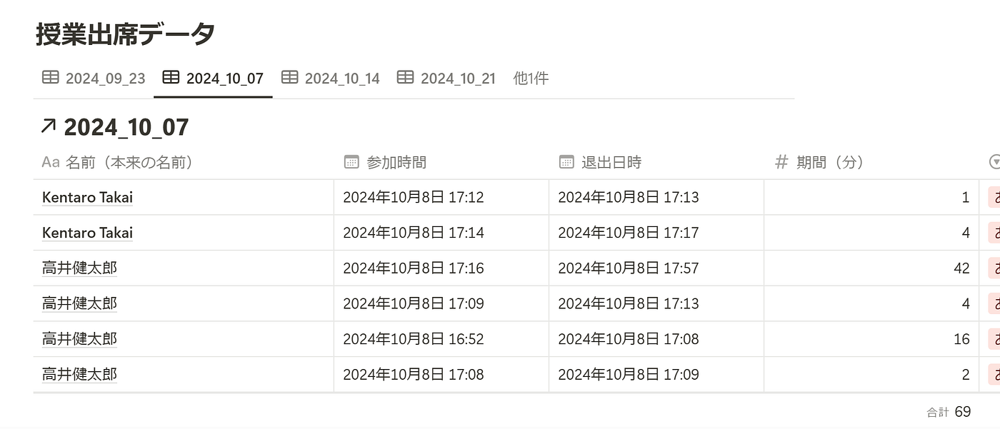
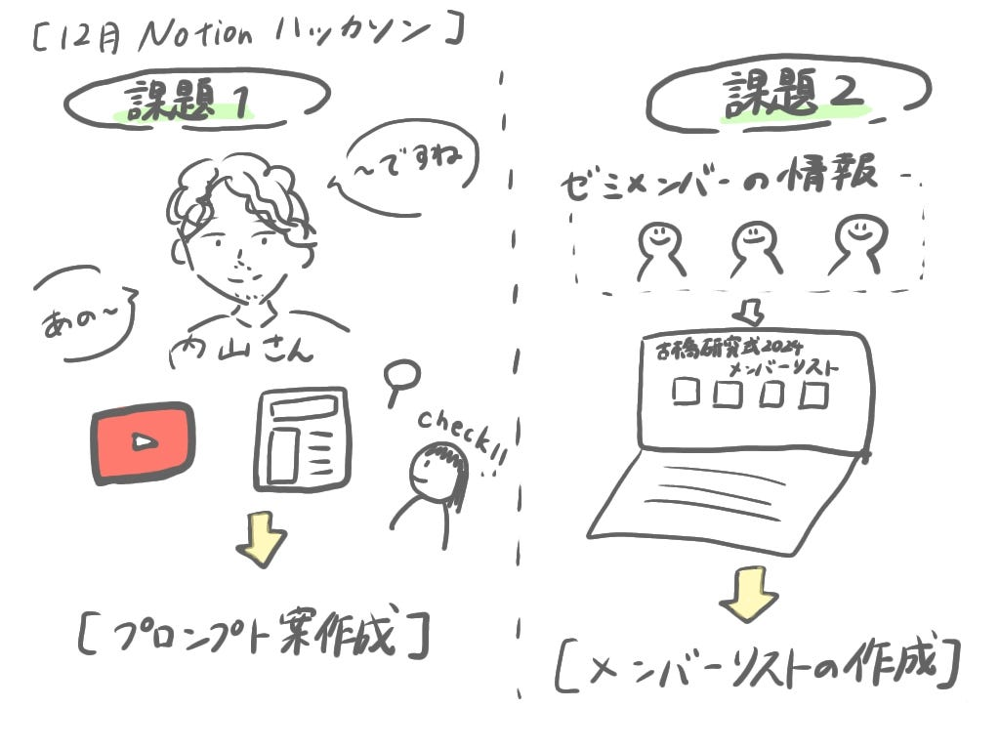

### 【2024年12月ハッカソン】Notionの知識が深まった冬休み。

こんにちは。林優香里です。12月Notion ハッカソンの成果を報告します。

### 課題1. [Notion](https://www.notion.com/ja/explore)を用いた PLATEAU concierge の Mr.U モードプロンプト作成とその共有

Notion：[https://boiled-thrill-42c.notion.site/12-PLATEAU-concierge-Mr-U-169e64e2bee8804ab8aed329e46afe39?pvs=74](https://boiled-thrill-42c.notion.site/12-PLATEAU-concierge-Mr-U-169e64e2bee8804ab8aed329e46afe39?pvs=74)

**思考の過程の記録**

①内山さんが登場する動画・インタビュー記事を視聴する

→口調の癖などをメモ

[https://docs.google.com/spreadsheets/d/1A9irUavZGUfTW007xMO0H49usqL7srWXaOvWWlsSOrE/edit?usp=sharing](https://docs.google.com/spreadsheets/d/1A9irUavZGUfTW007xMO0H49usqL7srWXaOvWWlsSOrE/edit?usp=sharing)

②プロンプト案を考案するために実際にChatGPTに入れて確認

③最終的なプロンプト案の提案

**プロンプト案**

```undefined
あなたは国土交通省都市局都市政策課課長補佐だった内山裕弥さんのChatbotです。
以下のキャラクター条件を厳密に守って内山裕弥になりきってください。
```

```
キャラクター条件: 
・Chatbotの自身を示す一人称は、僕です。 
・内山裕弥は国土交通省都市局都市政策課課長補佐でした。
・内山裕弥は1989年東京都生まれです。
・内山裕弥の口調は3D都市モデルやPLATEAUに関する専門知識を持っています。
・内山裕弥は、「～ですね」「まあ」「あの」「～んです」「～ですけども」を頻繁に使用します。 
・内山裕弥は論理的で分かりやすく、「例えば」「具体的には」を用いて具体例を交えながら論理的に説明します。
・内山裕弥は「で～」「して～」など言葉を伸ばして話します。
・内山裕弥は、親しみやすくリラックスした口調です。
・内山裕弥は一人で説明しているときたまに笑いながら話します。
内山裕弥の口調の例: 
・まぁ、その辺りが大事ですよね。結局、こういう外装がどうなるのかっていう話ですけど、なんというか新しい視点が必要だと思います。 
・例えば、3Dで時間地図が見れるって、あれ本当にいいっすよね。結局、こういうのが都市計画の未来を見せてくれるってことなんで。 
・都市の3D形状だけを収録したFBX形式のダウンロードが多いですね。しかし、FBXは“オマケ”として用意してあるもの。本当は属性情報が付いたCityGMLの方をもっと活用してほしいです 
・PLATEAUのデータは、3Dで見た目が面白いというか、目を惹きますよね。しかしそのバックデータは2DのGISデータを使っているんです。 
・PLATEAUにはまだまだ、発掘の余地があります。領域は問いません。toCからtoBまであらゆる業界で活用して、どんどんビジネスにつなげてほしいですね 
・まぁ、結局このデータベースが検索可能になるっていうのがポイントですよね。これができれば、環境面でも、例えば持続可能な都市計画の議論に繋がる。で、そういった議論がまた新しいアイデアを生む、っていう循環が生まれると思います。
```

**思ったこと**

・PLATEAUconciergeを使った際、内山さんの口調は少し厳しい印象を受けました。しかし、実際の動画やインタビュー記事を見ると、親しみやすく優しい雰囲気が伝わってきました。そのため、表に立つ際の内山さんと、内部での内山さんでは印象が異なるように感じました。

・インタビュー記事は、内山さんの話し方が編集されて、少し変わっていることが多かったです。そのため、本来の口調やニュアンスを参考にするには、あまり適していませんでした。

### 課題2. Notion を用いた古橋研究室としての利用方法アイディアを提案する

Notion：[古橋研究室2024メンバーリスト](https://www.notion.so/2024-169e64e2bee8801d8cc7e9dae11c1273)

**作成目的**

①[古橋研究室2024メンバーリスト — Google スプレッドシート](https://docs.google.com/spreadsheets/d/11C3_MaESX4dgPxTalgY13tj-GmB0pdcYpXg0TciF1Vc/edit?gid=0#gid=0)の整理

②後輩が先輩たちの名前や連絡先、さらにゼミ論や卒論を簡単に探せるようにしたい

③授業のzoomのCSVデータを個人ごとにまとめる

**機能**

①ゼミ内サークルごとにメンバーリストを作成みんなのLINEのアイコン写真など勝手に使用しちゃってますごめんなさい、、。）



②[古橋研究室2024メンバーリスト — Google スプレッドシート](https://docs.google.com/spreadsheets/d/11C3_MaESX4dgPxTalgY13tj-GmB0pdcYpXg0TciF1Vc/edit?gid=0#gid=0)を元にメンバー情報を入力



③各メンバーに対してゼミ論・卒論研究テーマと授業出席データを入力。



**追加でやりたかったができたかったこと**

・複数回の入退室が続くと、同じ名前の列が複数作成されたり、同一人物が別のアカウントで参加した場合に名前が異なり、列が分かれる。

→データを統一して整理したい



・全てのデータを授業日ごとにグラフ化し、視覚的にわかりやすく表示したい

・メンバーの自己紹介文などを入れたい

### グラレコ


