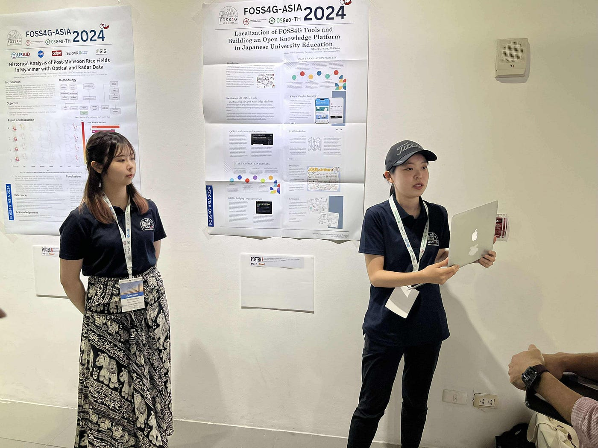
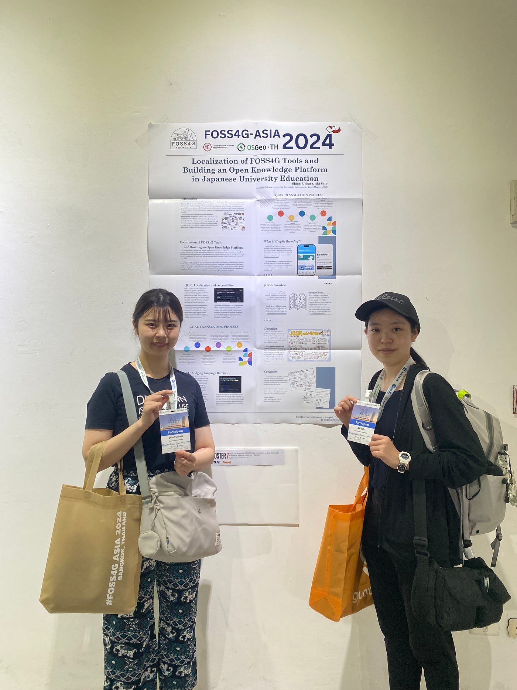
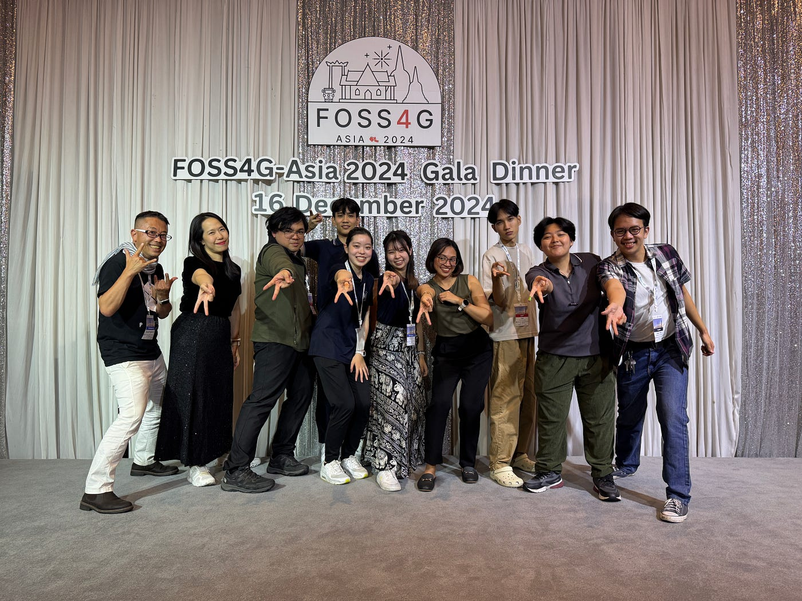

### 2回目の国際会議でもドキドキでした！FOSS4GAsia2024 in Thailand

こんにちは、4年の上原です。12月15～18日に開催された[FOSS4GAsia2024](https://foss4g.asia/2024/)について報告します。

大学2年次の留学、[昨年のSotM Asia2023](https://medium.com/furuhashilab/foss4g-thailand-sotm-asia-2023%E3%81%AB%E5%8F%82%E5%8A%A0%E3%81%97%E3%81%BE%E3%81%97%E3%81%9F-9526db42444a?source=collection_home---4------1-----------------------)に続き、3度目のバンコクとなりました。国際会議自体の参加は2度目で、雰囲気は掴んでいたはずなのですが、やはり緊張しました。

### 発表について

Poster Sessionの枠で会議2日目（12/16）の13:00～14:00に発表しました。テーマは「Localization of FOSS4G Tools and Building an Open Knowledge Platform in Japanese University Education（日本の大学教育におけるFOSS4Gツールの多言語化とオープンナレッジ・プラットフォームの構築）」です。

QGIS、GDALマニュアルの日本語訳のパートを佐藤愛妃（3年）、JOSMハッカソンを例にしたグラレコ活用のパートを私が担当しました。

こちらが作業用に使った[GitHub](https://github.com/furuhashilab/FOSS4GASIA2024_general-track-presentation)と[発表したポスター](https://github.com/furuhashilab/FOSS4GASIA2024_general-track-presentation/blob/main/FOSS4G_Shiori%2CAki_presentation_v2.pdf)です。

[GitHub - furuhashilab/FOSS4GASIA2024_general-track-presentation
Contribute to furuhashilab/FOSS4GASIA2024_general-track-presentation development by creating an account on GitHub.github.com](https://github.com/furuhashilab/FOSS4GASIA2024_general-track-presentation)

SotMと違い、今回は技術系の鋭い質問を多く受けました。受けた質問を反映しつつ、成長が感じられた1時間の発表だったと思います。

また、12/26の19:00からの[アフタートーク](https://osgeojp.connpass.com/event/340170/?fbclid=IwZXh0bgNhZW0CMTEAAR3oEKa-0nniWYFj6_Ugd5dksed0rDU1i2CUlnZ9BlN9dBV5W_YsC-UL6AE_aem_2Q-qd9lJ-C9fAGwlyu8zdQ)にも登壇し、会議の感想を共有させていただきました。

[FOSS4G Belem＆Asiaアフタートーク (2024/12/26 19:30〜)
はじめに FOSS4G（国際カンファレンス） の振り返りトークイベントを開催します！ 2024年12月2日〜8日にブラジル・ベレンでFOSS4G Belemが、そして2024年12月15日〜18日にタイのバンコクでFOSS4G…osgeojp.connpass.com](https://osgeojp.connpass.com/event/340170/?fbclid=IwZXh0bgNhZW0CMTEAAR3oEKa-0nniWYFj6_Ugd5dksed0rDU1i2CUlnZ9BlN9dBV5W_YsC-UL6AE_aem_2Q-qd9lJ-C9fAGwlyu8zdQ)

### まとめ

会議全体を通してビジネスチックな印象を受けましたが、やはり気さくな方が多くてたくさんお話をできました！SWUのYouthMappersと仲良くなれたことが一番の収穫です！

今回、昨年に引き続き国際会議に参加したことで、人と人との関わりを広げることができたというのが、最も嬉しかったことでした。ここで得た縁を次の学年にもつないでいくためにも、合同マッパソンの開催等、計画していきます。

### Strava

[https://strava.app.link/9i1BP4CGVPb](https://strava.app.link/9i1BP4CGVPb)
