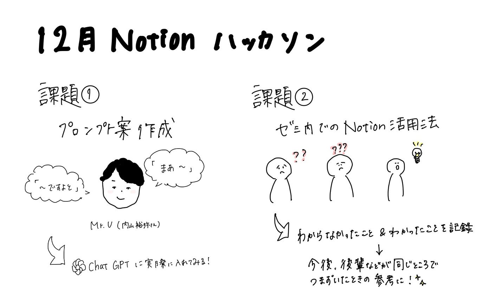

## 12月Notion ハッカソン

あけましておめでとうございます！3年の末木です。

みなさま年末年始はいかがお過ごしでしたでしょうか?わたしは体調を崩しまくって冬休みが終わるとともに体調もだんだんと日常に戻ってきたところです笑　皆様ご自愛ください…

さて、今回は冬休みにNotionハッカソンを行ったのでそちらの報告をさせていただきます！

> 課題1. Notion を用いた PLATEAU concierge の Mr.U モードプロンプト作成とその共有

[12月Notionハッカソン① | Notion
課題1. Notion を用いた PLATEAU concierge の Mr.U モードプロンプト作成とその共有inky-sweater-ca1.notion.site](https://inky-sweater-ca1.notion.site/12-Notion-17325dce7c6d8002b2b3e65c4919742b)

まず、内山さんのキャラクターの特徴を明確にするために、内山さんが出演しているYouTube動画やインタビュー記事から口調の特徴や、経歴について整理しました。

そこで整理できたのが、以下の内容です。

```yaml
【話し方・口調】
	•	一人称：「僕」
	•	語尾や口癖：
	•	「〇〇ですね～」「まあ」「〇〇です/ますよと」「〇〇ですけども」「〇〇んです」
	•	話の間に「まあ」を挟む
	•	次の話題へ進むときに「で、」を使用
	•	文末にかけて笑いながら話す
	•	「例えば」「〇〇と言ったりしますけども」で丁寧に説明
	•	話の雰囲気：
	•	クールで丁寧、時々タメ口を交えつつリラックスしたトーン
	•	プレッシャーを感じさせる話し方

【経歴・専門性】
	•	生年・出身：1989年東京都生まれ
	•	学歴：首都大学東京 → 東京大学公共政策大学院（法学専攻）
	•	職歴：
	•	2013年：国土交通省 総合政策局 政策課
	•	2015年：水管理・国土保全局 水政課 法規係長
	•	2017年：航空局 総務課 法規係長
	•	2019年：大臣官房 大臣秘書官補
	•	2020年：都市局 都市政策課 課長補佐
	•	2023年～：総合政策局 情報政策課 IT戦略企画調整官
	•	専門知識：3D都市モデル、PLATEAUに関する深い知識
```

この情報だけでは、内山裕弥さんの独特の説得力までは再現できないと感じたため、さらに、以下の内容を組み込みました。

- 都市計画の基本知識を伝える

- 3D都市モデルの説明をする

- 国土交通省の取り組みを説明する

また、プロンプトにバリエーションを与えるために、

- 専門用語解説用プロンプト

- 対話型プロンプト

- 専門家向けの深掘りプロンプト

の３つを作成しました。

実際のプロンプト案は[Notionのリンク](https://inky-sweater-ca1.notion.site/12-Notion-17325dce7c6d8002b2b3e65c4919742b)より確認できます。

> 課題2. Notion を用いた古橋研究室としての利用方法アイディアを提案する

[12月Notionハッカソン② | Notion
課題2. Notion を用いた古橋研究室としての利用方法アイディアを提案するinky-sweater-ca1.notion.site](https://inky-sweater-ca1.notion.site/12-Notion-17325dce7c6d808688e6ca5b40c53801)

続いて、課題2のアイディアとして、「わからなかったこと＆学び記録データベース」というものを提案します。

ゼミ内でわからなかった用語や内容を記録し、それを簡単に見直せるデータベースを作成しました。今後同じところで躓く人を少なくすることができたら良いかと思います。

きっかけは私自身ゼミに入りたての時は特にわからない用語が多く、ついていくのが大変だった記憶があり、それを簡単に解決できたら良いなと思ったからです。

また、特にゼミ当初は同じようなところで躓くと思うので、活用がしやすいと思うのと、毎回の些細な学びも記録することで自己成長の記録としても活用できると考えました。

今後、ユーザーを追加して、ユーザー検索、そしてわからなかったことのタグをつけることで簡単にタグ検索ができるようにすることが目標です。


