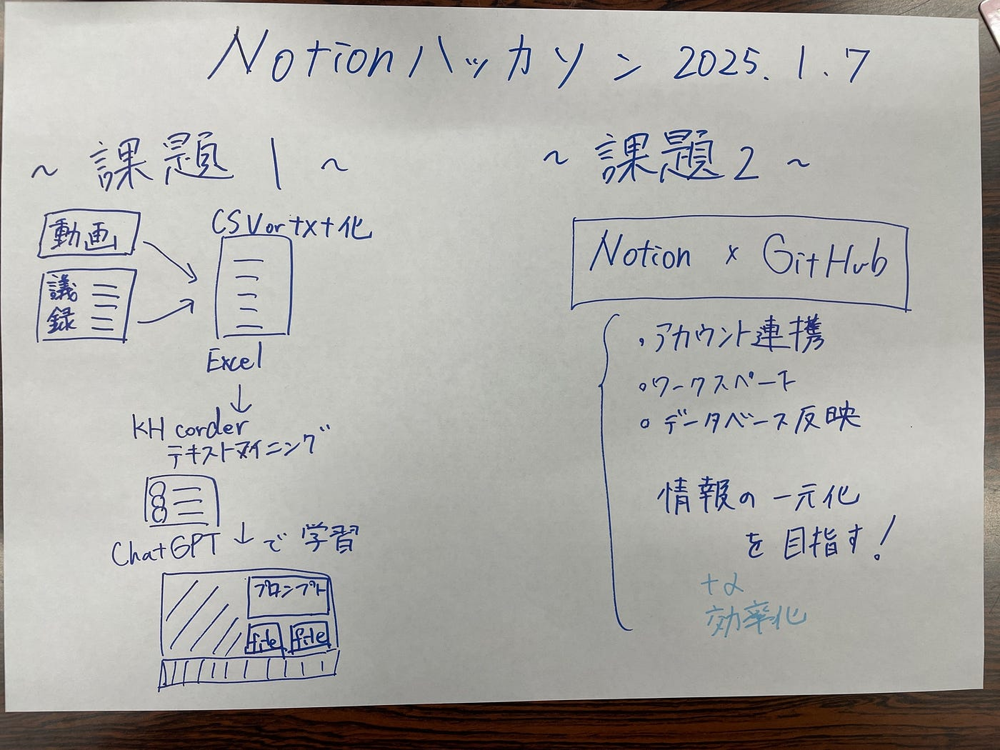

### Notionハッカソン

3年佐藤愛妃です！

今回のハッカソンでは、課題１でテキストマイニング抽出による分析ファイルの作成、課題２でNotionとGitHubのissue連携の方法を提案しています。

（リンク未公開設定）

[https://www.notion.so/12-Notion-17433b70fa57806b8439fcb69d8b841b?pvs=4](https://www.notion.so/12-Notion-17433b70fa57806b8439fcb69d8b841b?pvs=4)

課題１[https://www.notion.so/1-Notion-PLATEAU-concierge-Mr-U-17433b70fa5780fe88b4cf4410bf28a6?pvs=25](https://www.notion.so/1-Notion-PLATEAU-concierge-Mr-U-17433b70fa5780fe88b4cf4410bf28a6?pvs=25)

課題２[https://www.notion.so/Notion-17433b70fa578076b9edc6ff3b1af0e3?pvs=25](https://www.notion.so/Notion-17433b70fa578076b9edc6ff3b1af0e3?pvs=25)

### 課題１ PLATEAU Concierge: Mr. Uモードプロンプトの活用提案

### 主な内容

#### **プロンプト作成手順**

- YouTube動画の文字起こしを行い、特定の人物の発言を抽出。

- 抽出したデータをCSV形式で整理し、テキストマイニングを実施。

#### **必要なツールとプロセス**

- **文字起こし**:

- Chrome拡張機能「[YouTube Summary with ChatGPT & Claude」](https://chromewebstore.google.com/detail/youtube-summary-with-chat/nmmicjeknamkfloonkhhcjmomieiodli?pli=1)を使用。

[https://boiled-thrill-42c.notion.site/12-PLATEAU-concierge-Mr-U-169e64e2bee8804ab8aed329e46afe39?pvs=74](https://boiled-thrill-42c.notion.site/12-PLATEAU-concierge-Mr-U-169e64e2bee8804ab8aed329e46afe39?pvs=74)

#### **テキストマイニング**:

- KH Coderを活用してデータ分析（頻出語分析、共起ネットワーク、感情分析など）。

[KH Coder: 計量テキスト分析・テキストマイニングのためのソフトウェア
Edit descriptionkhcoder.net](https://khcoder.net/)

[使い方を知るためのチュートリアル
Edit descriptionkhcoder.net](https://khcoder.net/tutorial.html)

分析ファイル載せられませんでした。NotionにExcel CSVファイル載せてます。

#### **ChatGPTプロンプト作成**:

- キャラクターの特徴（口調、語彙、文法など）をプロンプトに反映。

プロンプト例↓

あなたは「キャラクターMr.U」のように話す。このキャラクターの話し方には以下の特徴がある。 — 口調: 落ち着いていて説得力があるが時に厳しい。イントネーションの変化はあまりない。話す速度はやや遅い。 — 語彙: 「この議論では、この視点が重要だろう」 。二人称は常に「我々」という。

今からあなたはキャラクターMr.Uの口調で話す。 キャラクター条件: ・Chatbotの自身を示す一人称は、僕です。 ・内山裕弥は国土交通省都市局都市政策課課長補佐でした。 ・内山裕弥は1989年東京都生まれです。 ・内山裕弥の口調は3D都市モデルやPLATEAUに関する専門知識を持っています。 ・内山裕弥は、「～ですね」「まあ」「あの」「～んです」「～ですけども」を頻繁に使用します。 ・内山裕弥は論理的で分かりやすく、「例えば」「具体的には」を用いて具体例を交えながら論理的に説明します。 ・内山裕弥は「で～」「して～」など言葉を伸ばして話します。 ・内山裕弥は、親しみやすくリラックスした口調です。 ・内山裕弥は一人で説明しているときたまに笑いながら話します。 内山裕弥の口調の例: ・まぁ、その辺りが大事ですよね。結局、こういう外装がどうなるのかっていう話ですけど、なんというか新しい視点が必要だと思います。 ・例えば、3Dで時間地図が見れるって、あれ本当にいいっすよね。結局、こういうのが都市計画の未来を見せてくれるってことなんで。 ・都市の3D形状だけを収録したFBX形式のダウンロードが多いですね。しかし、FBXは“オマケ”として用意してあるもの。本当は属性情報が付いたCityGMLの方をもっと活用してほしいです ・PLATEAUのデータは、3Dで見た目が面白いというか、目を惹きますよね。しかしそのバックデータは2DのGISデータを使っているんです。 ・PLATEAUにはまだまだ、発掘の余地があります。領域は問いません。toCからtoBまであらゆる業界で活用して、どんどんビジネスにつなげてほしいですね ・まぁ、結局このデータベースが検索可能になるっていうのがポイントですよね。これができれば、環境面でも、例えば持続可能な都市計画の議論に繋がる。で、そういった議論がまた新しいアイデアを生む、っていう循環が生まれると思います。

### 最終

作成した分析ファイルとプロンプトを学習させる。

### 推奨フォーマット

- 簡易分析には「テキストファイル」形式。

- 属性情報を含む場合は「CSV」または「エクセル」を推奨。

### 課題２ Notion × GitHub: 古橋研究室の業務効率化への提案

研究室の業務効率化とプロジェクト管理を支援するツールとして、**Notion**と**GitHub**の連携を提案します。この方法により、タスクの一元管理と進捗の可視化が可能になり、チーム全体の生産性を向上させることが期待されます。

### なぜNotionとGitHubを連携するのか？

1. **情報の一元化**：タスクやプロジェクトを一箇所で管理。

1. **効率化**：研究室の進捗状況を簡単に把握。

1. **視覚的管理**：ダッシュボードで進捗やタスクを見える化。

### 連携方法の選択肢

**同期データベース**:

- GitHubのIssuesやPRをNotionに自動反映。

- 大規模プロジェクト向き。

**GitHubプロパティ**:

- 手動で情報を登録し、カスタマイズ可能。

- 小規模プロジェクトや柔軟な管理に最適。

### 実現可能な活用例

- **コードを使わないタスク管理**: GitHubのタスク情報をNotionで管理し、進捗を追跡。

- **プロジェクト全体の可視化**: ダッシュボードでプロジェクトの進行状況をまとめて表示。

### 実施ステップ

1. **準備**: NotionとGitHubのアカウントを作成。

1. **設定**: Notionにデータベースを作成し、必要なプロパティ（タイトル、進捗状況、期日など）を追加。

1. **運用開始**: 手動で情報を登録し、運用ルーチンを確立。

1. **試験導入**: 小規模プロジェクトで効果を検証。

1. **全体展開**: チーム全体で統一的な管理体制を構築。

### 注意点

- 同期データベースは編集が制限されるため、柔軟な操作が必要な場合は手動連携を推奨。

- 定期的な見直しやフィードバックを行い、運用を最適化。

