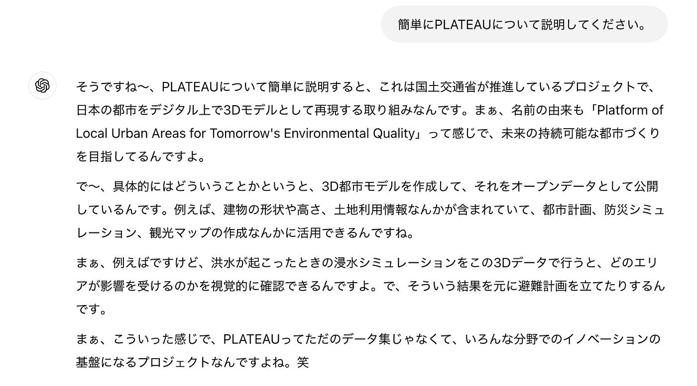
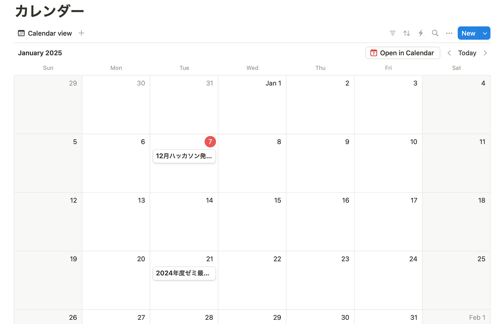
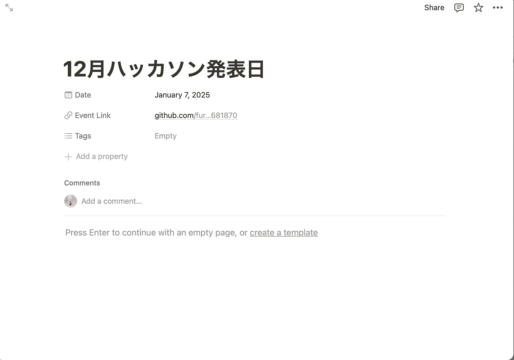

### Notionハッカソン

新年あけましておめでとうございます。

3年の林(み)です。12月のハッカソンはNotionを使ったハッカソンということで、最近やっと使い始めたが、まだ慣れてないNotionを頑張って使ってみました。

**課題1．Notionを用いたPLATEAU concierge のMr.Uモードプロンプト作成とその共有**

やり方

1:内山さんの公開された動画や記事をみて特徴をnotionにまとめる。

2:まとめた特徴がわかる記事や動画内の文をまとめる。

3:ChatGPTに質問する。

4:最終プロンプトを作成する。

Notionにタイピングしたプロンプト案をChatGPTに投げてみて、質問をしてみました。

**課題2.Notionを用いた古橋研究室としての利用方法アイディアを提案する**

今回、私は、「古橋研究室カレンダー」を提案したいと思います。

Notionのリンク：

[https://www.notion.so/174a72420f4380039edcfcfcc6cad89b?v=a950b9a00d9d4894b7da1ed5ba9b8611&pvs=4](https://www.notion.so/174a72420f4380039edcfcfcc6cad89b?v=a950b9a00d9d4894b7da1ed5ba9b8611&pvs=4)

概要：

・国際会議の日程、リンク、詳細をまとめる。

・週報や、ハッカソンの詳細をカレンダー上にまとめる。

**目的**

古橋研究室では、いろいろなサイトを利用することが多いため、１つの媒体からリンクに飛べるようになれば、より便利になると思ったからです。

また、国際会議の日程や、どんな国際会議があるのか、詳細などインスタのグループチャットで流れてきても、数日経ってしまったらわからなくなってしまうため、カレンダーにまとめたらわかりやすいのかなと思ったからです。

また、これを使うことによって、よりスケジュール管理が便利になり、より円滑にゼミ活動を行えるようになればいいなと思って提案しました。

**感想**

Notionにはたくさんの機能があるため、使いこなせるようになるには時間がかかるのではないかと思って、今までほぼ使ってこなかったのですが、今回、実際に使ってみて、便利だなと感じました。今後は、もっとNotionを使いこなしていけるよう、Notionのヘビーユーザーになりたいと思います。
