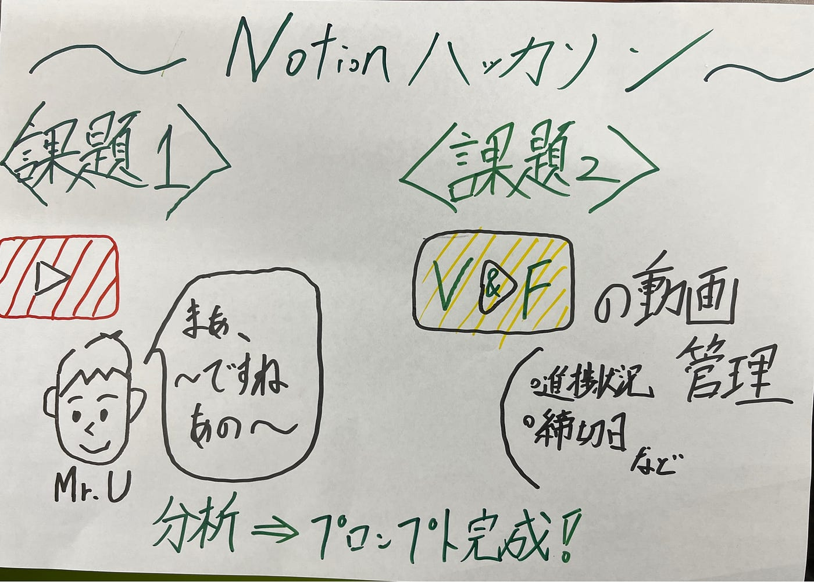

### 12月ハッカソンの報告

あけましておめでとうございます。
今年もよろしくお願いいたします。
12月の[Notion](https://www.notion.com/ja)ハッカソンの報告をいたします。

> 課題１. Notion を用いた PLATEAU concierge の Mr.U モードプロンプト作成とその共有

[Notionハッカソン | Notion
課題1 Notion を用いた PLATEAU concierge の Mr.U モードプロンプト作成とその共有juvenile-lake-dbd.notion.site](https://juvenile-lake-dbd.notion.site/Notion-174ff81a6c988023a0d6f5aca61f4d13?pvs=4)

作業手順としては、
①[YouTube](https://www.youtube.com/?app=desktop&hl=ja)動画を視聴し、内山さんの喋り方の特徴をつかむ。
②気づいた特徴を[Notion](https://www.notion.com/ja)にメモする。
③それをまとめたプロンプト案を構成するために、[ChatGPT](https://chatgpt.com/)に投げながら作業する。
④最終的なプロンプトを提案する。

で行いました。

> 課題２.[Notion](https://www.notion.com/ja) を用いた古橋研究室としての利用方法アイディアを提案する

[V&F管理 | Notion
TikTokアカウントjuvenile-lake-dbd.notion.site](https://juvenile-lake-dbd.notion.site/V-F-174ff81a6c9880a9a129c24b7ed67dfe?pvs=4)

私が考えたアイデアは、「V＆Fの動画管理をNotionで行う」です。
12月17日に[TikTok](https://www.tiktok.com/ja-JP/)で投稿した「[V＆F紹介動画](https://drive.google.com/file/d/1AIgXr0DjIrD2lctlmAJWws3AAjPEj3MR/view?usp=sharing)」を作成する段階で、「企画会議から動画を投稿するまでの流れをもっと一括に管理したい！」と感じていたので、今回[Notion](https://www.notion.com/ja)を利用して実施しようと考えました。
また、以前のゼミの時に、古橋先生から引継ぎの件で指摘を受けたので、今回[Notion](https://www.notion.com/ja)でアカウントへのログイン方法などの引継ぎ情報もまとめることによって、引継ぎがスムーズになるように工夫しました。

> グラレコ

