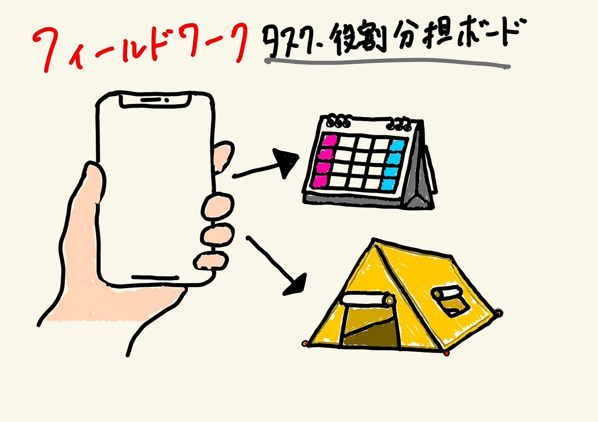

### Notionハッカソン

明けましておめでとうございます。三年の伊藤です。今回は2024年末に行われたハッカソンについてまとめます。

**課題１ _PLATEAU concierge の Mr.U モードプロンプト作成とその共有_**

[１月ハッカソン課題 | Notion
【課題の進め方】river-anglerfish-0f3.notion.site](https://river-anglerfish-0f3.notion.site/17a84b62375b803a8e14d0d6b2388298?pvs=4)

課題の進め方として以下の手順で進めました。

1. YouTubeの内山さんのインタビュー動画を基に、話し方の癖や言葉のチョイスなどを分析。Notionを活用しまとめていきました。

1. 内山さんの経歴やプロジェクト内容、分析された内山さんの話し方の特徴をもとにプロンプトを作成

1. 作成されたプロンプトから実行

_**課題２古橋研究室としての利用方法アイディアを提案する_**

[【フィールドワーク】タスク・役割分担ボード | Notion
Made with Notion, the all-in-one connected workspace with publishing capabilities.river-anglerfish-0f3.notion.site](https://river-anglerfish-0f3.notion.site/17a84b62375b80eba192f38989ecc171?pvs=4)

古橋ゼミならではのアイデアを考案するという課題に対して、フィールドワークでのタスク分担をカレンダーに表示させることで、より効率よくワークを回せるようになると考え、**[タスク・役割分担ボード**](https://river-anglerfish-0f3.notion.site/17a84b62375b80eba192f38989ecc171?pvs=4)を作成しました。

【感想】

Notionに触れるのが初めてだったので、最初はかなり戸惑いましたが、課題を進める中で、このサービスの便利さに気づき、日常使いできるようなレベルにはなったのかなと思ってます。最近は、筋トレのトレーニングを管理するように使っていて、これから社会人になるにつれて使いこなせるようになりたいです！

