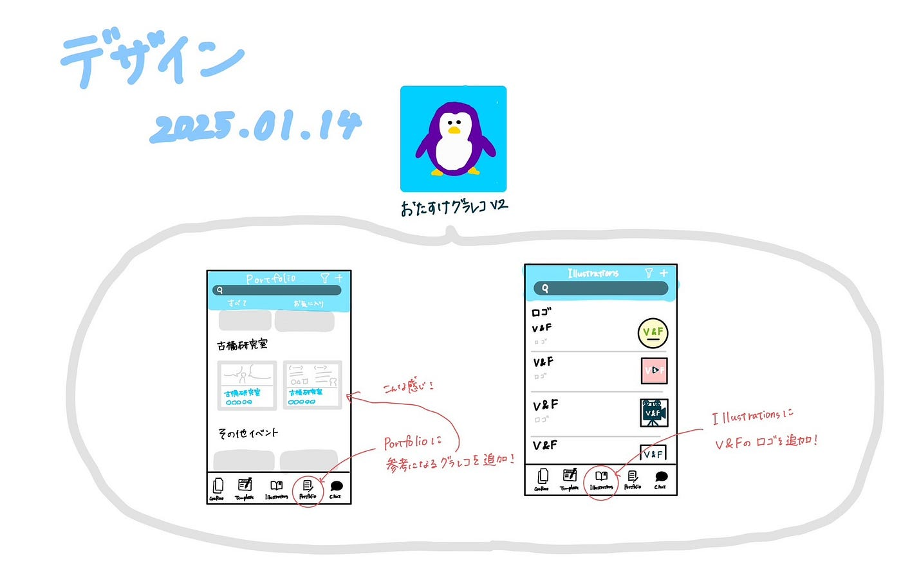

### デザイン部週報 １/21

こんにちは！三年の福田です。

冬休み前の内容に続き、グラレコをまとめ、「おたすけグラレコ」にそれぞれ追加する作業を再開しました。

Mediumに投稿されたグラレコは保存することができないのでスクショして保存するという方法でまとめました。

[おたすけグラレコ v2
青学 古橋研究室 謹製 グラレコ支援アプリ © FuruhashiLab., CC BY 4.0otasukegrareco.glideapp.io](https://otasukegrareco.glideapp.io/dl/a400f7)

「Portfolio」にわかりやすく描かれているグラレコを追加し、その内容に合わせてタイトルと名前を記入しています。グラレコを誰が描いたかわかりやすくするため作成者名と同一にしました。また、「illustration」にV&Fのロゴも追加しました。

グラレコを描くときに自分が参考になる、良いと思うグラレコを見つけて、自分のグラレコ技術を向上させることができると思います。

グラレコ

