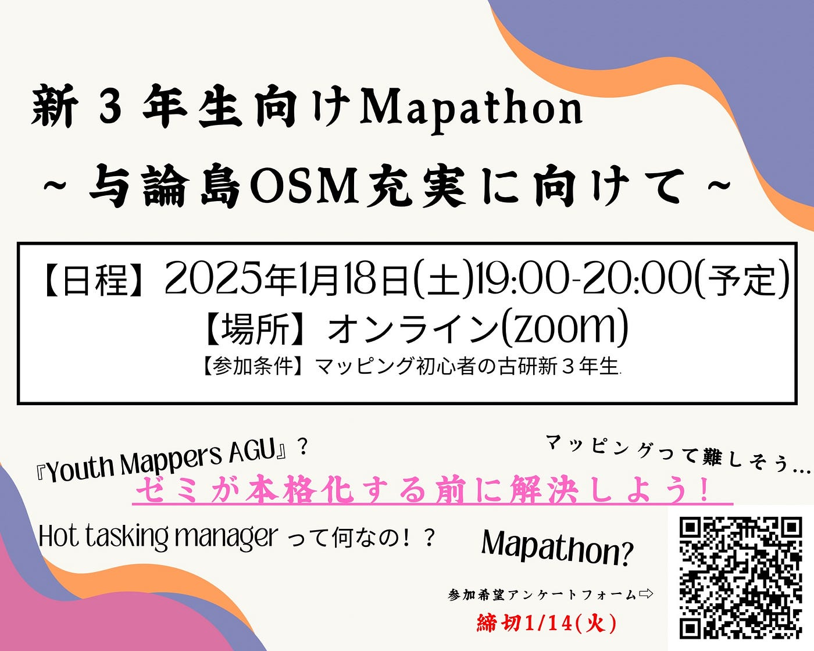
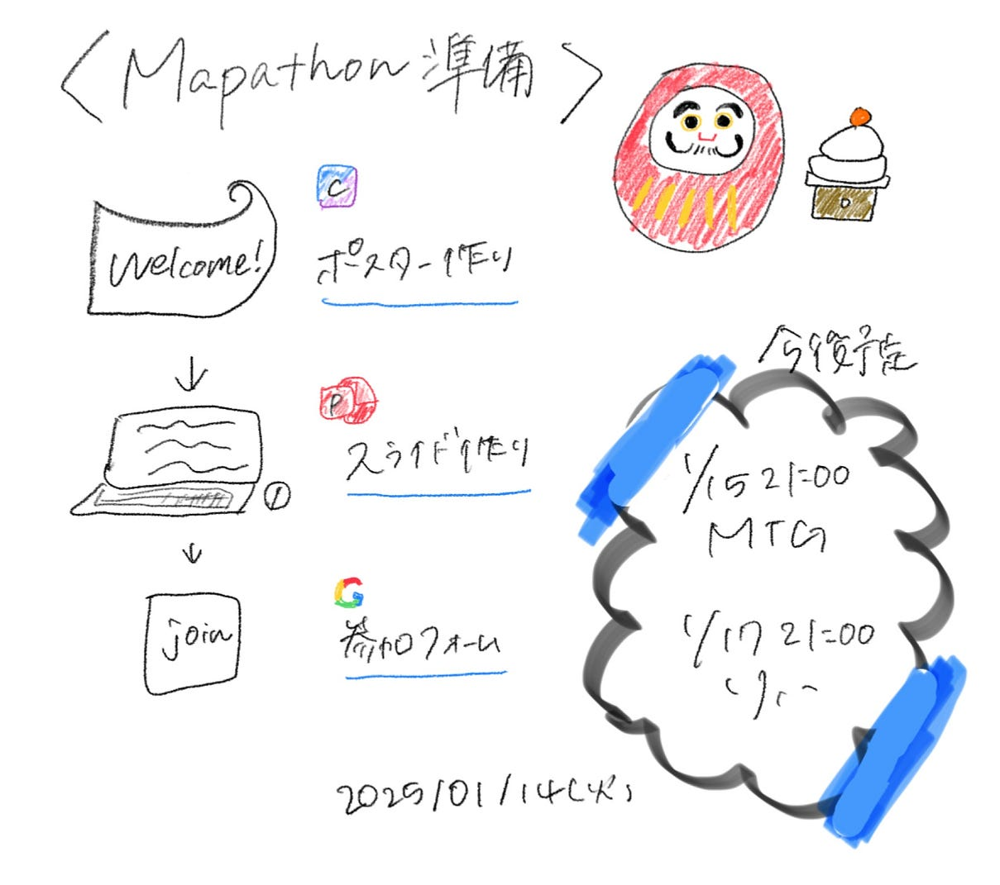
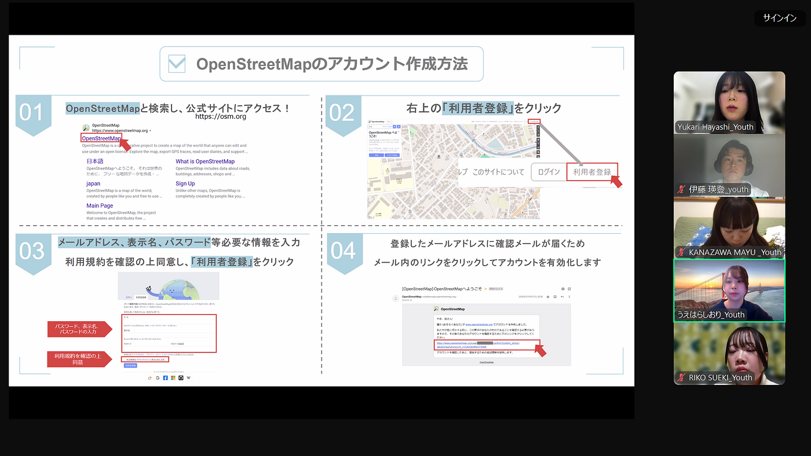
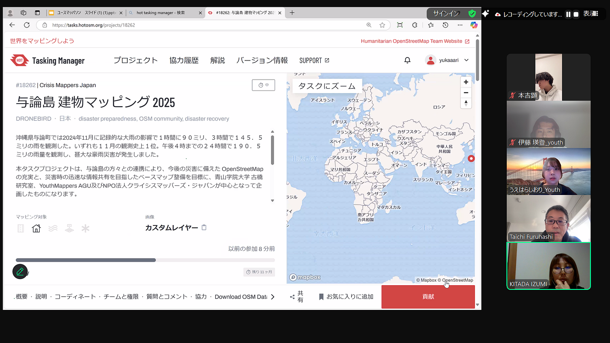
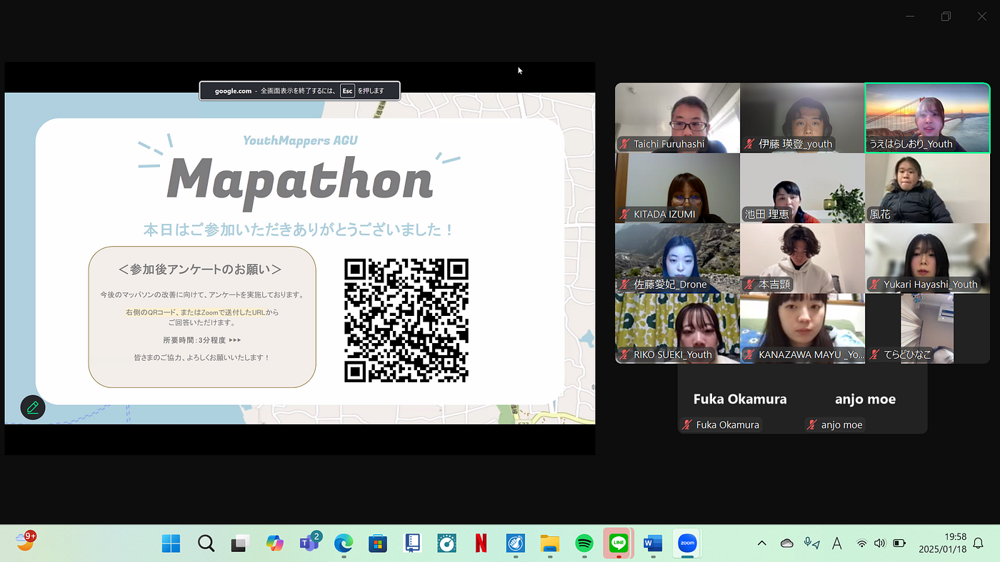

## 1/21週報

こんにちは。ユース三年の金澤です。

先週は風邪で寝込んでしまいました…

これからは大事なイベント等増えてくるので気をつけたいと思います。

今週は、冬休み中にYouthが用意したマッパソン準備の報告をします。

（追記：1/21 マッパソンが無事終了したので、その記事もまとめて書きます！）

### 準備

私はポスター作成をしました。

何かとポスター作成をするのは初めてでした。

CANVAを利用しましたが、有料コンテンツになるとできることの幅が広がり、作業も固まったりしないそうです！

(ＱＲコードは、りこが作ってくれたものを載せました！)

その他、

☑️スライド作成(担当：ゆかり、えいと)

[ユースマッパソン スライド (1) (1).pptx](https://1drv.ms/p/s!AoV0OPVhLK7NnHYnlWyuEhmOQFbC?e=zrO7rv)

（最終形態↓）

[https://docs.google.com/presentation/d/11vAzsiXDpyM0jy6SN-b5claliwTCf-NX/mobilepresent](https://docs.google.com/presentation/d/11vAzsiXDpyM0jy6SN-b5claliwTCf-NX/mobilepresent)

☑️参加フォーム作成

また、現時点(1/10)の申し込み状況としては、2年生5人が申し込みをしてくれています。

【Youth今後の日程:マッパソンリハ】

1回目➡️15日21:00〜MTG（資料の確認修正など）

2回目➡️17日21:00〜リハ

### 【本番での気づき】

私が一番感じたことは、相手は何がわかっていないのか、どの段階につまづいているのかを把握する最大の手段は『pcでの作業とそのpcでの画面共有』であることです。

私のブレイクアウトルームに来てくださった参加者は、スマホでzoomに参加し、pcで作業をしていました。そのため、今何ができていないのかをオンタイムで把握できず、効率が悪いと感じました。

(また、スマホでpcの画面を映すと反射する)

また、zoomの画面共有機能を知らない参加者もいたので、あらかじめ伝えておくべきだったと感じました。

私もこれから気をつけたいと思います！

以下はMapathonのスクリーンショットです。

参加後アンケート(りこ実施)では、一時間という時間の少なさや、スキル向上よりもやり方が知れて良かったという感想をいただきました。

初めてのMapathonで、これから活かせる課題も見つかり、自分も初心に戻れ、良い経験となりました。
